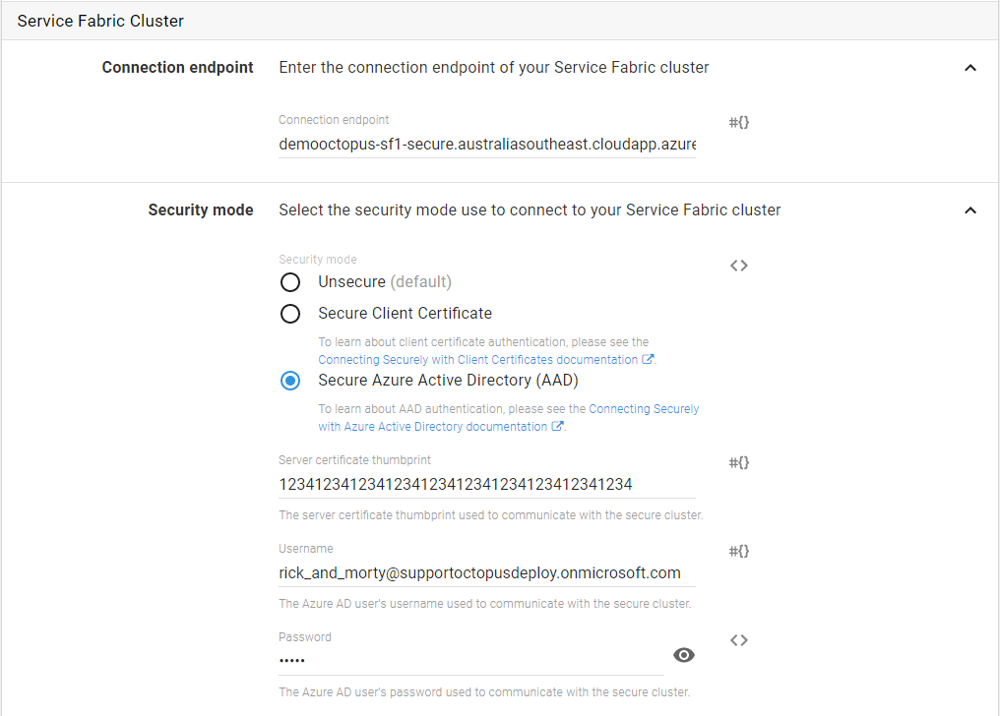

As part of Service Fabric step templates, Octopus allows you to securely connect to a secure cluster by using Azure Active Directory (AAD).

This page assumes you have configured your Service Fabric cluster in secure mode and have already configured your primary/server certificate when setting up the cluster (and have used an Azure Key Vault to store the server certificate thumbprint).

:::warning
This example assumes you are using Azure to host your Service Fabric cluster and AAD.
:::

During a Service Fabric deployment that uses AAD for authentication, Calamari will set the following connection parameters before attempting to connect with the Service Fabric cluster:

```powershell
$ClusterConnectionParameters["ServerCertThumbprint"] = $OctopusFabricServerCertThumbprint
$ClusterConnectionParameters["AzureActiveDirectory"] = $true
$ClusterConnectionParameters["SecurityToken"] = $AccessToken

# Where $AccessToken is obtained through an earlier PowerShell call using the following variables:
#
# $OctopusFabricAadUserCredentialUsername
# $OctopusFabricAadUserCredentialPassword
#
```

These PowerShell variables correspond to the following Octopus variables:

| PowerShell Variable                      | Octopus Variable                                       |
| ---------------------------------------- | ------------------------------------------------------ |
| $OctopusFabricAadUserCredentialUsername  | Octopus.Action.ServiceFabric.AadUserCredentialUsername |
| $OctopusFabricAadUserCredentialPassword  | Octopus.Action.ServiceFabric.AadUserCredentialPassword |
| $OctopusFabricServerCertThumbprint       | Octopus.Action.ServiceFabric.ServerCertThumbprint      |

It is these values and variables that we will be discussing below.

## Step 1: Configure the Service Fabric Cluster to Use Azure Active Directory

The Azure Portal supports adding an AAD user to an AAD app (ie. a Service Fabric cluster application). So Octopus can authenticate using AAD with user credentials _(NOTE: At the time of writing (March 22nd, 2017), user credentials are the only supported method of authentication with SF and AAD. Client application credentials are not yet supported)_. We therefore need to setup an AAD user and grant them permissions to access our Service Fabric cluster, via an AAD app. This section will discuss how to do this.

For a Service Fabric cluster to be able to see our AAD user, we need to setup some AAD applications (a _cluster_ application and a _client_ application) and assign an AAD user to our cluster application.

This process is made easier with scripts. Luckily for us, Microsoft have published an article on how to do exactly what we need, titled [Securing an Azure Service Fabric cluster with Azure Active Directory via the Azure Portal](https://blogs.msdn.microsoft.com/ncdevguy/2017/01/09/securing-an-azure-service-fabric-cluster-with-azure-active-directory-via-the-azure-portal-2/). This article includes some [sample scripts](http://servicefabricsdkstorage.blob.core.windows.net/publicrelease/MicrosoftAzureServiceFabric-AADHelpers.zip) you can use and customize to help setup your own cluster and client applications. We leave this as an exercise for the reader.

After running through these scripts, we end up with the following AAD app registrations:

- a cluster application
- a client application

## Step 2: Configure an Azure Active Directory User that Octopus Can Connect With During Deployments

Now that we have configured our Service Fabric cluster to use AAD, we can assign an AAD user to our Service Fabric cluster application.

In the Azure Active Directory:

- Create a user that you will use for deploying to your Service Fabric cluster.
- Login to the Azure Portal with this user (so you get past any temporary password shenanigans).

Once we know this user is valid and can login, we can proceed again to your Azure Active Directory in the Azure Portal:

- Go to **App registrations**.
- Select your cluster application that you setup earlier.
- Click on the link for **Managed Application In Local Directory**.
- Click **Users and groups**.
- Proceed to add your deployment user to your application, with the role of Admin.

Make note of this user's username (_not_ their display name) and password. The format of an AAD username is typically something like this: `my-user@my-azure-directory.onmicrosoft.com`

We can then configure our deployment step to connect to our Service Fabric cluster using these user credentials.

## Step 3: Configure and Run a Deployment Step

In Octopus, Service Fabric deployment steps that use "Azure Active Directory" as the security mode will need you to enter the username and password of the AAD user who has access to your SF cluster application. Octopus will use these user credentials to obtain an `AccessToken` that it will then pass as the `SecurityToken` when connecting to your Service Fabric cluster.



## Connection Troubleshooting

Calamari uses the [Connect-ServiceFabricCluster cmdlet](https://docs.microsoft.com/en-us/powershell/servicefabric/vlatest/connect-servicefabriccluster) to connect to your Service Fabric cluster. The connection parameters are logged (Verbose) at the time of a deployment to help if you need to debug connection problems to your Service Fabric cluster.

If you wish to learn more about how Octopus connects securely to Service Fabric clusters, the PowerShell scripts used by Calamari can be [viewed here](https://github.com/OctopusDeploy/Calamari/blob/master/source/Calamari.Azure/Scripts/AzureServiceFabricContext.ps1).
