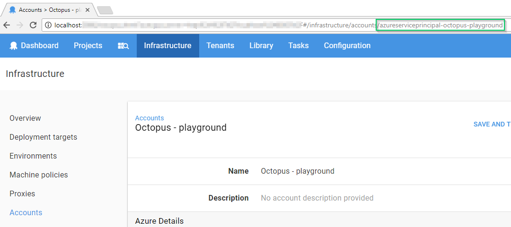

You may want to use a different Azure subscription depending on which environment you are targeting. This can be achieved by binding the account field to an Octopus variable:

1. Add an [Azure Subscription Account](/docs/infrastructure/azure/index.md) to Octopus.
   * If you want to use the Account ID in your variable, open the account you just added from {{Infrastructure,Accounts,[Account name]}} and copy the account ID from the URL.

   
   ​    
   The Account ID is the value after the last `/` in the Url.

2. Create a variable in your project and set the Account ID or Account Name as its value. Make sure to scope this variable to the Environment/Role/Target where you'll be using it.

   

3. If you are deploying an **Azure Web App**, you will need to create an [Azure Web App Target](/docs/deployment-examples/azure-deployments/deploying-a-package-to-an-azure-web-app/index.md) for each environment.

   If you are deploying an **Azure Cloud Service**, you will need to create an [Azure Cloud Service Target](/docs/infrastructure/azure/cloud-service-targets/index.md) for each environment.

4. Once you start the deployment, Octopus will resolve the variables that hold the Account and WebApp/Cloud Service info based on their scope. To use a different account, repeat steps 1-3 and scope the new account variable accordingly.
