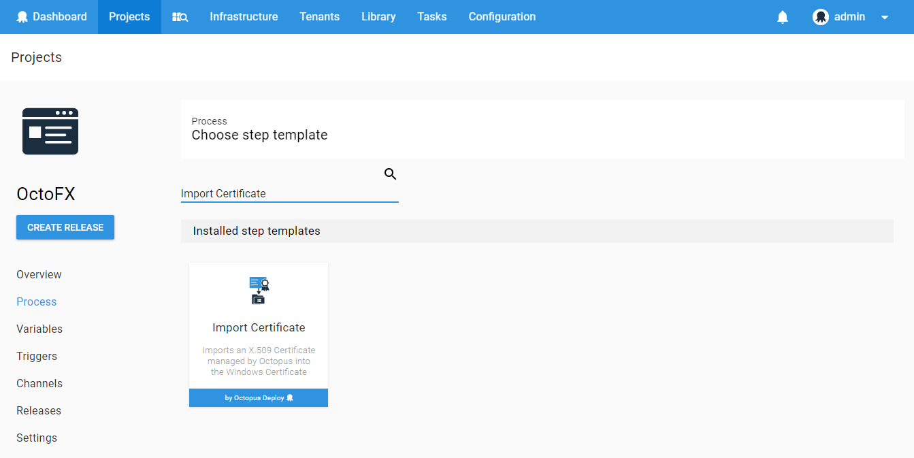
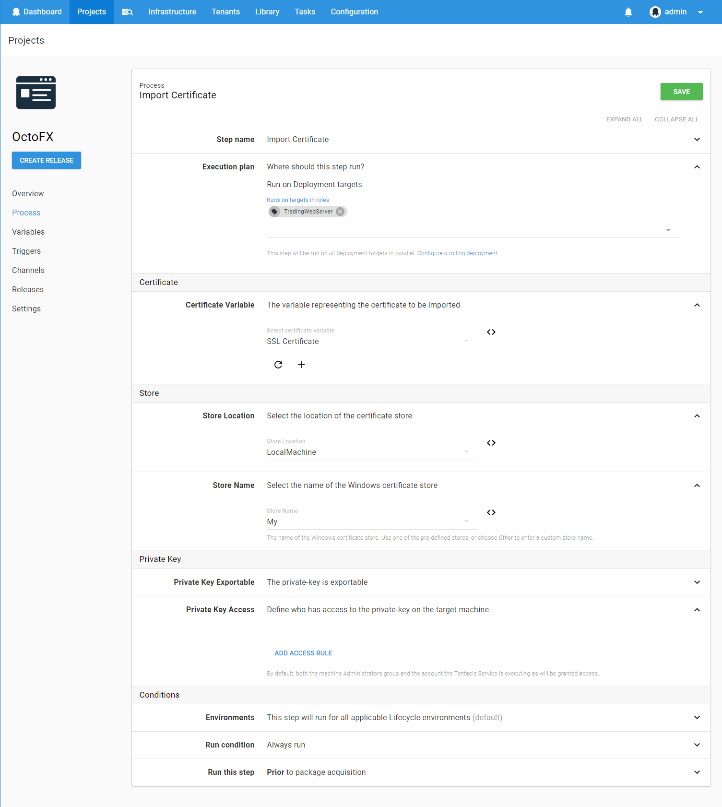

The *Import Certificate* step can be used to import a certificate managed by Octopus into a Windows Certificate Store.

## Import Details

### Store Location
The certificate can be imported to the *Local Machine* or *Current User* locations, or enter a *Custom User* to install the certificate for.

### Store Name
The store name can be one of the built-in Windows stores, or you can define a custom store name to use.

### Private Key
If the certificate has a private-key, it can be marked as exportable, and access can be granted to specific users.   
The Administrators group on the target machine will always be granted access to the private-key.

## Recommended Practice

:::hint
It is recommended to allow Octopus to perform the initial import of a certificate.
:::

This avoids potential issues with accessing certificates imported by different accounts.      
If the certificate is already imported on the target machine and issues are encountered, try removing the certificate.    
