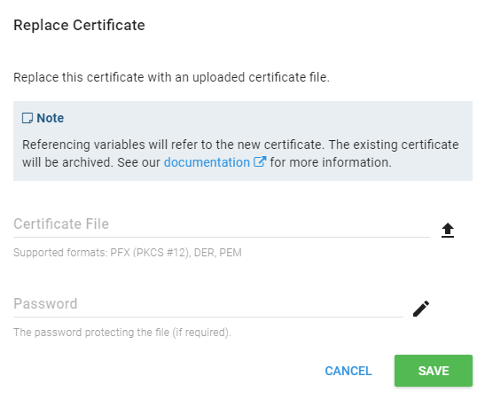

The Replace Certificate feature is designed for the scenario where a new certificate has been obtained via a renewal process.

The new certificate will assume the ID of the previous certificate, meaning all referencing variables will now refer to the new certificate.

The previous certificate will be [archived](archiving-and-deleting-certificates.md).

To replace a certificate, navigate to the certificate details page and click 'Replace':

Select the replacement certificate file and password (if required):

