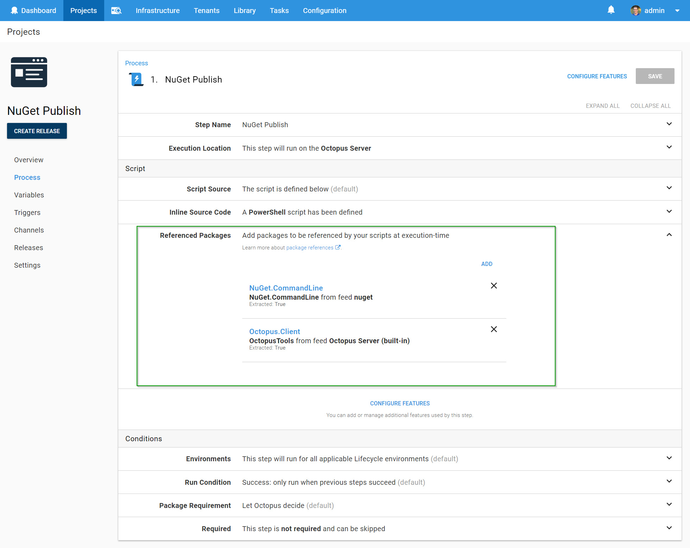
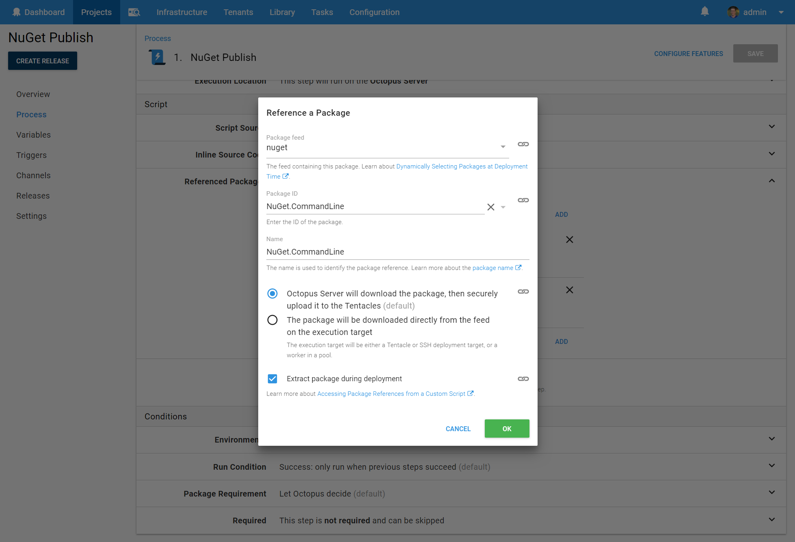

Octopus also allows you to run standalone scripts as part of your deployment process. You can run a script on the Octopus Server or across the deployment targets in roles. You can run scripts contained in a package, or ad-hoc scripts you've saved as part of the step. For information about adding a step to the deployment process, see the [add step](/docs/deployment-process/steps/index.md) section.

:::success
You can use all of the features we provide for [custom scripts](/docs/deployment-examples/custom-scripts/index.md), like [using variables](/docs/deployment-examples/custom-scripts/index.md#Customscripts-Variables), [passing parameters](/docs/deployment-examples/custom-scripts/index.md#Customscripts-Passingparameterstoscripts), publishing [output variables](/docs/deployment-examples/custom-scripts/index.md#Customscripts-Outputvariables) and [collecting artifacts](/docs/deployment-examples/custom-scripts/index.md#Customscripts-Collectingartifacts).
:::

## Choosing Where the Script Will Run {#Standalonescripts-Choosingwherethescriptwillrun}

:::hint
The ability to run scripts on the Octopus Server shipped in **Octopus 3.3**.
:::

When adding a script you choose where the script will run, and in which context the script will run.

Choosing the right combination of **Target** and **Roles** enables some really interesting scenarios. See below for some common examples:

| Target            | Roles                  | Description                              | Variables                                | Example scenarios                        |                              |
| ----------------- | ---------------------- | ---------------------------------------- | ---------------------------------------- | ---------------------------------------- |
| Deployment target | `web-server` `app-server` | The script will run on each deployment target with either of the `web-server` or `app-server` roles | The variables scoped to the deployment target will be available to the script. For example, `Octopus.Machine.Name` will be the deployment target's name | Apply server hardening or ensure standard pre-requisites are met on each deployment target |
| Octopus Server    |                        | The script will run once on the Octopus Server | Scope variables to the Step in order to customize variables for this script | Calculate some output variables to be used by other steps or run a database upgrade process |
| Octopus Server    | `web-server`           | The script will run on the Octopus Server on behalf of the deployment targets with the `web-server` role. The script will execute once per deployment target | The variables scoped to the deployment target will be available to the script. For example, `Octopus.Machine.Name` will be the deployment target's name | Remove web servers from a load balancer as part of a [rolling deployment](/docs/deployment-patterns/rolling-deployments.md) where access to the load balancer API is restricted |

:::hint
Bash scripts are not able to be run on the Octopus Server, even if Bash is installed on that server
:::

## Choosing Where to Source the Script {#Standalonescripts-Choosingwheretosourcethescript}

:::hint
The ability to source your script from a package shipped in **Octopus 3.3**
:::

You may also select the source of the script, either:

- An ad-hoc or inline script, saved as part of the step itself, or:
- A script file inside a package (shown below).

:::success
**Scripts from packages, versioning and source control**
Using scripts from inside a package is a great way to version and source control your scripts. (You can be assured the correct version of your script will be run when deploying each version of your application.) Both methods (ad-hoc versus packaged) have benefits and suit different applications: choose the method best suited to your situation.
:::

:::hint
When sourcing a script from a file inside a package you cannot choose to run the step before packages are acquired.
:::

## Passing Parameters to Scripts {#Standalonescripts-Passingparameterstoscripts}

:::hint
The ability to pass parameters to scripts was added in **Octopus 3.4**.
:::

When you call external scripts (sourced from a file inside a package) you can pass parameters to your script. This means you can write "vanilla" scripts that are unaware of Octopus, and test them in your local development environment. Read about [passing parameters to scripts](/docs/deployment-examples/custom-scripts/index.md#Customscripts-Passingparameterstoscripts).

## Referencing Packages

:::hint
The ability to reference packages was added in **Octopus 2018.8**
:::

In addition to being able to [source the custom script from a package](#Standalonescripts-Choosingwheretosourcethescript), it is often desirable to reference other packages.  Scenarios where this can be useful include:

- Executing a utility contained in a package
- Deploying a package in a manner for which there is no built-in steps available; for example pushing a package to a Content-Management-System 
- Performing tasks which require multiple packages.  For example:
    - Executing `NuGet.exe` to push another package (e.g. `Acme.Web`)
    - Referencing multiple container images and performing `docker compose`

Package references can be added regardless of whether the script is sourced inline or from a package.

### Package Reference Fields

When adding a package reference, you must supply:

#### Package ID
The ID of the package to be referenced, or a variable-expression.

#### Feed
The feed the package is sourced from, or a variable-expression.

#### Name {#package-reference-fields-name}
A unique identifier for the package-reference. In general the Package ID is a good choice for the name. The reasons the Package ID may not be suitable as the name include:
    - The Package-ID may be bound to a variable-expression (e.g. `#{Acme.Package.Id}`). Some of the places the name is used are not suitable for variable-expressions.
    - In rare situations it may be desirable to reference multiple versions of the same package.  In this case they would need to be given different names. 

#### Extract
Whether the package should be extracted. See [below](#referencing-packages-package-files) for information on the package file locations. 
This will not be displayed for certain package-types (i.e. container images). This may also be bound to a variable-expression.

### Accessing Package References from a Custom Script

Having added one or more package references, it's reasonable to assume you wish to do something with them in your custom script.  

#### Package Variables
Package-references contribute variables which can be used just as any other variable. These variables are (assuming a package-reference named `Acme`):

| Variable                                      | Description                                            | Example value |
| ----------------------                        | ------------------                                     | ------------- |
| Octopus.Action.Package[Acme].PackageId        | The package ID                                         | Acme.Web 
| Octopus.Action.Package[Acme].FeedId           | The feed ID                                            | feeds-nuget-org 
| Octopus.Action.Package[Acme].PackageVersion   | The version of the package included in the release     | 1.4.0 
| Octopus.Action.Package[Acme].ExtractedPath    | The absolute path to the extracted directory (if the package is configured to be extracted)       | C:\Octopus\Work\20180821060923-7117-31\Acme 
| Octopus.Action.Package[Acme].PackageFilePath    | The absolute path to the package file (if the package has been configured to not be extracted)  | C:\Octopus\Work\20180821060923-7117-31\Acme.zip 
| Octopus.Action.Package[Acme].PackageFileName    | The name of the package file (if the package has been configured to not be extracted)           | Acme.zip 

#### Package Files {#referencing-packages-package-files}

If the package reference was configured to be extracted, then the package will be extracted to a sub-directory in the working-directory of the script. This directory will be named the same as the package-reference.  For example, a package reference named `Acme` would be extracted to directory similar to `C:\Octopus\Work\20180821060923-7117-31\Acme` (this is obviously a Windows directory; a script executing on a Linux target may have a path such as `/home/ubuntu/.octopus/Work/20180821062148-7121-35/Acme`). 

If the package reference was _not_ configured to be extracted, then the un-extracted package file will be placed in the working directory. The file will be named as the package reference name, with the same extension as the original package file.  For example, for a package reference named `Acme`, which resolved to a zip package, the file would be copied to a path such as `C:\Octopus\Work\20180821060923-7117-31\Acme.zip` (for Linux: `/home/ubuntu/.octopus/Work/20180821062148-7121-35/Acme.zip`). 

These locations were designed to be convenient for use from custom scripts, as the relative path can be predicted, e.g. `./Acme` or `./Acme.zip`.  If the absolute path is required the variables above may be used. 