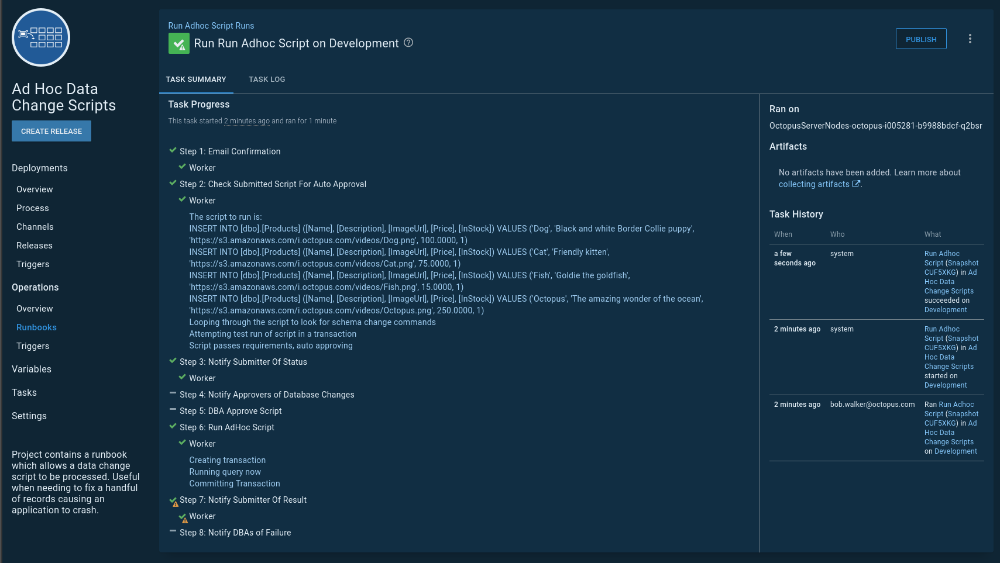

Sometimes the right conditions in an application exist that result in a lousy record getting inserted.  It is impossible to reproduce, and it has only happened once or twice.  The priority to fix the software bug is low.  But the data needs to be fixed.  That is one record in one environment in one database.  It doesn't make sense to send a script to fix the data through the standard automated database deployment pipeline.

The majority of the time, this is a manual process.  The process varies from company to company.  It could be as simple as emailing the script to a DBA to as complicated as submitting a lengthly request form.  

Just like database deployments, it is possible to automate this.  Automation has multiple advantages over a manual process.

1) A consistent set of business rules can be applied.  For example, no schema changes, and only insert or update statements are allowed.
2) The script can run through an auto-approval script.  The auto-approval ensures the rules are followed.  It can also run the script in a transaction and roll it back.  If the script changes more than a set number of rows say 10, then a DBA must look at it.
3) An automated process is faster, and it frees up the people running those scripts to do more meaningful work.
4) The process can also send out notifications and an audit trail easier to search through than email.

## Leveraging Runbooks for Adhoc data change scripts

Runbooks were added to Octopus Deploy in version: **2019.11**.

Runbooks provide an excellent means of run ad-hoc data change scripts.  Runbooks don't require a release to be created.  But they still have the same functionality, such as prompted variables and auditing as a typical Octopus Deployment.  Typically we find this process is a good starting point.

1) Runbook run is created, the script to run and the database information is provided via [prompted variables](/docs/projects/variables/prompted-variables.md).
2) The script to run is analyzed for any schema change commands, and it is run and immediately rolled back in a transaction.  
    1) If no schema change commands are found, the script ran successfully, and it updated less than X number of rows then set an DBA Approval Required [output variable](/docs/projects/variables/output-variables.md) to `False`
    2) If any of those conditions fail then set the DBA Approval Reuqired [output variable](/docs/projects/variables/output-variables.md) to `True`
3) Notify the approvers when that DBA Approval Required [output variable](/docs/projects/variables/output-variables.md) is `True` using [run conditions](/docs/deployment-process/conditions/index.md#run-condition)
4) Pause for a [manual intervention](/docs/deployment-process/steps/manual-intervention-and-approvals.md) when that DBA Approval Required [output variable](/docs/projects/variables/output-variables.md) is `True` using [run conditions](/docs/deployment-process/conditions/index.md#run-condition).
5) Run the script on the desired database.
6) Notify the DBAs and the person who submitted the script the script had finished running.

For the example process, only the database name and script are prompted variables.  The prompted variables allow a person to enter values prior to running the runbook.  In this example, a `create table` command is also included in the data changes.

The auto-approval script leverages the [write highlight](/docs/deployment-examples/custom-scripts/logging-messages-in-scripts.md) command so important messages are shown on the task summary screen.  The `create table` command was detected, requiring a DBA to approve the script.  The DBA has a choice to accept the script or reject it.  There are some cases when a create table is necessary, for example, creating a temporary table.

In another example, the same script, sans `create table` command is submitted.  This time it passes the auto-approval and is immediately executed.

You can view this example on our [samples instance](https://samples.octopus.app/app#/Spaces-106/projects/ad-hoc-data-change-scripts/operations/runbooks/Runbooks-225/overview).