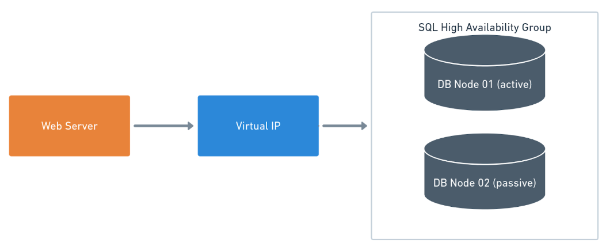

Deploying an Web Application or a Service is very straight-forward. Install the Tentacle on the server to be deployed to. Databases are different. Production databases are typically clusters or high-availability groups. They comprise more than one node hidden behind a VIP or virtual IP Address.

Database deployment tooling doesn't need to run an executable directly on the database server.  Rather it needs to run somewhere, which connects to the database over a port (1433 for SQL Server, 1521 for Oracle, 3306 for MySQL, and 5432 for PostgreSQL) as a specific user to run scripts.  That user account running the scripts needs to have permissions to modify the database.  

This section will address where to install the tentacle and basics on permissions.