Install Tentacles on jump boxes or leverage [Workers](https://octopus.com/workers) for database deployments.  Those VMs will handle all the heavy lifting.    

Don't install tentacles directly on your database servers. For high-availability groups or clusters, there are 1 to N nodes. The nodes are kept in sync by replication.  You only need to deploy to the primary node.  Replication will take of applying that change to all the nodes.  Installing a Tentacle on each node will not work. Octopus Deploy will see multiple Tentacles and attempt to deploy to both nodes.

SQL PaaS, such as [AWS RDS](https://aws.amazon.com/rds/) or [Azure's SQL](https://azure.microsoft.com/en-us/services/sql-database/), are hosted database servers. They don't allow anything to be installed on them.

Don't use the tentacles on your web or application servers.  A recommended security practice is the principle of least privilege. The account used by the website to connect to the database server should have restricted permissions. For example, the website uses stored procedures; the account would only have permissions to execute those stored procedures. Whereas, the account used for deployments needs elevated permissions. This is because that account needs to make schema changes.

**Please Note:** This document only covers the infrastructure side of database deployments.  You will still need to configure a project in Octopus Deploy to handle the actual deployments.  

## Workers

We recommend using [Workers](https://octopus.com/workers) to handle all your database deployments.  Workers have several advantages:

1) You can run multiple deployments on them at the same time.
2) You can place multiple VMs into a worker pool.  If a VM were to go down during a deployment, another VM would step in and take it's place.

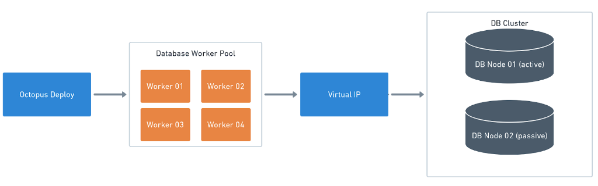

**Please Note:** Workers were added in version **2018.7.0.**

### General Worker Pool Configuration

We recommend having at least one separate worker pool for database deployments.  Out of the box, the worker in the default worker pool is your Octopus Deploy Server.  We don't recommend running database deployments off your Octopus Deploy server directly.  You will run into a variety of issues.

1) It is common you'll need to install additional tooling or SDKs unrelated to Octopus Deploy.
2) The database deployment tools might need to run on Linux while Octopus Deploy is running on Windows.
3) It can slow down other deployments; the Octopus Deploy server will be allocating resources for database deployments and trying to do everything else.

Having separate worker pools per deployment type is highly recommended as well.  

**Please Note:** A worker can be assigned to more than one pool.

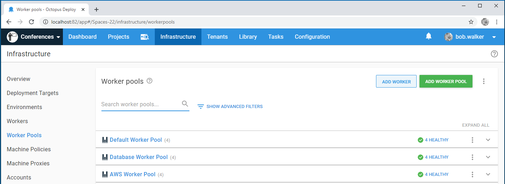

To create a new worker pool, go to `Infrastructure` -> `Worker Pools` and then click on the `Add Worker Pool` button.

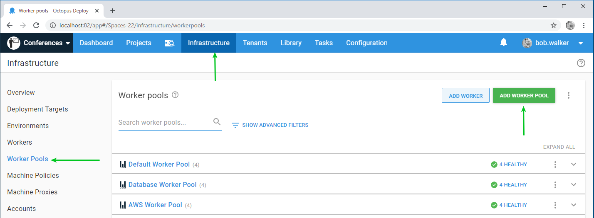

In the modal dialog, add the name of the worker pool you wish to add.

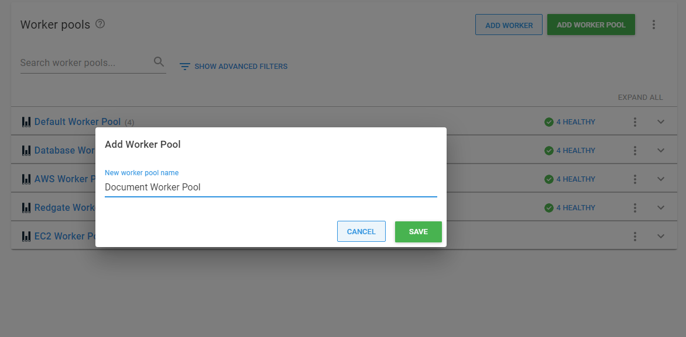

Once you click the `Save` button, you will be presented with the Worker Pool maintenance screen.  Your options are:

- Name: The name of the worker pool
- Default: Indicates if this is the default worker pool.  **Warning:** Changing this may lead to failed builds, as all tasks previously done in the old default pool will now be done on this pool. 
- Description: A brief description of the worker pool.

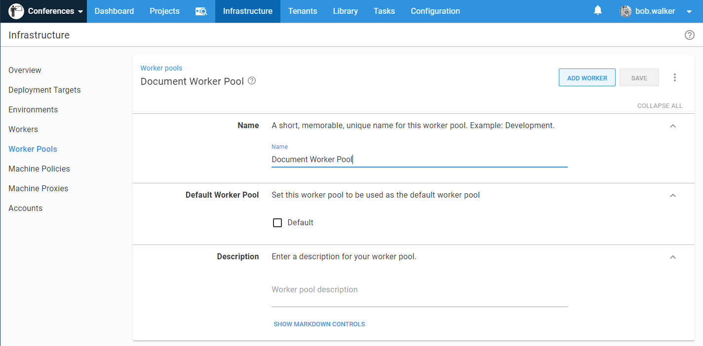

Adding a worker into the pool is just like adding a tentacle.  You are given a choice of listening, polling, and in the case of Linux, SSH.

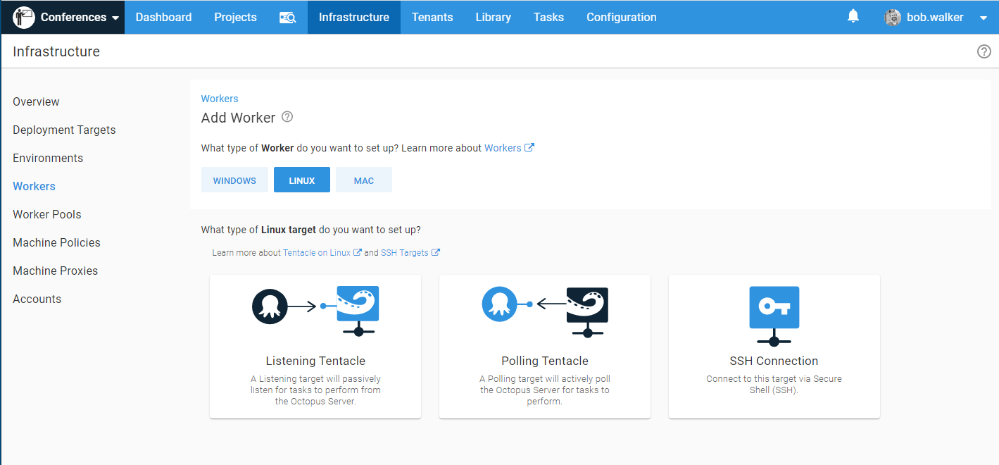

### Using Worker Pools in a deployment process

Once you've added a worker pool, a new option will appear in the deployment process.  Now you'll get the option to run once on a worker and then you'll be able to choose the worker pool.

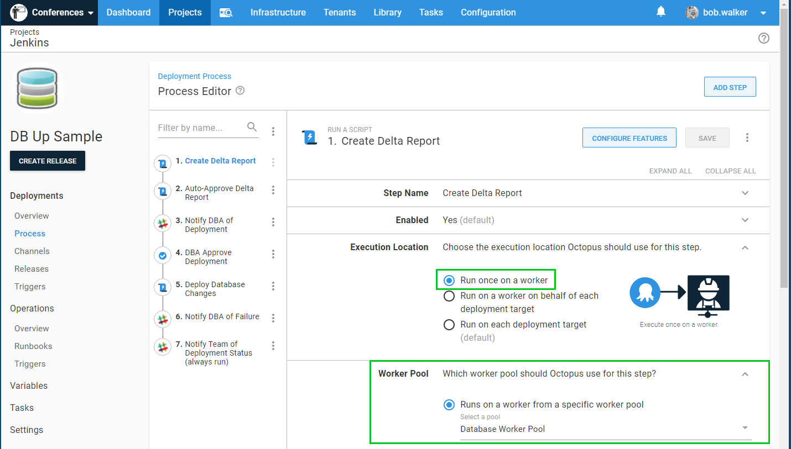

**Please note:** Certain steps do not allow you to pick a worker pool.  That list includes `Deploy to IIS`, `Deploy a Windows Service`, and `Deploy a Package`.  If you are using a step template that relies on that functionality, you will need to leverage jump boxes (explained below).

### Worker Pool Per Environment After Octopus Deploy 2020.1

A common security practice is to leverage Active Directory service accounts.  But each environment has its own service account.  The account which deploys to `Development` is preventing from deploying to `Test.`  The account which deploys to `Production` is prevented from deploying to `Development.`  This is accomplished by leveraging integrated security and running the Octopus Tentacle [as a specific user account](https://octopus.com/docs/infrastructure/deployment-targets/windows-targets/running-tentacle-under-a-specific-user-account).  For that to work, you'll need to have a worker pool per environment.

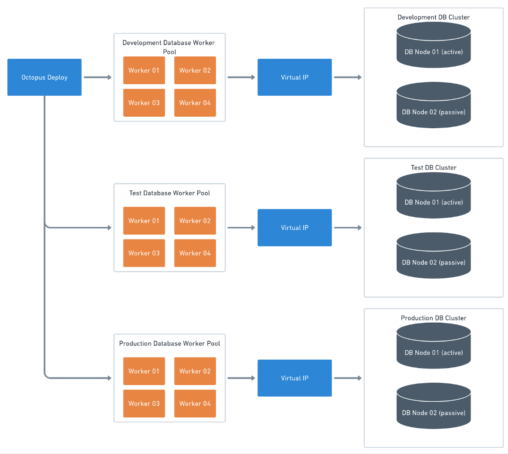

To start, we need to create a dedicated worker pool for each environment.

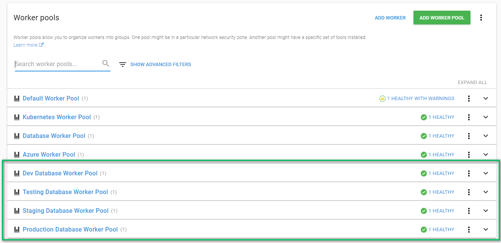

In your project variables, or in your variable set, create a new variable.  Click the `Change Type` option and select `Worker Pool`.

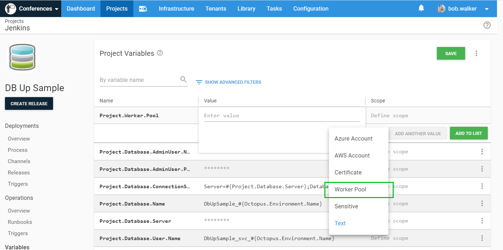

That will bring up a modal dialog for you to select the worker pool.

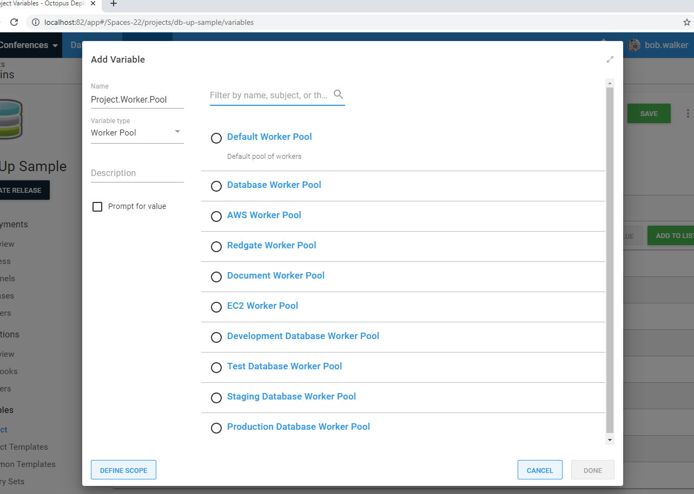

With that option, you can scope worker pools to specific environments.

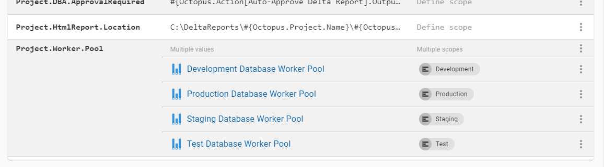

In the deployment process, a new option has appeared under worker pool `Runs on a worker from a pool selected via a variable`.  Update the desired steps to use that variable.

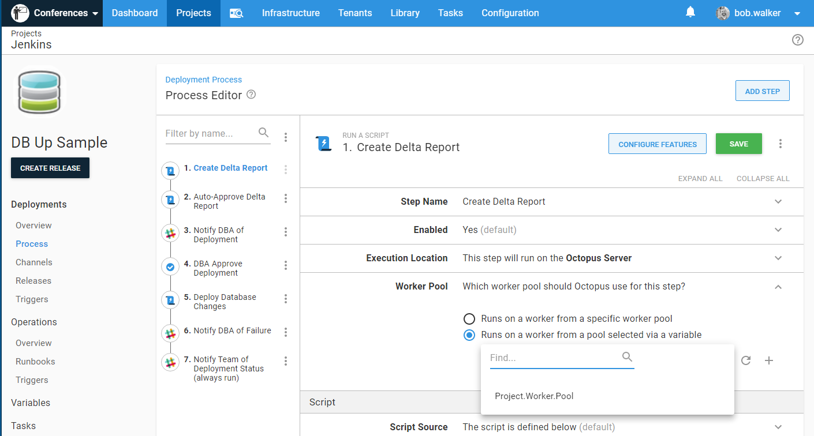

### Worker Pool Per Environment Before Octopus Deploy 2020.1

If you are using a version of Octopus Deploy released prior to 2020.1, never fear, that functionality to provide this has been built-in to Octopus Deploy since **2018.7.0**.  It has just been hidden.  To start, we need to create a dedicated worker pool for each environment.

Next, create cloud region deployment targets. The Cloud region is a bit of a misnomer. It is a fancy way of saying, "grouped deployment targets."

**Please Note:** Cloud Region deployment targets do NOT count against your license.

You will create a cloud region for each environment.  In this example, a new role called `DbWorker` was created for these cloud regions. This will help differentiate these new deployment targets.  Make a note of the worker pool for that cloud region.  Select the one which matches your environment of choice.

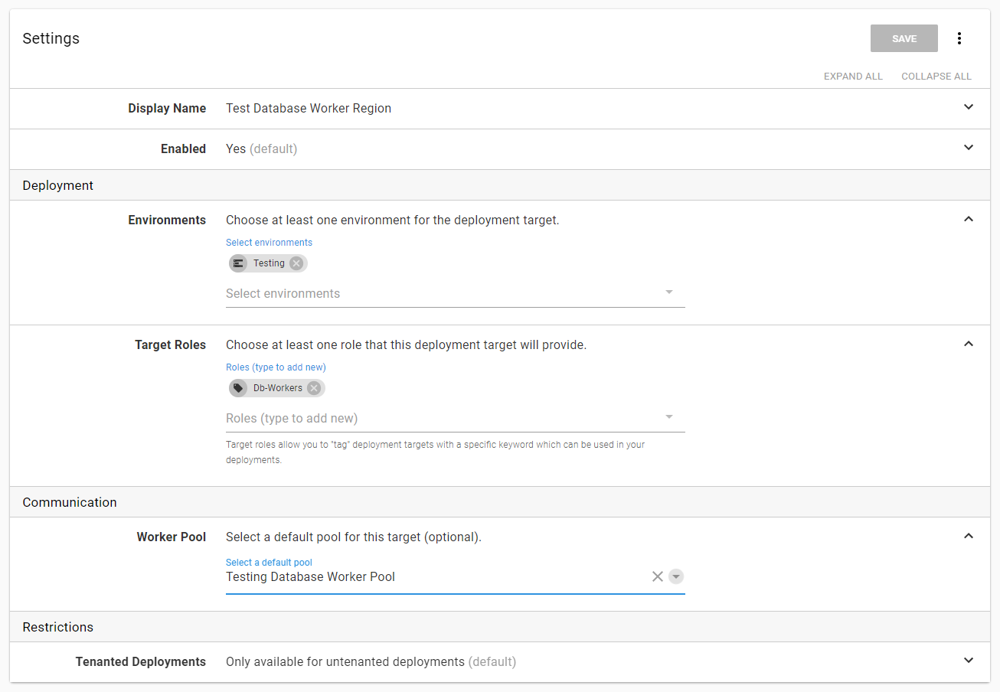

When done, you will end up with a cloud region per environment.

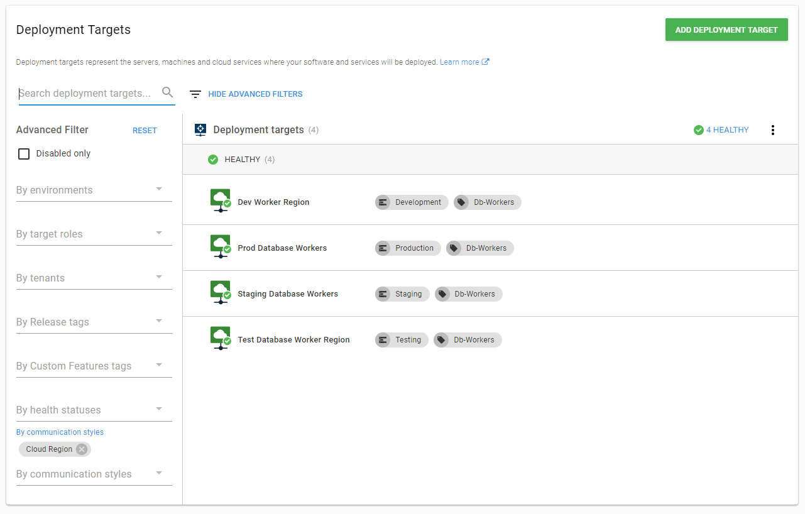

The execution location will now be a target role.  This is why the `DbWorker` role was created.  That tells the deployment to use the new cloud region created.  The cloud region will use the worker pool.

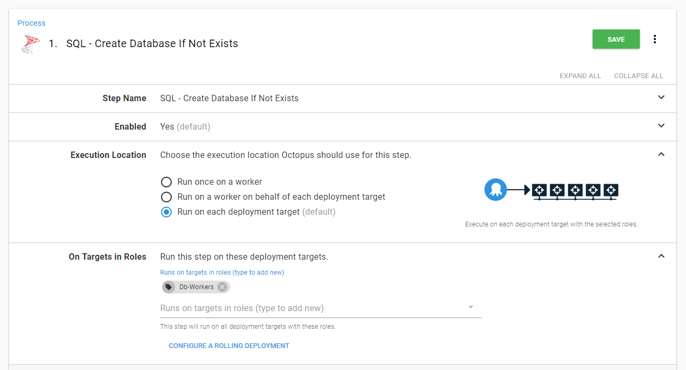

That step will need to be repeated for each step in the process.

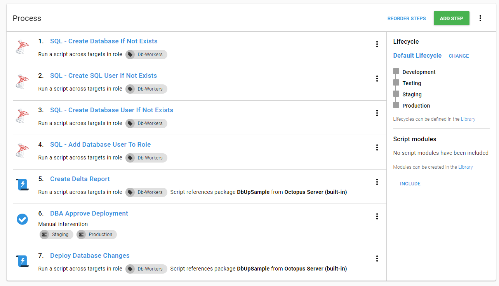

Now, when a release is performed, it will use the environment-specific worker pool.  In the example below, a new release to the `Test` environment was done using the `Test Database Worker Region`.

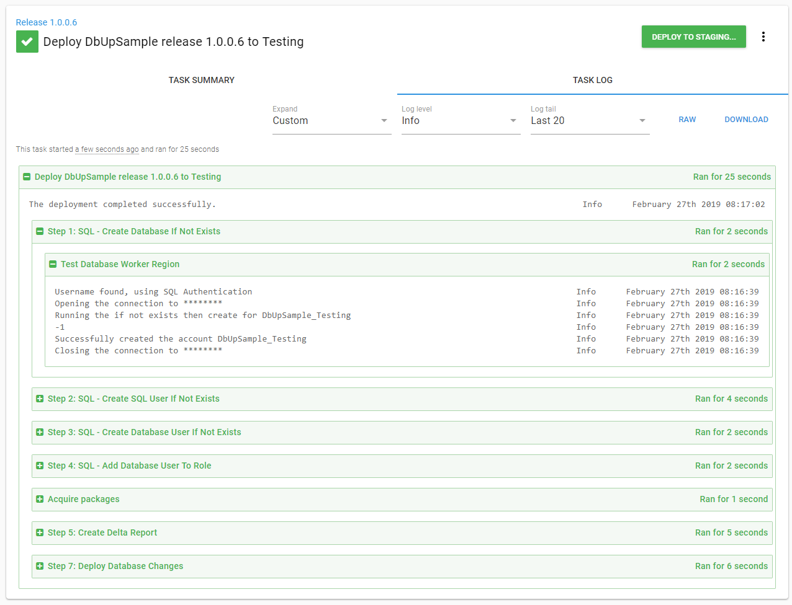

### Database Deployments without Workers

If you are using an older version of Octopus Deploy, or your license limits you to one worker, then you will need to install tentacles on a jump box.  The jump box sits between Octopus Deploy and the Database Server VIP.  The Tentacle is running as a [service account](/docs/infrastructure/deployment-targets/windows-targets/running-tentacle-under-a-specific-user-account.md) with the necessary permissions to make schema changes.  The tooling chosen for database deployments is installed on the jump box.

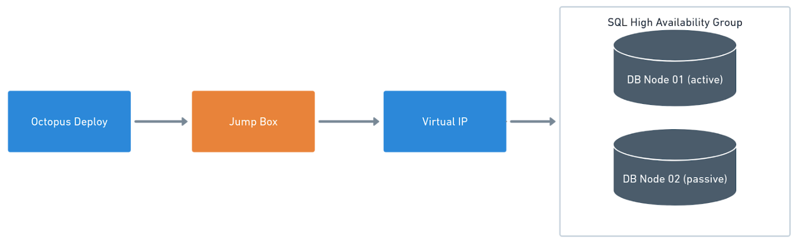

In the event of multiple domains, a jump box would be needed per domain.  This might be seen where there is a domain in local infrastructure and another domain in a cloud provider such as Azure as long as port 10933 is open (for a listening Tentacle) or port 443 (for a polling Tentacle) Octopus will be able to communicate to the jump box.

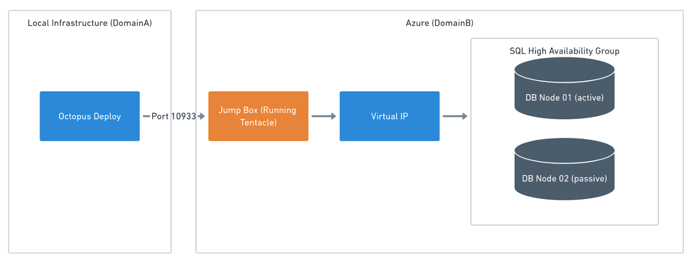

It is possible to install many Tentacles on a single server.  Please [read here](/docs/administration/managing-infrastructure/managing-multiple-instances.md) for more information.  

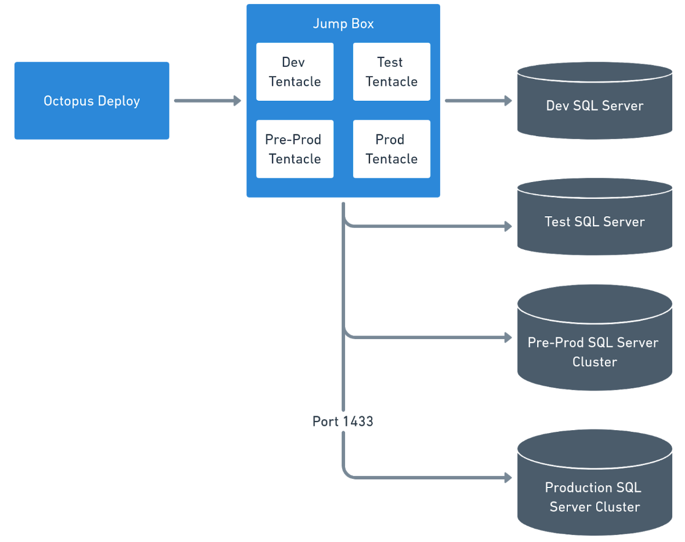