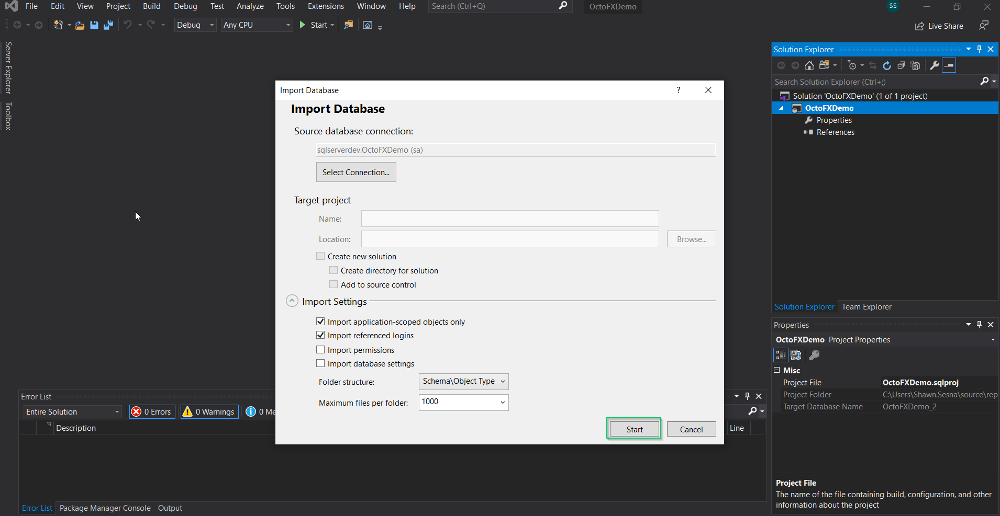
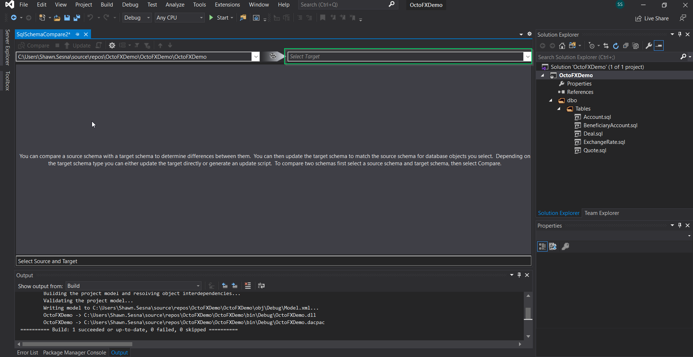

One of the most complex aspects of full stack deployments is automating database changes.  There are two schools of thought in how changes should be implemented; state-based and migration-based.  The state-based approach captures the state of the database and uses that to compare against the target.  Differences are automatically scripted out and applied to the target so it matches the given state.  The migration-based approach starts with an intial script to define your database, then uses versioned scripts applied in sequence to migrate the database over time.

## Microsoft Data-tier application package (DACPAC)
Starting with SQL Server 2008, Microsoft introduced a new project type called Database Projects.  These projects use the state-based approach to applying changes to your database.  Initially, Database Projects were not available as part of the initial Visual Studio install and had to be downloaded separately. This download was referred to as SQL Server Data Tools (SSDT) and included project types for Database projects, SQL Server Reporting Services (SSRS) projects, and SQL Server Integration Services (SSIS) projects.  Modern versions of Visual Studio has this available to choose when installing or modifying an existing installation.

### Installing SSDT for Visual Studio
For earlier versions of Visual Studio such as 2015 and below, installing the SSDT was a matter of locating the download for your version of Visual Studio.  Microsoft has provided a convenient way of finding the appropriate download on [this page](https://docs.microsoft.com/en-us/sql/ssdt/previous-releases-of-sql-server-data-tools-ssdt-and-ssdt-bi?view=sql-server-ver15).

For more modern versions of Visual Studio (2017+), the option appears on the project type selection screen during intial installation or when modifying an existing installation.

#### Visual Studio 2017 Installer
To install the SSDT for Visual Studio 2017, scroll to the `Web & Cloud` category and select the `Data storage and processing` option

#### Visual Studio 2019 Installer
To install the SSDT for Visual Studio 2019, scroll to the `Other Toolsets` category and select the `Data storage and processing` option.

For both versions Visual Studio, a new project type of SQL Server Database Project:

Visual Studio 2017

Visual Studio 2019

(The remainder of the images in this guide will use Visual Studio 2019)

### Connecting the project to the database
Once you've chosen the SQL Server Database Project type, chose Next.  Fill in the project name and click Create

Now that we have the project created, let's connect it to the database.  For this guide, I've already created an empty database called OctoFXDemo.

Right-click on the Project -> Import -> Database

Click on Select Connection

Fill in the details for connecting to the server and database.  In this screenshot, I'm using a SQL Account to connect to the database server simply because I'm not running an Active Directory domain.  Otherwise I could have chosen Windows Authentication.  Click Connect when done.

Once we've selected the connection, the Start button will enable.  Click Start to begin the process

You should see the following once the import has completed.

Our import didn't do much because this was an empty database, but we have something to comapre the project with now.

At this point, we can start creating our database schema (tables, views, stored procedures, etc...)

### Comparing projecto the database schema
Once we've created some objects in our project, we can compare the project to the target database.  Right-click on the Project, then choose `Schema Compare...`

Select the target database connection

Once you've selected the target, click on Compare

Visual studio will then compare the project to the database and list out what it will do on a deployment

:::hint
For databases that have a dependency on other databases, it is possible to add a reference to another database projects.  This should be done with caution as you could end up with a circular dependency where database A depends on database B and database B depends on database A.  In this situation, neither database project will compile.
:::

### Build definition
Building the SQL Server Database Project can be done pretty much any build server (Azure DevOps, TeamCity, Jenkins, Bamboo, etc...).  The requirements for building are similar to those of Visual Studio itself, MSBuild and the SSDT.  The recommended approach to this is to install the Visual Studio build tools on the build agent(s) for the version of Visual Studio that you're using.  Just like Visual Studio, if you're using older versions, you'll need to locate the SSDT and install that separately.  If you're using the more modern versions, the option to install will SSDT will be on the Visual Studio tools installer.  This guide will use Azure DevOps as the build platform, but any build server can do this.

#### Creating the definition
From our Azure DevOps repo, click on Pipelines then New Pipeline

Because it's easier to follow, we're going to use the classic editor without YAML

