[Flyway](https://flywaydb.org/) is an open source [migrations-based](https://octopus.com/blog/sql-server-deployment-options-for-octopus-deploy) database deployment tool supported by Redgate.  It's a command-line utility that uses Java to execute script files against several database technologies such as Microsoft SQL Server, MySQL, MariaDB, and PostgreSQL.  Along with a free Community edition, there is also a paid Pro and Enterprise versions available.  Flyway is a popular tool with the open source community.  This guide will demonstrate how to use Flyway with a MySQL database.

## Including Flyway with your project
Adding Flyway to your project is pretty simple, just [download the archive](https://flywaydb.org/download/) file and extract it to disk.  Once the files are extracted, move them into your project folder structure.  The Flyway download comes with everything it needs to execute, including a version of the Java Runtime Environment (JRE).  

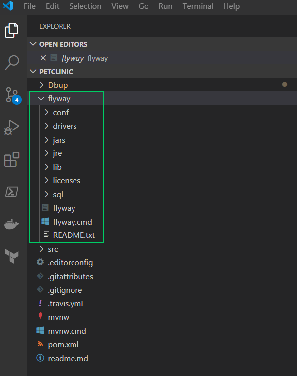

:::hint
If Flyway doesn't find Java installed on the machine (detected by the presence of the JAVA_HOME environment variable), it will fall back to the included JRE.  The included version of the JRE has the .exe and .dll files located within a `bin` subfolder.  It is often the case that source control will ignore any folder with the name `bin`, so be careful when including a Flyway project and you need the included JRE.
:::

## Adding scripts to your Flyway project
Within the Flyway folder structure is a folder called `sql`.  This folder is where all of your scripts are placed.  To control the execution order, the [documenation](https://flywaydb.org/documentation/) states that the files need to be named in a specific way.  Flyway is capable of doing Versioned Migrations, Undo Migrations, and Repeatable Migrations.  All script files follow this naming structure:

- Prefix: V for Versioned, U for Undo, and R for Repeatable (this guide will focus on Versioned migrations)
- Version: Numbers with dots or underscores as separators
- Separator: Two underscores
- Description: A meaningful name with underscores or spaces to separate the words
- Suffix: Usually `.sql`

Examples of what a filename would look like are `V1__initDB.sql`, `V1_1__populateDb.sql`, or `V1.1__populateDb.sql`

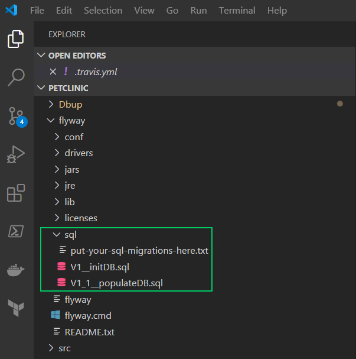

## Executing a migration
As previously stated, Flyway is a command-line utility.  Flyway was originally designed to be cross-platform so the downloaded archive will work on either Windows or Linux.  For Windows, the `flyway.cmd` file is used when executing.  For Linux, the file `flyway` is a Bash script for execution.  Both OS methods use the same arguments for deployment.

## Including Flyway in your build
Flyway itself is already compiled, so there's no need to do anything for building.  However, it can still be included in a build process to package it up for deployment with Octopus Deploy.  This guide will use Jenkins as the build platform.  

### Add Package step
Within a Jenkins project, click Add Build Step and choose `Octopus Deploy Package application`

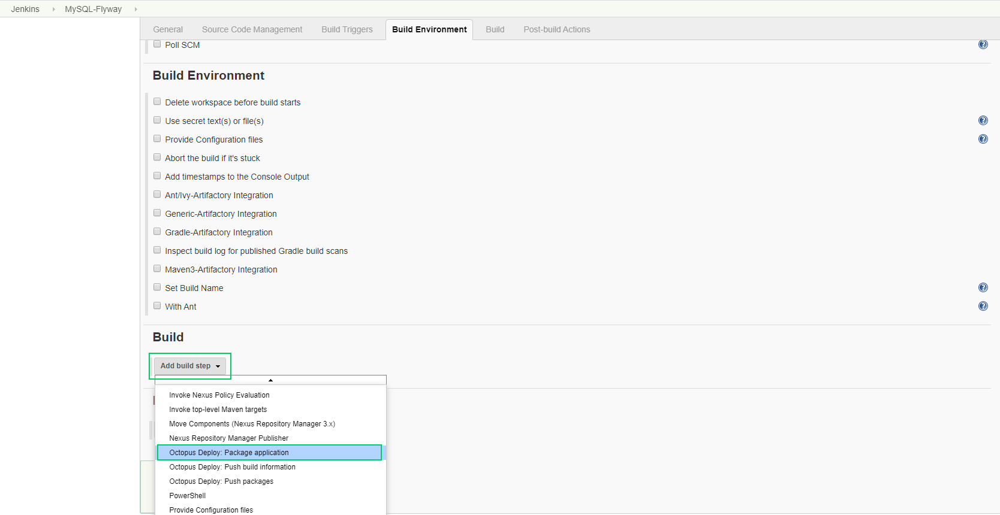

:::hint
You will need to make sure you install the Octopus Deploy Jenkins plugin to make use of these templates.  In addition, you'll need to download the Octopus Deploy CLI on to the Jenkins build agent(s)
:::

Fill in the inputs
- Package ID: A unique name for this package like `petclinic.mysql.flyway`
- Version Number: The unique version number for this package
- Package format: zip | nuget
- Package base folder: ${WORKSPACE}\flyway
- Package include paths:
- Package output folder: ${WORKSPACE}

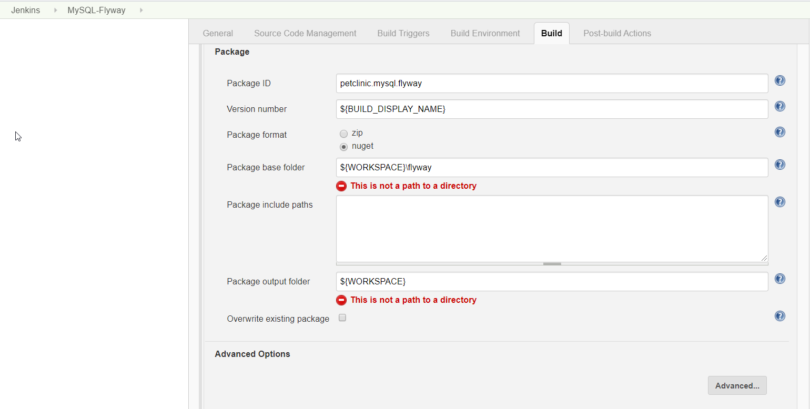

:::hint
To configure Jenkins to produce build numbers in a format like yyyy.mm.dd.hhmmss (2020.03.25.145344), install the following plugins
- Build Name and Description Setter
- Date Parameter Plugin


Once those are installed, configure your Jenkins project to be parameterized in the General tab

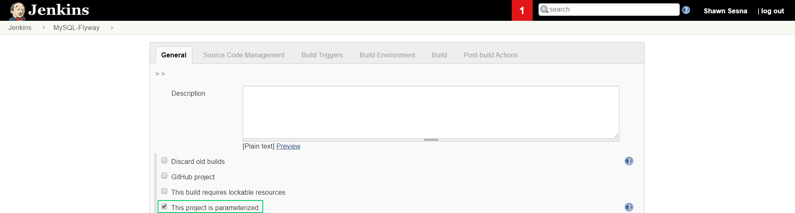

Then use the Date parameter to create some parameters

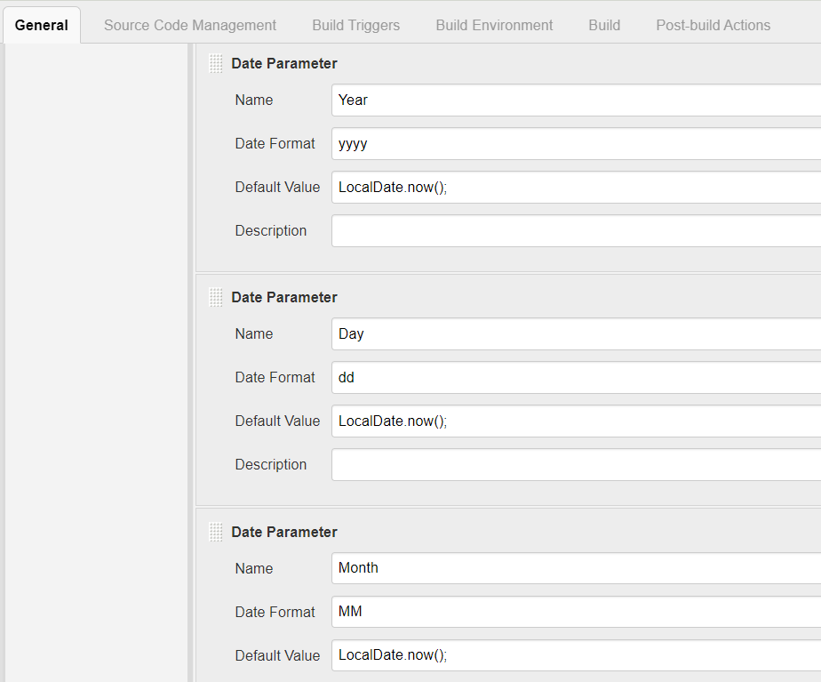

Lastly, set the build name in the Build Environment section

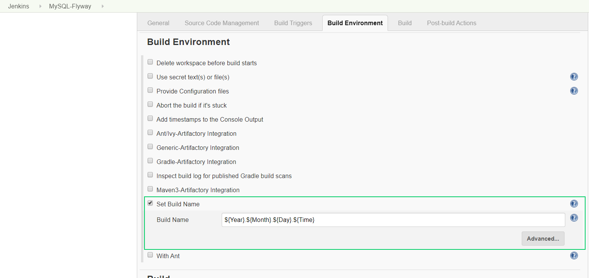
:::

### Add push step
Add an Octopus Deploy Push step to your build


Fill in the fields
- Octopus Deploy Server: The values for the drop-down for this come from the Jenkins server configuration.  To configure this, go to Jenkins home screen -> Manage Jenkins -> Configure System then scroll down to the Octopus Deploy Plugin section.
- Space: Select the space to deploy to.  You can leave this blank for the Default space
- Package paths: `/*.nupkg`


Those are the only two steps that are needed to package and push a Flyway project to Octopus Deploy.  Once saved, click on `Build with Parameters`

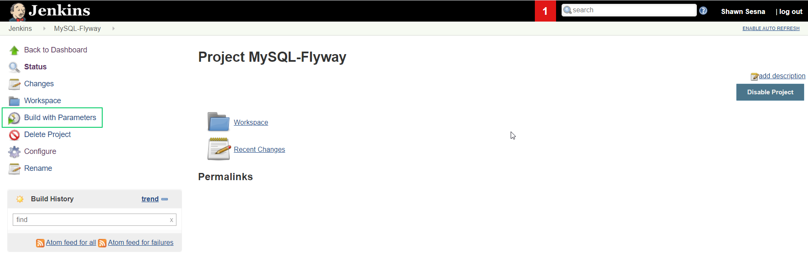

The generated Date parameters will display.  Click `Build` to continue.

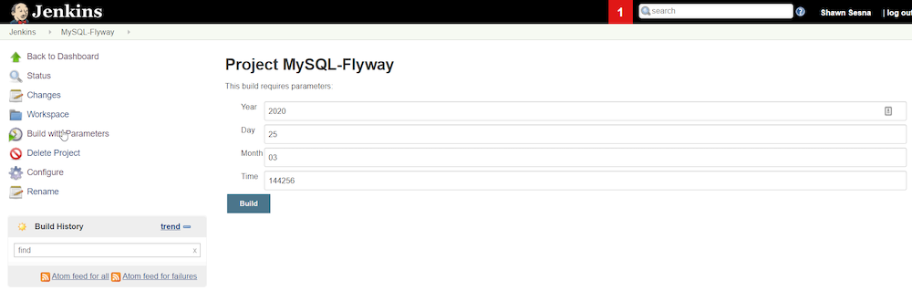

When the build is complete, you should have something like this


Now that the build is complete, it's time to configure out Octopus Deploy project

## Octopus Deploy
From the Dashboard of Octopus Deploy, click on Projects


Select the Project Group and click the **ADD PROJECT** or the green **ADD PROJECT** button in the upper right-hand corner.


Give the project a unique name, (optional) a description, select the Project Group and the Lifecycle.  If you've clicked on the **ADD PROJECT** button on a specific project group, this selection will be pre-populated.

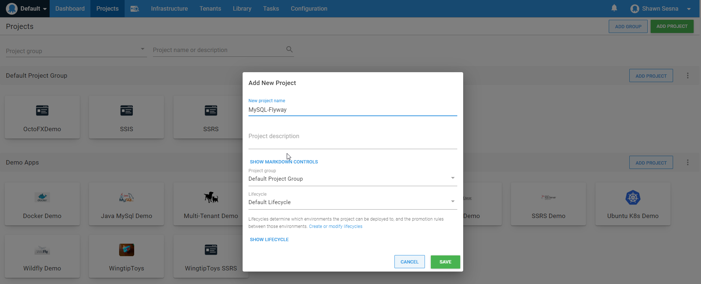

### Variables
Once in the new project, click on Variables to set up some variables

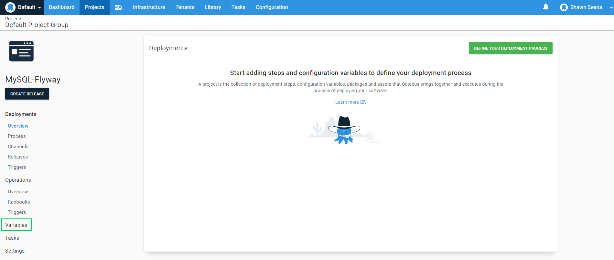

Add the following variables:
- Project.MySql.Database.Name: Name of the database
- Project.MySql.Database.Server.Name: Name or IP address of the database server
- Project.MySql.Database.Server.Port: Port that MySql is listening on
- Project.MySql.Database.Admin.User.Name: User account with elevated permissions on the database
- Project.MySql.Database.Admin.User.Password: Password for the user account
- Project.MySql.ConnectionString: jdbc:mysql://#{Project.MySql.Database.Server.Name}:#{Project.MySql.Database.Server.Port}/#{Project.MySql.Database.Name}?useUnicode=true


### Deployment process
The variables needed to be defined first so that we could use them within the deployment process.  Click on the `Process` tab, then **ADD STEP**.


Filter the steps by `flyway`

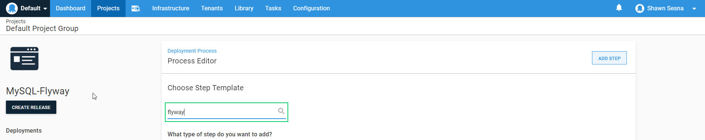

Five results will be returned, three for PowerShell and two for Bash.

#### Flyway Info from a Referenced Package
This template will compare the scripts in the scripts folder against the ones that have already been run and display the status of each script using a Package Parameter.  This template is available for both PowerShell and Bash.

#### Flyway Migrate
This template performs the Flyway Migrate command and applies any scripts that haven't been run to the database and records which ones were applied so they won't be run again.  It also contains the ability to run the Redgate SQLCompare to run a drift check.  This template is available for both PowerShell and Bash.

#### Flyway Migrate from a referenced Package
This template is nearly identical to the Flyway Migrate step with the difference being this version uses a Package Parameter instead of Feed Id and Package Id.  This is only available in the PowerShell variant at this time.

Choose the `Flyway Info from a Referenced Package` for whichever OS you intend to deploy.  This guide will make use of the Bash versions for use with Linux Tentacles.

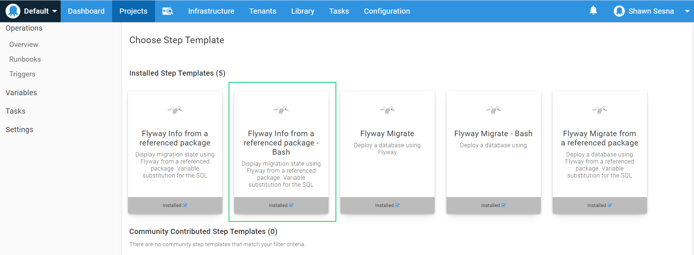

Fill in the fields:
- Relative path to flyway.cmd (optional): Use if your flyway bash file isn't within the root of the package.
- locations (relative path, optional): Use if your `sql` folder is not off the root folder
- Target -url (required): Connection string to MySql - #{Project.MySql.ConnectionString}
- Target -user (required): User account with elevated rights - #{Project.MySql.Database.Admin.User.Name}
- Target -password (required): Password for the user account - #{Project.MySql.Database.Admin.User.Password}
- Flyway package: The package for deployment

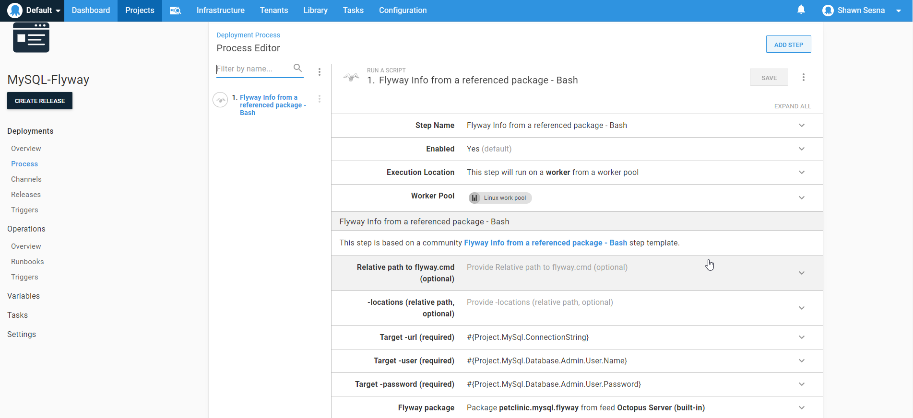

Add a `Manual Intervention` step and scope it to the Production environment.  This will pause the deployment so you can review what is about to be executed and determine whether or not to proceed when deploying to Production.

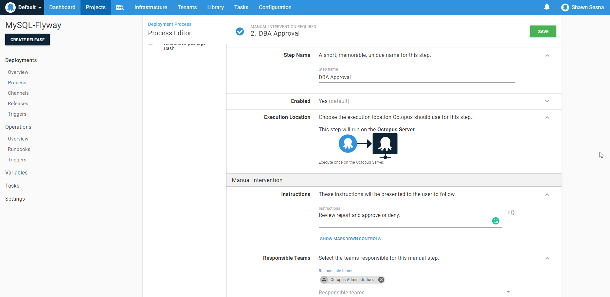

Add the `Flyway Migrate` step.  The fields for this are identical to the `Flyway Info` step that was added previously.

- Relative path to flyway.cmd (optional): Use if your flyway bash file isn't within the root of the package.
- locations (relative path, optional): Use if your `sql` folder is not off the root folder
- Target -url (required): Connection string to MySql - #{Project.MySql.ConnectionString}
- Target -user (required): User account with elevated rights - #{Project.MySql.Database.Admin.User.Name}
- Target -password (required): Password for the user account - #{Project.MySql.Database.Admin.User.Password}
- Run pre-deploy drift check: Used if you have Redgate SQLCompare
- Path to Redgate comparison tool (required for drift-check): Path to the SQLCompare executable
- Shadow -url (required for drift-check): Connection string to shadow database
- Shadow -user (required for drift-check): Shadow database user account
- Shadow -password (required for drift-check): Password for shadow database user
- Flyway package: Package to deploy


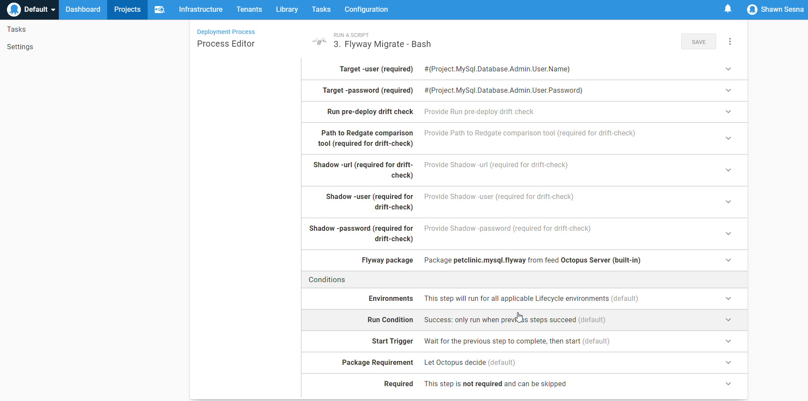

When done, the deployment process should look like this:


### Creating the release
With the deployment process defined, the project can create a release for deployment.  Click on **CREATE RELEASE**

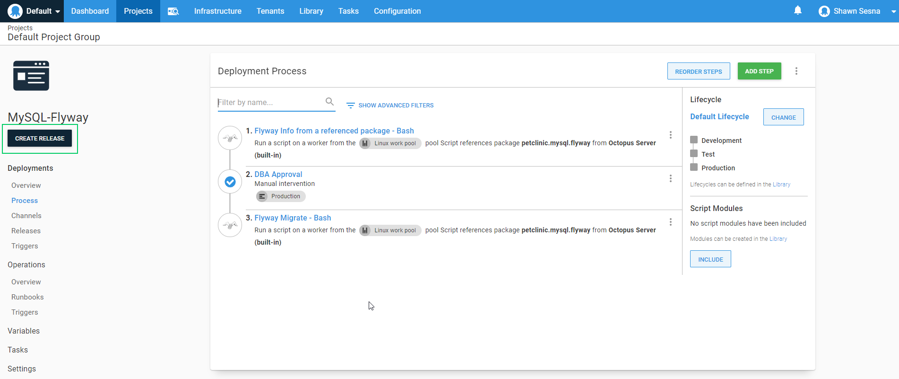

Click **SAVE**

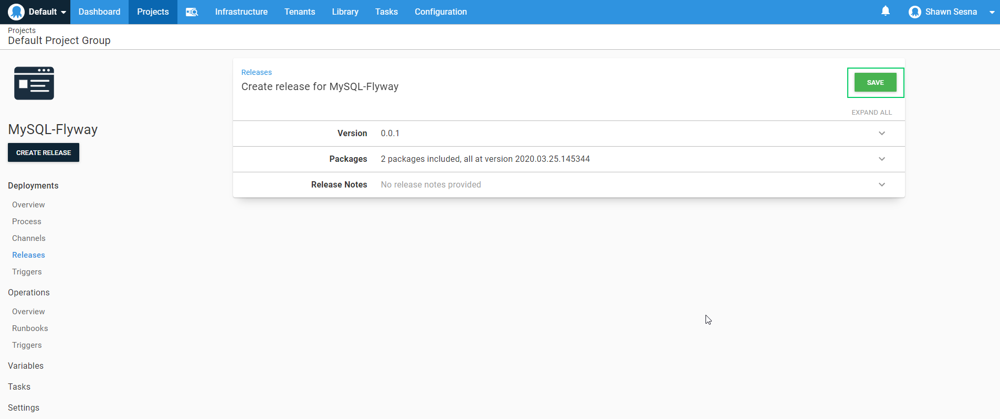

With the release created, choose the Environment to deploy to.  You can do this by either choosing the row with the **DEPLOY** button enabled or using the **DEPLOY TO ** in the upper right-hand corner.


Finally, click **DEPLOY**

:::hint
If you receive an error message like
```
/etc/octopus/default/Work/20200326224917-19880-127/FlyWayPackage/flyway: line 17: $'\r': command not found 
/etc/octopus/default/Work/20200326224917-19880-127/FlyWayPackage/flyway: line 20: syntax error near unexpected token `$'in\r''
/etc/octopus/default/Work/20200326224917-19880-127/FlyWayPackage/flyway: line 20: ` case "`uname`" in 
```

your build server has converted line endings from LF to CRLF, which doesn't play nice.  This typically happens on Windows-based build servers.

Workarounds are:
- Run the following command on your build agent `git config --global core.eol lf`
- Set the `text eol=lf` setting within the `.gitattributes` of the git repo
:::

You should receive the following output from the deployment


