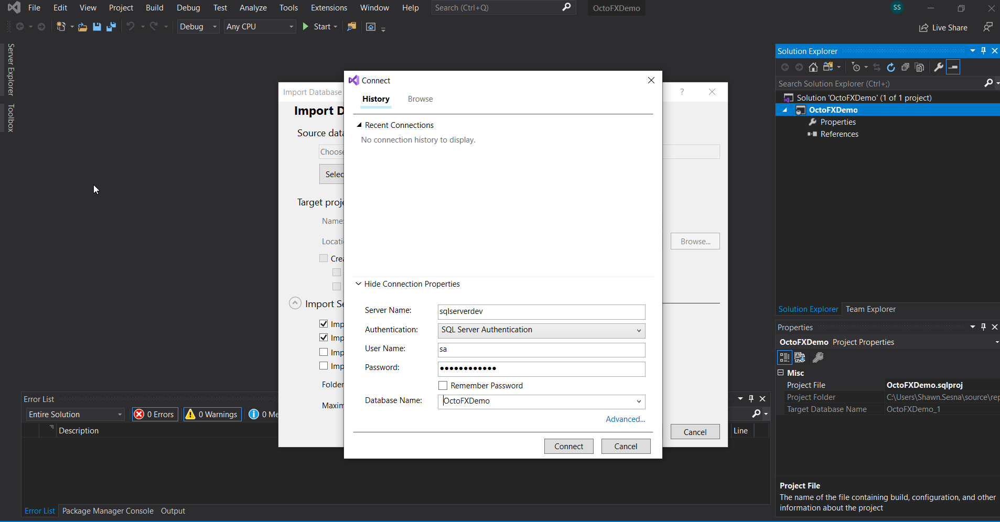
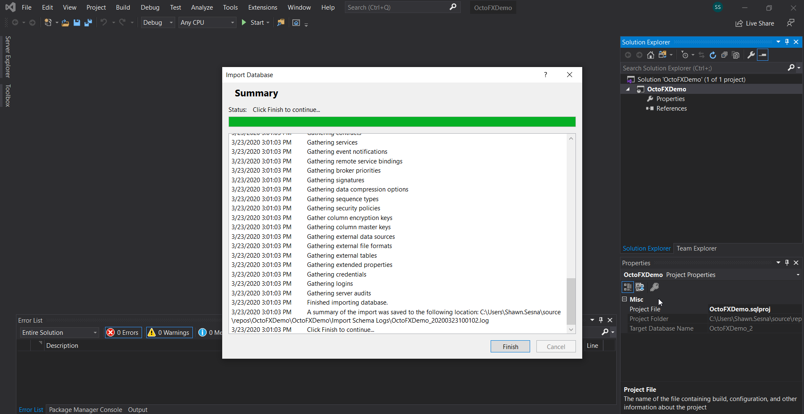
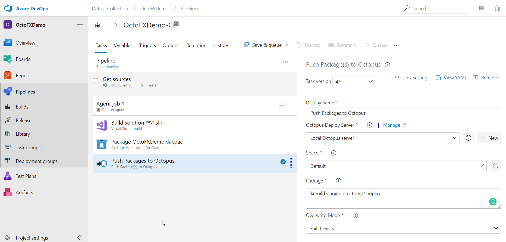
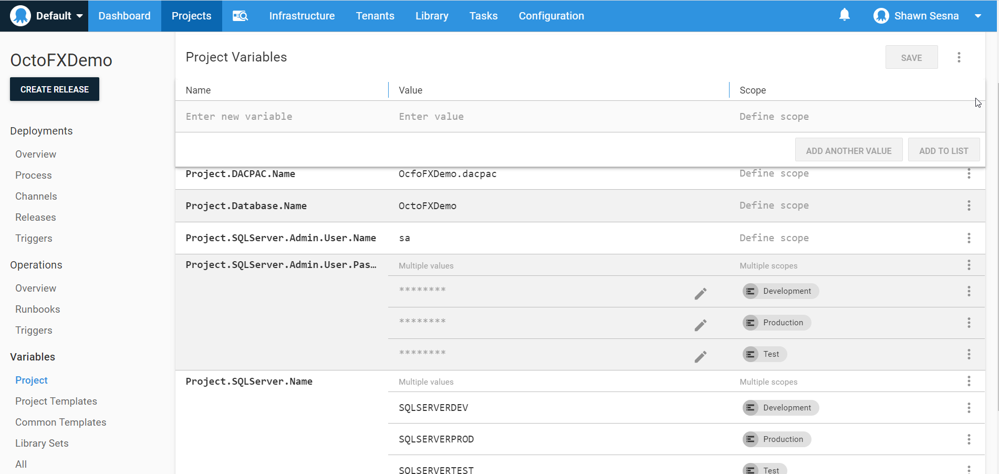
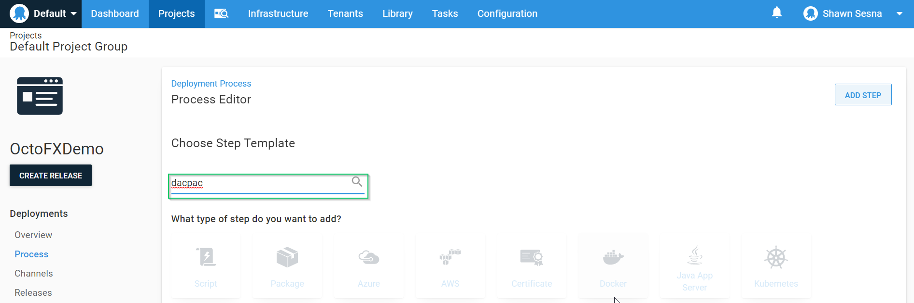

Starting with SQL Server 2008, Microsoft introduced a new project type called Database Projects.  These projects use the [state-based approach](https://octopus.com/blog/sql-server-deployment-options-for-octopus-deploy) to applying changes to your database.  Initially, Database Projects were not available as part of the initial Visual Studio install and had to be downloaded separately. This download was referred to as SQL Server Data Tools (SSDT) and included project types for Database projects, SQL Server Reporting Services (SSRS) projects, and SQL Server Integration Services (SSIS) projects.  Modern versions of Visual Studio have SSDT available to choose when installing or modifying an existing installation.

## Installing SSDT for Visual Studio
For earlier versions of Visual Studio such as 2015 and below, installing the SSDT was a matter of locating the download for your version of Visual Studio.  Microsoft has provided a convenient way of finding the appropriate download on [this page](https://docs.microsoft.com/en-us/sql/ssdt/previous-releases-of-sql-server-data-tools-ssdt-and-ssdt-bi?view=sql-server-ver15).

For more modern versions of Visual Studio (2017+), the option appears on the `Workloads` selection screen during initial installation or when modifying an existing installation.

### Visual Studio 2017 Installer
To install the SSDT for Visual Studio 2017, scroll to the `Web & Cloud` category and select the `Data storage and processing` option

### Visual Studio 2019 Installer
To install the SSDT for Visual Studio 2019, scroll to the `Other Toolsets` category and select the `Data storage and processing` option.

For both versions Visual Studio, there will be a new project type of SQL Server Database Project:

Visual Studio 2017

Visual Studio 2019

(The remainder of the images in this guide will use Visual Studio 2019)

## Connecting the project to the database
Once the SQL Server Database Project type has been selected, choose Next.  Fill in the project name and click **Create**

After the project has been created, it will need to connect to a database.  This example will use a pre-existing database called OctoFXDemo.

Right-click on the Project -> Import -> Database

Click on Select Connection

Fill in the details for connecting to the server and database.  In this screenshot, a SQL Account is used to connect to the database server.  Click **Connect** when done.

Once the connection has been selected, the Start button will enable.  Click Start to begin the process

You should see the following once the import has completed.

Since this example uses an empty database, the import didn't do much.

:::hint
This guide uses an empty database to start with, however, using an existing, populated database will work just the same.  The import process will populate your project with the existing objects from the database.
:::

The project is now ready for creating database schema objects (tables, views, stored procedures, etc...)

## Comparing project the database schema
Once the project has some objects, we can compare the project to the target database.  Right-click on the Project, then choose `Schema Compare...`

Select the target database connection

Once you've selected the target, click on Compare

Visual studio will then compare the project to the database and list out what it will do on a deployment

:::hint
For databases that have a dependency on other databases, it is possible to add a reference to another database project.  This should be done with caution as you could end up with a circular dependency where database A depends on database B and database B depends on database A.  In this situation, neither database project will compile.
:::

## Build definition
Building the SQL Server Database Project can be done pretty much any build server (Azure DevOps, TeamCity, Jenkins, Bamboo, etc...).  The requirements for the build agents are similar to those of Visual Studio itself, MSBuild and the SSDT.  The recommended approach to this is to install the Visual Studio build tools on the build agent(s) for the version of Visual Studio that you're using.  Just like Visual Studio, if you're using older versions, you'll need to locate the SSDT and install that separately.  If you're using the more modern versions, the option to install will SSDT will be on the Visual Studio tools installer.  This guide will use Azure DevOps as the build platform, but any build server can do this.

### Creating the definition
From our Azure DevOps repo, click on Pipelines then New Pipeline

Because it's easier to follow, this example will use the classic editor without YAML

This guide uses an Azure DevOps Git repo with the master branch

The build process is going to be quite simple and doesn't need a template, choose `Empty job` to start with.

After choosing the build pool to use, click on the `+` to add a step to the build definition

Click on the Build category and scroll down to `Visual Studio build`

:::hint
An MSBuild task will accomplish the same thing
:::

Add `/p:OutDir=$(build.stagingdirectory)` to the MSBuild Arguments so that the built artifacts are separated from the source code.

Click on the `+` to add an Octopus Package step

:::hint
The Octopus Deploy extension is available in the Marketplace, install the extension if you haven't already done so.
:::

Fill in the properties of the task
- Package ID: Give the package a meaningful name
- Package Format: Chose whichever package type you wish
- Package Version:  Use the build server build number to associate a package version back to a build number
- Source Path: This will be the same path as what we set the MSBuild argument to, $(build.stagingdirectory)
- Output Path: Location to store the created package

:::hint
For Azure DevOps, the build number can be formatted on the Options tab under Build number format.  This guide uses the format of `$(Year:yyyy).$(Month).$(DayOfMonth).$(Rev:r)`

:::

Expand the Advanced Options section
- Include: The only file we need for deployment is the .dapac itself.  Add the filename here, this example uses OctoFXDemo.dacpac

The final step in the definition will be pushing the package to a repository.  This guide will make use of the built-in Octopus Deploy NuGet package repository.

Click on the `+` to add an Octopus Push step

This step requires that a connection to the Octopus server be created.  Click on the `+ New` button

Add the connection details and click OK

Choose the Space to push to

Enter the package(s) that you would like pushed to the Octopus repository.  This can be individual packages such as `OctoFXDemo.dacpac.$(Build.BuildNumber).nupkg` or something more generic like using a wildcard `*.nupkg`.  For this guide, I'll be using the wildcard approach.  You will also need to provide the path to where to find the package.  I used `$(build.stagingdirectory)\*.nupkg`

These three steps are all that we need for our build definition.  Queue the build to get our artifact pushed to our Octopus Server.

## Creating the Octopus Deploy project
The build successfully pushed the artifacts for deployment, now we need to create the Octopus Deploy project to deploy it.

From the Dashboard of Octopus Deploy, click on Projects

Select the Project Group and click the **ADD PROJECT** or the green **ADD PROJECT** button in the upper right-hand corner.

Give the project a unique name, (optional) a description, select the Project Group and the Lifecycle.  If you've clicked on the **ADD PROJECT** button on a specific project group, this selection will be pre-populated.

After you click **SAVE**, you will be brought to your new Project.  Before defining our deployment process, let's define some variables that will be used in the deployment process steps.  Click on **Variables**.

Define the following:
- Project.SQLServer.Name
- Project.SQLServer.Admin.User.Name (optional)
- Project.SQLServer.Admin.User.Password (optional)
- Project.Database.Name
- Project.DACPAC.Name

It is considered best practice to namespace your variables.  Doing this helps prevent any variable name conflicts from Library Variable Sets or Step Template variables.  Prefixing Project. to the front indicates that this is a Project variable.

:::hint
If you're using Integrated Authentication (Windows), you do not need either of the Project.SQLServer.Admin* variables.
:::

Note that both Project.SQLServer.Admin.Password and Project.SQLServer.Name both have multiple values associated with them, but for different Environment specifications.  This is known as scoping.  Scoping a variable to an Environment lets Octopus Deploy know that when deploying to the Development environment to use the value of SQLSERVERDEV for the Project.SQLServer.Name variable.

With variables defined, we can add steps to our deployment process.  Click on the **Process** tab.

Click on **ADD STEP**

Filter by `dacpac`

There will be three results returned

All three Step Templates have close to the same code within them and support the same features.  However, there are some differences.

### SQL - Deploy DACPAC
This is the original step template written for DACPAC deployments.  This step template requires the template to be run on a Deployment Target.  Recent versions of SQL Server are not placing the DLLs necessary to perform a DACPAC deployment on the servers directly, in such situations, this template will temporarily download the SqlServer PowerShell module, if not found locally, to load the DLLs necessary.  It's important to note that if the NuGet PowerShell Package Provider is not present on the target, it will be installed.

### SQL - Deploy DACPAC from Referenced Package
This version of the template does not need be exected directly on the Deployment Target and can be run from a Worker.  This version requires two packages to be supplied; the DACPAC and a package containing the DLLs to deploy DACPACs.  This would be ideal for situations where you would like to use a Worker and don't have access to the Internet.  With this version, you need to know the Feed Id, which can be problematic when not using the Default space.

### SQL - Deploy DACPAC from Package Parameter
Similar to `SQL - Deploy DACPAC`, this version will automatically download a temporary version of the SqlServer PowerShell module if it cannot find the DLLs locally for DACPAC deployment (and install the NuGet Package Provider).  It also can run from a Worker like `SQL - Deploy DACPAC from Referenced Package`.  However, the difference is that it uses a Package Parameter instead of a Package Reference making it easier to use in multi-space instances.

:::hint
All three templates support the use of SqlCmd Variables.  To use SqlCmd variables, apply a specific naming convention to your project variable by prefixing `SqlCmdVariable.` to the SqlCmd Variable.  For example, if your SqlCmd Variable is named MyVariable, then you would create an Octopus variable called SqlCmdVariable.MyVariable
:::

This guide uses the `SQL - Deploy DACPAC from Package Parameter` step template

Fill in the template inputs:
- DACPACPackageName - Name of the dacpac file.  The Project.DACPAC.Name variable was created for this field.
- Publish profile name - Fill this in if you use Publish profiles
- Report - True
- Script - True
- Deploy - False
- Extract target database to dacpac - False
- Target Servername - Project.SQLServer.Name variable
- Target Database - Project.Database.Name variable
- Target Database Version - Select from the drop-down if DLLs are locally installed, otherwise you can leave it blank
- Use Integrated Security - False (if using SQL Authentication)
- Username - Project.SQLServer.Admin.User.Name variable
- Password - Project.SQLServer.Admin.User.Password variable
- Enable multi subnet failover 
- Additional deployment contributors
- DACPAC Package - The package from the repository, OctoFXDemo.dacac for this guide

This first step will report out what changes will be done without applying.  This allows for a manual intervention step to be placed for Production deployments in between the report and the deploy steps.

Add a manual intervention step, scoping it to Production

Finally, add another `SQL - Deploy DACPAC from Referenced Package` step, changing the Report and Script values to False, and the Deploy value to True.

When done, the deployment process should look like this:

Create a Release by clicking on the **CREATE RELEASE** button

Click **SAVE**

Click **DEPLOY** on the Development row or the **DEPLOY TO DEVELOPMENT** button

Finally, click **DEPLOY**

The results should look like:

The first step (Gather changes) creates two [artifacts](https://octopus.com/docs/deployment-process/artifacts), an XML file reporting which objects will be changed and the script it's going to use to apply those changes.  Step 3 (Deploy DACPAC) uses that generated script and applies it to the target so the database matches the desired state.