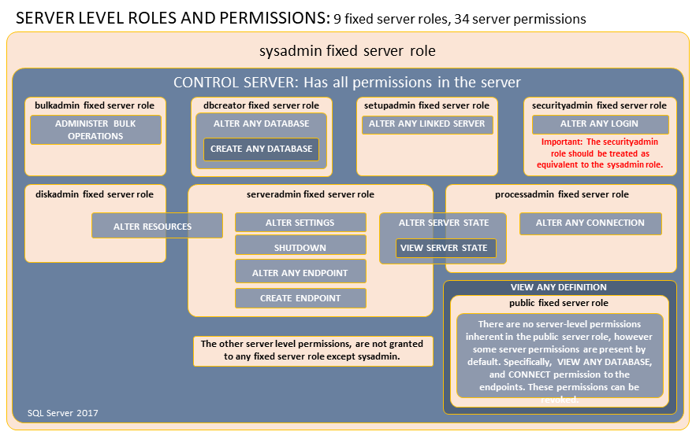
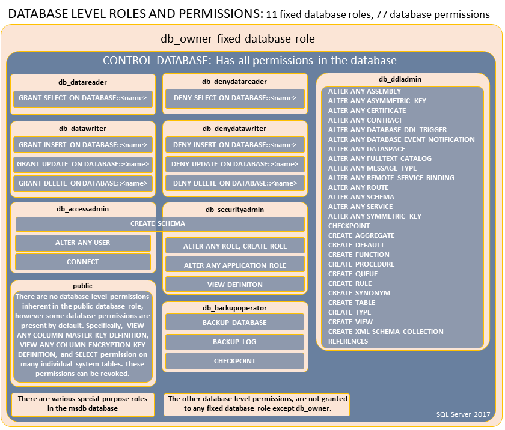

The level of permissions required to automate database deployments is tricky.  There is a fine line between functionality and security.  There is no single magic bullet.  It will be up to you and your security team to discuss this.  With that said, below are some considerations around permissions and a couple of recommendations.

### Application Account Permissions 

Applications should run under their own service accounts with the least amount of rights.  Each environment for each application should have its own service account.  

Having separate service accounts for each environment can make automated database deployments very tricky.  Which service account should be stored in source control?  All of them or none of them?  None of them.  Assign permissions to roles.  Attach the correct user for the environment to that role.

### Deployment Permission Considerations

The account used to make schema changes requires elevated permissions.  Because of that, create a special service account to handle database deployments.  Do not use the same account used by an application.  If the application service account has permissions to modify the schema, and it was compromised, it could cause a lot of damage.

The level of elevated permissions is up to you.   More restrictions placed on the deployment account means more manual steps.  Deployments will fail due to missing or restricted permissions.  Octopus will provide the error message to fix the issue.  It will need manual intervention to resolve the issue.  It is up to you to decide which is best.

First, decide what the deployment account should have the ability to do at the server level.  From there, research which server roles are applicable.  Microsoft has provided a chart of the server roles and their specific permissions.

Next, decide what permissions the deployment account can have at the database level.  Again, Microsoft has provided a chart of the database roles and their specific permissions.   

With those two charts in mind, below are some recommended permissions sets.  

### Fully Automated Database Deployments Permission Recommendation

Following DevOps principles, everything that can be automated should be automated.  This includes creating databases, user management, schema changes, and data changes.  Octopus Deploy plus the third-party tool of your choice can handle that. The deployment account should have these roles assigned:

- Server Permissions
    - dbcreator -> ability to create new databases
    - securityadmin -> ability to create new users and grant them permissions (you will need a check-in place to ensure it doesn't grant random people sysadmin roles)
- Database Permissions
    - db_ddladmin -> can run any Data Definition Language (DDL) command in a database.
    - db_datareader -> can read all the data from all user tables
    - db_datawriter -> can add, delete, or change data from all user tables
    - db_backupoperator -> can backup the database
    - db_securityadmin -> modify role membership and manage permissions
    - db_accessadmin -> can add or remove access to the database for logins
    - Can View Any Definition

Be sure to assign the deployment account those database roles in the model database.  That is the system database used by SQL Server as a base when a new database is created.  This means the deployment account will be assigned to those roles going forward.

### Fully Automated Database Deployments Permission Recommendation {#SQLServerdatabases-ManualUsers}

Security Admins should be treated the same as System Admins, as they can grant permissions at the server level.  For security purposes, it is common to see that role restricted.  In that case, below are the recommended permissions.  It can do everything except create a new SQL Login.

- Server Permissions
    - dbcreator -> ability to create new databases
- Database Permissions
    - db_ddladmin -> can run any Data Definition Language (DDL) command in a database.
    - db_datareader -> can read all the data from all user tables
    - db_datawriter -> can add, delete, or change data from all user tables
    - db_backupoperator -> can backup the database
    - db_securityadmin -> modify role membership and manage permissions
    - db_accessadmin -> can add or remove access to the database for logins
    - Can View Any Definition

### No Database Creation or User Creation Everything Else Automated Permission Recommendation

If granting that level of access is not workable or allowed, we would recommend the following.  It requires SQL Users to be manually created and the database to already exist.  The process can add existing users to databases as well as deploy everything.

- Database Permissions:
    - db_ddladmin -> can run any Data Definition Language (DDL) command in a database.
    - db_datareader -> can read all the data from all user tables.
    - db_datawriter -> can add, delete, or change data from all user tables.
    - db_backupoperator -> can backup the database.
    - db_securityadmin -> modify role membership and manage permissions.
    - db_accessadmin -> can add or remove access to the database for logins.
    - Can View Any Definition.

### Manual User Creation Both Server and Database Permission Recommendation

Here are the most restrictive permissions for automating database deployments.  No new database users can be created.  No new schemas can be created.  Users cannot be added to roles.  Table and stored procedure changes can be made.

- Database Permissions:
    - db_ddladmin -> can run any Data Definition Language (DDL) command in a database.
    - db_datareader -> can read all the data from all user tables.
    - db_datawriter -> can add, delete, or change data from all user tables.
    - db_backupoperator -> can backup the database.
    - Can View Any Definition.