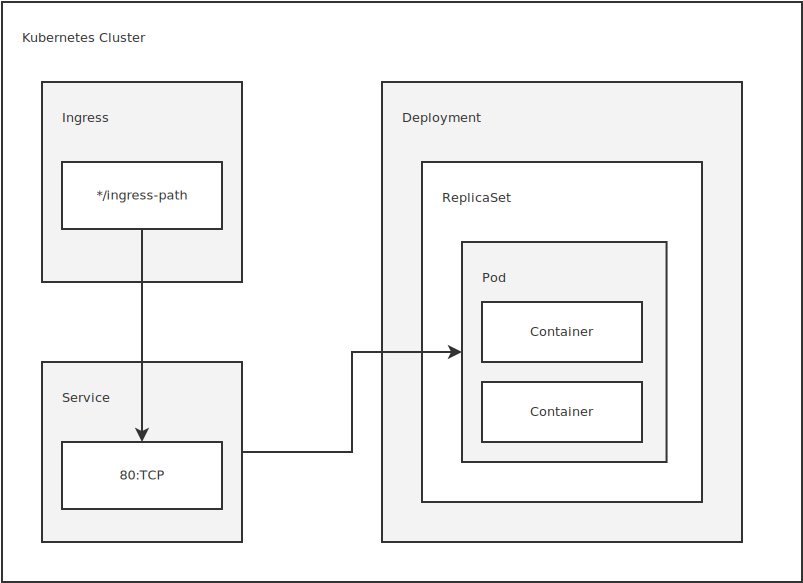
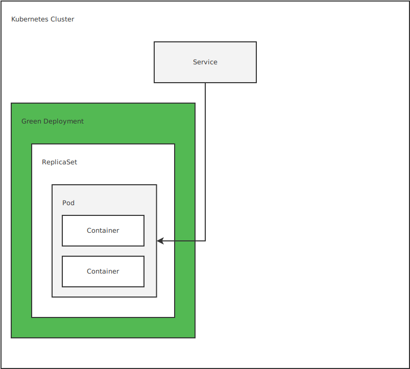
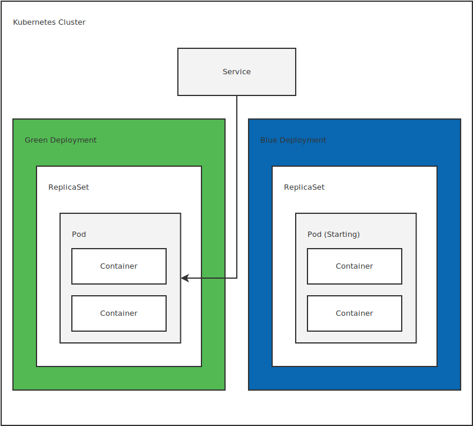
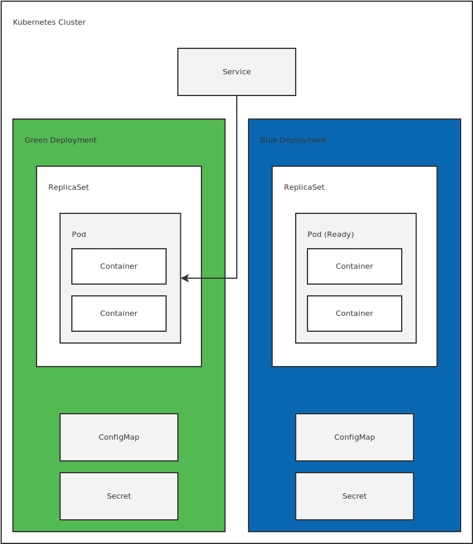
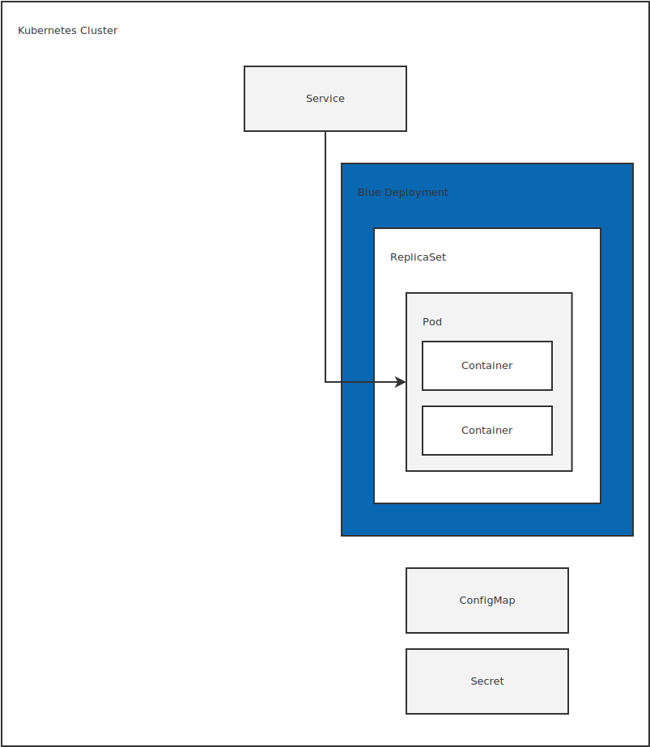

This featured was introduced as a pre-release in Octopus `2018.8`.

:::warning
Kubernetes steps in Octopus are of alpha level quality and have been made available for testing and feedback purposes only. They **must not** be used for production deployments, or enabled on production Octopus instances. The information provided here is subject to change at any point, and existing Kubernetes steps will most likely need to be deleted and recreated with Octopus upgrades.
:::

Octopus supports the deployment of Kubernetes resources through the `Deploy Kubernetes containers` step. This step exposes a UI that builds up a [Kubernetes Deployment resource](http://g.octopushq.com/KubernetesDeploymentResource), a [Service resource](http://g.octopushq.com/KubernetesServiceResource), and an [Ingress resource](http://g.octopushq.com/KuberntesIngressResource). The combination of these resources represents an opinionated view about what makes up a typical Kubernetes deployment.

## Deploy Kubernetes Containers Step

To begin, add the `Deploy Kubernetes containers` step to a project.


This step has three important sections that make up the combined objects that are deployed to Kubernetes.

The first section is the `Deployment`. This section is used to build of the [Deployment resource](http://g.octopushq.com/KubernetesDeploymentResource).

The second feature is the `Service`. This feature is used to build a [Service resource](http://g.octopushq.com/KubernetesServiceResource).

The third feature is the `Ingress`. This feature is used to build a [Ingress resource](http://g.octopushq.com/KubernetesIngressResource).



:::hint
Kubernetes terminology overlaps with a number of general concepts in Octopus. For example, Kubernetes has the notion of a Deployment, which is distinct from the act of performing a deployment in Octopus.

To distinguish between Kubernetes and Octopus terminology, we will reference Kubernetes "resources" e.g. a Deployment resource or Pod resource.
:::

### Deployment

A Deployment resource provides a declarative interface for a [Pod resource](http://g.octopushq.com/KubernetesPodResource) and a [ReplicaSet resource](http://g.octopushq.com/KubernetesReplicaSetResource).

A Pod resource in turn configures one or more [Containers resources](http://g.octopushq.com/KubernetesContainer). Container resources reference a Docker container image and provide all the additional configuration required for Kubernetes to deploy, run, expose, monitor, and secure the Docker container.

A ReplicaSet resource monitors the Pod resources to ensure that the required number of instances are running.

### Deployment Name

Each Deployment resource requires a unique `Deployment Name`. Kubernetes resources are identified by their names, so the name must be unique in the target [namespace](http://g.octopushq.com/KubernetesNamespace).

### Replicas

The desired number of Pod resources is set in the `Replicas` field. This is the number of replicas maintained by the ReplicaSet resource. This field is optional, and will default to a value of `1`.

### Progression Deadline

An optional value that defines the maximum time in seconds for a deployment to make progress before it is considered to be failed. If this value is not specified, it will default to `600` seconds (or 10 minutes).

This value affects [Blue/Green deployments](#bluegreen-deployment-strategy), which will point the service to the new deployment only after the new deployment has succeeded.

### Add Label

Labels are custom key/value pairs that are assigned to Kubernetes resources. The labels defined in the `Deployment` section are applied to the Deployment, Pod, Service, and Ingress resources.

The labels are optional, as Octopus will automatically add the tags required to manage the Kubernetes resources created as part of this step.

### Deployment Strategy

Kubernetes exposes two native deployment strategies.

### Recreate Deployment Strategy
The first native deployment strategy is the [Recreate](http://g.octopushq.com/KubernetesRecreateStrategy) deployment. This strategy will kill all existing Pod resources before new Pod resources are created. This means that only one Pod resource version is exposed at any time. This can result in downtime before the new Pod resources are fully deployed.

### Rolling Update Deployment Strategy
The second native deployment strategy is the [Rolling Update](http://g.octopushq.com/KubernetesRollingStrategy) deployment. This strategy will incrementally replace old Pod resources with new ones. This means that two Pod resource versions can be deployed and accessible at the same time but can be performed in a way that results in no downtime.

### Blue/Green Deployment Strategy
The third deployment strategy, Blue/Green, is not a native concept in Kubernetes. It is a deployment strategy that is achieved by the `Deploy Kubernetes containers` step because it creates and coordinates both the Deployment resource and the Service resources.

The Blue/Green deployment strategy involves four phases.

#### Phase 1

The first phase is the state of the existing Deployment and Service resources.

If a previous Octopus deployment was performed, there will be both a Deployment and a Service resource created in Kubernetes. These resources have tags like `Octopus.Step.Id` and `Octopus.Deployment.Id` that identify the Octopus step and specific deployment that created the resources (these tags are added automatically by Octopus).

This existing Deployment resource is considered to be the green half of the blue/green deployment.



#### Phase 2

The second phase involves creating the new Deployment resource. This new resource is considered to be the blue half of the blue/green deployment. It is important to note that the new Deployment resource is a completely new resource in Kubernetes. The existing green Deployment resource is not updated.

Because the names of distinct resources must be unique in Kubernetes, Octopus will append the Octopus deployment ID to the Deployment resource name. So if the Deployment resource name was defined as `my-application` in the step, the resulting Deployment resource name would look something like `my-application-deployment-1232`.

At the end of Phase 2 there are three resources in Kubernetes: the green Deployment resource, the Blue Deployment resource, and the Service resource which is still pointing at the green Deployment resource.



#### Phase 3

The third phase involves waiting for the blue Deployment resource to be ready.

Octopus executes the command `kubectl rollout status "deployment/blue-deployment-name"`, which will wait until the newly created blue Deployment resource is ready. For a Deployment resource to be considered ready, it must have been successfully created, and any Container resource [readiness probes](http://g.octopushq.com/KubernetesProbes) must have successfully completed.

:::hint
The [progression deadline](#progression-deadline) field can be used to limit how long Kubernetes will wait for a deployment to be successful.
:::

If the Deployment resource was successfully created, we move to phase 4. If the Deployment resource was not successfully created, the deployment process stops with an error and leaves the service pointing to the green Deployment resource.



#### Phase 4

If the Deployment resource was successfully created, Octopus will execute the final phase which involves pointing the Service resource to the blue Deployment resource, and deleting any old Deployment resources.

At the beginning of Phase 4 there are three resources in Kubernetes: the green Deployment resource, the blue Deployment resource (now completely deployed and ready to accept traffic), and the Service resource which is still pointing at the green Deployment resource.

Octopus now updates the Service resource to direct traffic to the blue Deployment resource.

Once the Service resource is updated, any old Deployment resources are deleted. Old Deployment resources are defined as any Deployment resource with an `Octopus.Step.Id` label that matches the Octopus step that was just deployed and a `Octopus.Deployment.Id` label that does not match the ID of the deployment that was just completed.

:::hint
If the deployment fails at phase 3, the Kubernetes cluster can be left with multiple Deployment resources in a failed state. Because Deployment resources with an `Octopus.Deployment.Id` label that does not match the current deployment are deleted in phase 4, a successful deployment will remove all previously created Deployment resource objects.

This means failed deployments can be retried, and once successful, all previous Deployment resources will be cleaned up.
:::



#### Deployment Strategy Summary

The choice of which deployment strategy to use is influenced by three major factors:

1. Does the deployment require no downtime?
2. Can multiple versions of the Deployment resource coexist, even if different versions can not receive external traffic? This may not be possible if the act of deploying a new Deployment resource results in incompatible database upgrades.
3. Can multiple versions of the Deployment resource accept traffic at the same time? This may not be possible if APIs have changed in ways that are not backward compatible.


| Strategy   | No Downtime  | Multiple Deployed Versions  | Multiple Accessible Versions |
|-|-|-|-|
| Recreate   |   |   |  |
| Rolling Update   | *  | *  | * |
| Blue/Green   | *  | *  |   |

### Volumes

[Volume resources](http://g.octopushq.com/KubernetesVolumes) allow external data to be accessed by a Container resource via its file system. Volume resources are defined in the `Volumes` section, and later referenced by the container configuration.

Kubernetes provides a wide range of Volume resource types. The common, cloud agnostic Volume resource types can be configured directly by Octopus. Other Volume resource types are configured as raw YAML.

#### Common Values

All Volume resources must have a unique name defined in the `Name` field.

#### ConifgMap

The [ConfigMap Volume resource](http://g.octopushq.com/KubernetesConfigMapVolume) exposes the data saved in a [ConfigMap resource](http://g.octopushq.com/KubernetesConfigMap) as files in a container.

The `ConfigMap name` field defines the name of the ConfigMap resource that is to be exposed.

Individual ConfigMap resource values can be optionally mapped to custom files by adding them as items. The item `Key` is the name of the ConfigMap resource key. The item `Path` is the name of the file that the ConfigMap value will be placed in.

For example, consider a ConfigMap secret resource created with the following YAML.

```yaml
apiVersion: v1
kind: ConfigMap
metadata:
  name: special-config
  namespace: default
data:
  special.level: very
  special.type: charm
```

To mount this ConfigMap as a volume, the `ConfigMap name` would be set to `special-config`.

To expose the `special.level` key as a file called `my-special-level.txt`, an item is added with the `Key` of `special.level` and a `Path` of `my-special-level.txt`.

If this Volume resource is mounted by a container under the directory `/data`, the file `/data/my-special-level.txt` would have the contents of `very`.

#### Secret

The [Secret Volume resource](http://g.octopushq.com/KubernetesSecretVolume) exposes the data saved in a [Secret resource](http://g.octopushq.com/KubernetesSecretResource) as files in a container.

The `Secret name` field defines the name of the Secret resource that is to be exposed.

Individual Secret resource values can be optionally mapped to custom files by adding them as items. The item `Key` is the name of the Secret resource key. The item `Path` is the name of the file that the Secret value will be placed in.

For example, consider a Secret resource created with the following YAML.

```yaml
apiVersion: v1
kind: Secret
metadata:
  name: mysecret
type: Opaque
data:
  username: admin
  password: MWYyZDFlMmU2N2Rm
```

To mount this Secret as a volume, the `Secret name` would be set to `mysecret`.

To expose the `username` key as a file called `username.txt`, an item is added with the `Key` of `username` and a `Path` of `username.txt`.

If this Volume resource is mounted by a container under the directory `/data`, the file `/data/username.txt` would have the contents of `admin`.

#### Empty Dir

The [Empty Dir Volume resource](http://g.octopushq.com/KubernetesEmptyDirVolume) is used to create volume that is initially empty. The volume can be shared between containers. Some uses for an Empty Dir Volume resource are:

* Scratch space, such as for a disk-based merge sort.
* Checkpointing a long computation for recovery from crashes.
* Holding files that a content-manager Container fetches while a webserver Container serves the data.

By default, Empty Dir Volumes resources are stored on whatever medium is backing the node. Setting the `Medium` field to `Memory` will create the volume in a tmpfs, or RAM-backed filesystem.

#### Host Path

The [Host Path Volume resource](http://g.octopushq.com/KubernetesHostPathVolume) mounts a file or directory from the host node’s filesystem into your Pod. This is not something that most Pods will need, but it offers a powerful escape hatch for some applications.

For example, some uses for a Host Path Volume resource are:

* Running a Container that needs access to Docker internals; use a hostPath of `/var/lib/docker`.
* Running cAdvisor in a Container; use a hostPath of `/sys`.
* Allowing a Pod to specify whether a given hostPath should exist prior to the Pod running, whether it should be created, and what it should exist as.

The `Path` field is required and is set to the file or directory on the node's host filesystem that is to be exposed to the container.

The `Type` field is optional and has the supported values:

|Value | 	Behavior |
|-|-|
| | Empty string (default) is for backward compatibility, which means that no checks will be performed before mounting the hostPath volume.|
|DirectoryOrCreate| 	If nothing exists at the given path, an empty directory will be created there as needed with permission set to 0755, having the same group and ownership with Kubelet.|
|Directory |	A directory must exist at the given path|
|FileOrCreate |	If nothing exists at the given path, an empty file will be created there as needed with permission set to 0644, having the same group and ownership with Kubelet.|
|File |	A file must exist at the given path|
|Socket| 	A UNIX socket must exist at the given path|
|CharDevice| 	A character device must exist at the given path|
|BlockDevice| 	A block device must exist at the given path|

#### Persistent Volume Claim

The [Persistent Volume Claim volume resource](http://g.octopushq.com/KubernetesPersistentVolumeClaimVolume) is used to mount a PersistentVolume into a Pod. [PersistentVolume resources](http://g.octopushq.com/KubernetesPersistentVolumes) are a way for users to "claim" durable storage (such as a GCE PersistentDisk or an iSCSI volume) without knowing the details of the particular cloud environment.

The `Persistent Volume Claim Name` field must be set to the name of the PersistentVolumeClaim resource to be used.

For example, consider a PersistentVolumeClaim resource created with the following YAML:

```yaml
apiVersion: v1
kind: PersistentVolumeClaim
metadata:
  name: mysql-pv-claim
  labels:
    app: wordpress
spec:
  accessModes:
    - ReadWriteOnce
  resources:
    requests:
      storage: 20Gi
```

The `Persistent Volume Claim Name` field would be set to `mysql-pv-claim`.

#### Raw YAML

Kubernetes supports a huge range of volume resources, and only a small number are exposed directly the step user interface. Other volume resources can be defined as raw YAML.

The YAML entered must only include the details of the specific volume resource, and not include fields like `name`. For example, consider this example YAML provided by the Kubernetes documentation for the [AWS EBS volume resource](http://g.octopushq.com/KubernetesAwsEbsVolume) type:

```yaml
apiVersion: v1
kind: Pod
metadata:
  name: test-ebs
spec:
  containers:
  - image: k8s.gcr.io/test-webserver
    name: test-container
    volumeMounts:
    - mountPath: /test-ebs
      name: test-volume
  volumes:
  - name: test-volume
    awsElasticBlockStore:
      volumeID: <volume-id>
      fsType: ext4
```

The YAML from this example that can be included in the `Raw YAML` field is the `awsElasticBlockStore` key, meaning the YAML entered into the field is this:

```yaml
awsElasticBlockStore:
  volumeID: <volume-id>
  fsType: ext4
```

### Containers

The `Containers` section is where the Container resources are defined. This is where the bulk of the configuration for the Deployment resource is found.

The configuration options for a Container resource are broken down into a number of sections.

#### Image Details

Each Container resource must reference a container image from a [Docker feed](https://octopus.com/docs/packaging-applications/package-repositories/registries).

The container image must have a name that consists of lower case alphanumeric characters or '-', and must start and end with an alphanumeric character.

The image is then selected from one of those available from the Docker feed.

If the Docker feed requires authentication, Octopus will automatically generated the [required Secret resource](http://g.octopushq.com/KubernetesPrivateRegistry) as part of the deployment.

#### Ports

Each Container resource can expose multiple ports.

The port `Name` is optional. If it is specified, Service resources can refer to the port by its name.

The `Port` number is required and must be a number between 1 and 65535.

The `Protocol` is optional and will default to `TCP`.

#### Container Type

To support configuring and initializing Pod resources, Kubernetes has the concept of an [Init Container resource](http://g.octopushq.com/KubernetesInitContainer). Init Container resources are run before App Container resources and are often used to run setup scripts.

For example, an Init Container resource may be used to set the permissions on a directory exposed by a PersistentVolumeClaim volume resource before the App Container resource is launched. This is especially useful when you do not manage the App Container resource image, and therefor can't include such initialization directly into the image.

Selecting the `Init container` checkbox configures the Container resource as an Init Container resource.

#### Resources

Each Container resource can request a minimum allocation of CPU and memory resources and set a maximum resource limit.

The requested resources must be available in the Kubernetes cluster, or else the Deployment resource will not succeed.

The resource limits allow a Container resource to burst up to the defined limits.

The `CPU Request` field defines the minimum CPU resources that the Container resource requires. The value is measured in [CPU units](http://g.octopushq.com/KubernetesCpuUnits). One CPU, in Kubernetes, is equivalent to:

* 1 AWS vCPU
* 1 GCP Core
* 1 Azure vCore
* 1 Hyperthread on a bare-metal Intel processor with Hyperthreading

Fractional values are allowed. A Container that requests `0.5` cpu is guaranteed half as much CPU as a Container that requests `1` cpu. You can use the suffix `m` to mean milli. For example `100m` cpu, and `0.1` cpu are all the same. Precision finer than `1m` is not allowed.

The `CPU Limit` field defines the maximum amount of CPU resources that the Container resource can use.

The `Memory Request` field defines the minimum amount of memory that the Container resource requires. The memory resource is [measured in bytes](http://g.octopushq.com/KubernetesMemoryResourceUnits). You can express memory as a plain integer or a fixed-point integer with one of these suffixes: E, P, T, G, M, K, Ei, Pi, Ti, Gi, Mi, Ki. For example, the following represent approximately the same value:

* 128974848
* 129e6
* 129M
* 123Mi

The `Memory Limit` field defines the maximum amount of memory that can be consumed by the Container resource.

#### Environment Variables

Environment variables can be set three ways.

1. Plain name/value pairs. These are defined by clicking the `Add Environment Variable` button. The `Name` is the environment variable name, and the `Value` is the environment variable value.
2. Expose a ConfigMap resource value as an environment variable. These are defined by clicking the `Add ConifgMap Environment Variable` button. The `Name` is the environment variable name. The `ConfigMap Name` is the name of the ConfigMap resource. The `Key` is the ConfigMap resource key whose value is to be set as the environment variable value.
3. Expose a Secret resource value as an environment variable. These are defined by clicking the `Add Secret Environment Variable` button. The `Name` is the environment variable name. The `Secret Name` is the name of the Secret resource. The `Key` is the Secret resource key whose value is to be set as the environment variable value.

#### Volume Mounts

In the [Volumes](#volumes) section we defined the Volume resources that were exposed to the Container resource. It is here in the `Volume Mounts` container section that we map those Volume resources to the Container resource.

Each Volume Mount requires a unique `Name`.

The `Mount Path` is the path in the Container resource file system where the Volume resource will be mounted e.g. `/data` or `/etc/myapp/config`.

The `Sub Path` field is optional, and can be used to mount a sub directory exposed by the Volume resource. This is useful when a single Volume resource is shared between multiple Container resources, because it allows each Container resource to mount only the subdirectory it requires. For example, Volume resource may expose a directory structure like:

```
 - webserver
   - content
 - database
```

A Container resource hosting a webserver would specify the `Sub Path` to be `webserver/content`, while a Container resource hosting a database would specify the `Sub Path` of `database`.

The `Read Only` field defines if the Volume resource is mounted in read only mode.

:::hint
Some Volume resources like ConfigMap and Secret are always mounted in read only mode, regardless of the setting in the `Read Only` field.

See https://github.com/kubernetes/kubernetes/issues/62099 for more details.
:::

#### Liveness Probe

The [Liveness probe resource](http://g.octopushq.com/KubernetesProbes) configures a health check that is executed against the Container resource to verify that it is currently operational.

The `Failure threshold` defines how many times the probe can fail after the pod has been started. After this many failures, the pod is restarted. The default value is 3.

The `Timeout` defines the number of seconds after which the probe times out. The default value is 1 second.

The `Initial delay` defines the number of seconds to wait after the container has started before the probe is initiated.

The `Period` defines how frequently in seconds the probe is executed. The default value is 10.

The `Liveness probe type` defines the type of probe that is used to conduct the health check. Kubernetes supports three types of probes:

* `Command`, which will execute a command inside the container. If the command returns `0`, it is considered to be healthy.
* `Http`, which will execute a HTTP GET operation against a URL. If the request returns a status code between 200 and 399 inclusive it is considered healthy.
* `TCP Socket`, which will attempt to establish a connection against a TCP socket. If the connection can be established, it is considered healthy.

#### Command

The command probe type has one field, `Health check commands` that accepts a line break separated list of arguments. For example, if you want to run the command `/opt/healthcheck myservice "an argument with a space"`, you would enter the following text into the `Health check commands` field:
```
/opt/healthcheck
myservice
an argument with a space
```

#### Http

The Http probe type has five fields.

The `Host` field defines the host to connect to. If not defined, this value will default to the IP address of the Pod resource.

The `Path` field defines the URL path that the HTTP GET request will be sent to.

The `Scheme` field defines the scheme of the URL that is requested. If not defined, this value defines to `http`.

The `Port` field defines the port that is requested. This value can be a number, like `80`, or a [IANA](https://g.octopushq.com/IANA) port name.

Additional HTTP headers can be defined by clicking the `Add HTTP Header` button. The `Name` is the HTTP header name, and the `Value` is the header value.

#### TCP Socket

The TCP Socket probe type has two fields.

The `Host` field defines the host to connect to. If not defined, this value will default to the IP address of the Pod resource.

The `Port` field defines the port that is requested. This value can be a number, like `80`, or a [IANA](https://g.octopushq.com/IANA) port name.

#### Readiness Probe

The [Readiness probe resource](http://g.octopushq.com/KubernetesProbes) configures a health check that is executed against the Container resource to verify that it has started correctly. Readiness probes are not supported by Init Container resources.

:::hint
If defined, the readiness probe must succeed for a [Blue/Green](#bluegreen-deployment-strategy) deployment to complete successfully. If the readiness probe fails, the Blue/Green deployment will halt at [phase 3](#phase-3).
:::

The `Success threshold` defines many consecutive times the probe must succeed for the container to be considered successful after a failure. The default value is 1.

The `Failure threshold` defines how many times the probe can fail after the pod has been started. After this many failures, the pod is marked Unready. The default value is 3.

The `Timeout` defines the number of seconds to wait for a probe response. The default value is 1 second.

The `Initial delay` defines the number of seconds to wait after the container has started before the probe is initiated.

The `Period` defines how frequently in seconds the probe is executed. The default value is 10.

The `Liveness probe type` defines the type of probe that is used to conduct the health check. Kubernetes supports three types of probes:

* `Command`, which will execute a command inside the container. If the command returns `0`, it is considered to be healthy.
* `Http`, which will execute a HTTP GET operation against a URL. If the request returns a status code between 200 and 399 inclusive it is considered healthy.
* `TCP Socket`, which will attempt to establish a connection against a TCP socket. If the connection can be established, it is considered healthy.

#### Command

The command probe type has one field, `Health check commands`, that accepts a line break separated list of arguments. For example, if you want to run the command `/opt/healthcheck myservice "an argument with a space"`, you would enter the following text into the `Health check commands` field:
```
/opt/healthcheck
myservice
an argument with a space
```

#### Http

The Http probe type has five fields.

The `Host` field defines the host to connect to. If not defined, this value will default to the IP address of the Pod resource.

The `Path` field defines the URL path that the HTTP GET request will be sent to.

The `Scheme` field defines the scheme of the URL that is requested. If not defined, this value defaults to `http`.

The `Port` field defines the port that is requested. This value can be a number, like `80`, or a [IANA](https://g.octopushq.com/IANA) port name.

Additional HTTP headers can be defined by clicking the `Add HTTP Header` button. The `Name` is the HTTP header name, and the `Value` is the header value.

#### TCP Socket

The TCP Socket probe type has two fields.

The `Host` field defines the host to connect to. If not defined, this value will default to the IP address of the Pod resource.

The `Port` field defines the port that is requested. This value can be a number, like `80`, or a [IANA](https://g.octopushq.com/IANA) port name.

#### Command

The [command and arguments](https://g.octopushq.com/KubernetesCommand) that are executed when a Container resource is launched can be defined or overridden in the `Command` section.

This section has two fields: `Command` and `Command arguments`. Each plays a slightly different role relating to how Docker images define the command that is used to launch the container.

Docker images can define an [ENTRYPOINT](https://g.octopushq.com/DockerEntrypoint), a [CMD](https://g.octopushq.com/DockerCmd), or both.

When both are defined, the CMD value is passed to the ENTRYPOINT. So if CMD is set to `["hello", "world"]` and ENTRYPOINT is set to `["print"]`, the resulting command would be `print hello world`.

If the `Command` field is specified, it will override the value of the Docker image `ENTRYPOINT`. So if the `Command` was set to `echo`, the resulting command would be `echo hello world`.

If the `Command arguments` field is specified, it will override the Docker image `CMD`. So if the `Command arguments` was set to `hello Octopus` then the resulting command would be `print hello Octopus`.

Each of these fields accepts multiple arguments separated by line breaks. For example, if you want to run the command `/opt/myapp myservice "an argument with a space"`, you would enter the following text into the `Command` field:
```
/opt/myapp
```

And the following into the `Command arguments` field:
```
myservice
an argument with a space
```

### Service

The `Service` feature creates a Service resource that directs traffic to the Pod resources configured by the `Deployment` section. Although the Deployment and Service resources are separate objects in Kubernetes, they are treated as a single deployment by the `Deploy Kubernetes Container` step, resulting in the Service resource always directing traffic to the Pod resources created by the associated Deployment resource.

#### Service Name
Each Service resource requires a unique name, defined in the `Name` field. The names must consist of lower case alphanumeric characters or '-', and must start and end with an alphanumeric character.

#### Service Type

A Service resource can be one of three different types:
* Cluster IP
* Node Port
* Load Balancer

A Cluster IP Service resource provides a private IP address that applications deployed within the Kubernetes cluster can use to access other Pod resources.


A Node Port Service resource provides the same internal IP address that a Cluster IP Service resource does. In addition, it creates a port on each Kubernetes node that directs traffic to the Service resource. This makes the service accessible from any node, and if the nodes have public IP addresses then the Node Port Service resource is also publicly accessible.


A LoadBalancer Service resource provides the same Cluster IP and Node Ports that the other two service resources provide. In addition, it will create a cloud load balancer that directs traffic to the node ports.

The particular load balancer that is created depends on the environment in which the LoadBalancer Service resource is created. In AWS, an ELB or ALB can be created. Azure or Google Cloud will create their respective load balancers.


#### Cluster IP Address

The `Cluster IP Address` field can be used to optionally assign a fixed internal IP address to the Service resource.

#### Ports

Each port exposed by the Service resource has four common fields: Name, Port, Target Port and Protocol.

The `Name` field assigns an optional name to the port. This name can be used by Ingress resource objects.

The `Port` field defines the internal port on the Service resource that internal applications can use.

The `Target Port` field defines the name or number of the port exposed by a container.

The `Protocol` field defines the protocol exposed by the port. It can be `TCP` or `UDP`.

If the Service resource is a NodePort or LoadBalancer, then there is an additional optional `Node Port` field that defines the port exposed on the nodes that direct traffic to the Service resource. If not defined, a port number will be automatically assigned.


### Ingress

The `Ingress` feature is used to create an Ingress resource. Ingress resources provide a way to direct HTTP traffic to Service resources based on the requested host and path.

#### Ingress Name

Each Ingress resource must have a unique name, defined in the `Ingress name` field.

#### Ingress Host Rules

Ingress resources configure routes based on the host that the request was sent to. New hosts can be added by clicking the `Add Host Rule` button.

The `Host` field defines the host where the request was sent to. This field is optional and if left blank will match all hosts.

The `Add Path` button adds a new mapping between a request path and the Service resource port. The `Path` field is the path of the request to match. It must start with a `/`. The `Service Port` field is the port from the associated Service resource that the traffic will be sent to.

#### Ingress Annotations

Ingress resources only provide configuration. A Ingress Controller resource uses the Ingress configuration to direct network traffic within the Kubernetes cluster.

There are many Ingress Controller resources available. [Nginx](https://g.octopushq.com/NginxIngressController) is a popular option, that is used by the [Azure AKS service](https://g.octopushq.com/AzureIngressController). Google Cloud provides its [own Ingress Controller resource](https://g.octopushq.com/GoogleCloudIngressController). A [third party Ingress Controller resource](https://g.octopushq.com/AwsIngressController) is available for AWS making use of the ALB service.

The diagram below shows a typical configuration with Ingress and Ingress Controller resources.


:::hint
There is no standard behavior to the creation of load balancers when configuring Ingress Controller resources.

For example, the Google Cloud Ingress Controller will create a new load balancer for every Ingress resource. The [documentation](https://g.octopushq.com/GoogleCloudIngressFanOut) suggests to create a single Ingress resource to achieve a fanout pattern that shares a single load balancer. This can be achieved using the [Deploy Kubernetes ingress resource](../deploy-ingress/index.md) step.

On the other hand, the [Nginx Ingress Controller resource installation procedure](https://g.octopushq.com/NginxIngressControllerDocs) creates a single LoadBalancer Service resource that is shared by default.
:::

Each of these different implementations is configured through the Ingress resource annotations. Annotations are key value pairs, and the values assigned to them depend on the Ingress resource that is being configured. The list below links to the documentation that describes the supported annotations.

* [Nginx](https://g.octopushq.com/NginxIngressControllerAnnotations)
* [Google Cloud](https://g.octopushq.com/GoogleCloudIngressControllerGithub)
* [AWS](https://g.octopushq.com/AwsAlbAnnotations)

A new annotation is defined by clicking the `Add Annotation` button.

The `Name` field will provide suggested annotation names, but this list of suggestions is not exhaustive, and any name can be added.

The `Value` field defines the annotation value.

:::hint
Annotation values are always considered to be strings. See this [GitHub issue](https://g.octopushq.com/KubernetesAnnotationStringsIssue) for more information.
:::
