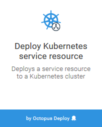

[Service resources](http://g.octopushq.com/KubernetesServiceResource), expose Pod resources either internally within Kubernetes cluster, or externally to public clients. The `Deploy Kubernetes service resource` steps can be used to configure and deploy a Service resource.

## Service Name
Each Service resource requires a unique name, defined in the `Name` field. The names must consist of lower case alphanumeric characters or '-', and must start and end with an alphanumeric character.

## Service Type

A Service resource can be one of three different types:
* Cluster IP
* Node Port
* Load Balancer

A Cluster IP Service resource provides a private IP address that applications deployed within the Kubernetes cluster can use to access other Pod resources.

A Node Port Service resource provides the same internal IP address that a Cluster IP Service resource does. In addition, it creates a port on each Kubernetes node that directs traffic to the Service resource. This makes the service accessible from any node, and if the nodes have public IP addresses then the Node Port Service resource is also publicly accessible.

A LoadBalancer Service resource provides the same Cluster IP and Node Ports that the other two service resources provide. In addition, it will create a cloud load balancer that directs traffic to the node ports.

The particular load balancer that is created depends on the environment in which the LoadBalancer Service resource is created. In AWS, an ELB or ALB can be created. Azure or Google Cloud will create their respective load balancers.

## Cluster IP Address

The `Cluster IP Address` field can be used to optionally assign a fixed internal IP address to the Service resource.

## Ports

Each port exposed by the Service resource has four common fields: Name, Port, Target Port and Protocol.

The `Name` field assigns an optional name to the port. This name can be used by Ingress resource objects.

The `Port` field defines the internal port on the Service resource that internal applications can use.

The `Target Port` field defines the name or number of the port exposed by a container.

The `Protocol` field defines the protocol exposed by the port. It can be `TCP` or `UDP`.

If the Service resource is a NodePort or LoadBalancer, then there is an additional optional `Node Port` field that defines the port exposed on the nodes that direct traffic to the Service resource. If not defined, a port number will be automatically assigned.

### Service Labels

[Labels](http://g.octopushq.com/KubernetesLabels) are optional name/value pairs that are assigned to the Service resource.

### Service Selector Labels

[Selector Labels](http://g.octopushq.com/KubernetesLabels) define the optional labels that must exist on the Pod resources in order for this Service resource to send traffic to them.

:::hint
There are some advanced use cases where creating a Service resource without selectors is useful. Refer to the [Kubernetes documentation](http://g.octopushq.com/KubernetesServicesWithoutSelectors) for more information.
:::
