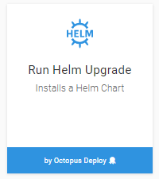

Support for deploying Helm charts, was introduced in **Octopus 2018.9**. Helm Charts are like a package manager for Kubernetes applications, allowing users to reuse and share complex resource configurations.

## Helm Feed
A Helm Feed in Octopus refers to a [Helm Chart repository](https://github.com/helm/helm/blob/master/docs/chart_repository.md). This repository is effectively just a HTTP server that houses an `index.yaml` which describes the charts available on that server. Octopus uses this index file to determine the available "packages" (Charts) and versions. A chart is a tarball that looks like `alpine-0.1.2.tgz` which for this example Octopus will interpret as having PackageID `alpine` and version `0.1.2`. There are various ways you can host a chart repository, from using the out-of-the-box [helm serve](https://github.com/helm/helm/blob/master/docs/helm/helm_serve.md) command, third party tools like [ChartMuseum](https://github.com/chartmuseum/chartmuseum) or [Artifactory](https://www.jfrog.com/confluence/display/RTF/Helm+Chart+Repositories), or even hosting your own [static web server](https://github.com/helm/helm/blob/master/docs/chart_repository.md#hosting-chart-repositories).

For more information about Helm Chart repositories and how to run your own private repository, check out the living documentation on their [GitHub repo](https://github.com/helm/helm/blob/master/docs/chart_repository.md).

## Helm Upgrade Step
Since the [helm upgrade](https://docs.helm.sh/helm/#helm-upgrade) command provides the ability to ensure that the chart is installed when it runs for the fist time (by using the `--install` argument), this upgrade command is the most practical step to provide.

:::success
Remember that since the Kubernetes cluster connection context is available via the kubectl script step, any helm commands that you want to perform that don't fit into the existing helm upgrade step can easily be scripted as per usual.
:::

### Upgrade Options

#### Kubernetes Release
The Kubernetes release uniquely identifies the released chart in the cluster. Because of the unique naming requirements of the release name, the default value provided includes both the project and environment name to ensure that successive Octopus releases do not conflict with one another. When redeploying new versions of the chart, this name is what is used to uniquely identify the resources that are related to that Octopus deployment. Helm requires that this name consist of only lowercase alpha numeric and dash (-) characters.

:::hint
Do to the design of Helm, the release names must be [unique across the entire cluster](https://github.com/helm/helm/issues/2060#issuecomment-287164881), not just namespaces.
:::

#### Reset Values
By default Helm will carry forward any existing configuration between deployments if not explicitly overridden. To ensure that the Octopus provided configuration acts as the source of truth, the `--reset-values` argument is set on the invoked command however this can be disabled if desired.

#### Helm Client Tool
Helm performs some strict version checks when performing any commands against the cluster and requires that the client have the same minor version as the tiller service (the helm component running in your cluster) in your Kubernetes cluster.

:::success
Like the other Kubernetes steps, the Octopus Server or workers will run the Helm commands directly during execution and need to have the `helm` executable installed.
:::

Since it is quite common to have different versions of Helm across your deployment workers or even across different environments clusters, this option lets you override the helm client tool that is invoked. By default, Octopus will expect the helm command to be directly available to the execution context. Provide either the explicit full path to the desired version of the helm tool or include a version of helm as a package. The available version can be downloaded via the helm public [GitHub repository](https://github.com/helm/helm/releases). Unlike some other Octopus steps like [Azure Powershell Scripts](/docs/deployment-examples/custom-scripts/azure-powershell-scripts.md), the helm client tools are not automatically embedded or installed by Octopus. This is due to the strict version requirements that would differ between Octopus Server installations, and the diverse number of different platform builds available.

### Template Values

The configuration for the Kubernetes resources required in a Helm Chart can be provided by making use of [Chart Templates](https://docs.helm.sh/chart_template_guide/). In each of the following options, the values file are passed into the `helm upgrade` command with the `-f` argument. The template values are applied in the order that they are displayed (i.e. with values provided the `Explicit key values` option taking a higher precedence than the same value obtained via the `Raw values YAML` option).

- **Explicit Key Values:** This option provides the ability to quickly provide key/value pairs of template configuration.
- **Raw values YAML:**  Standard Octopus [variable substitution syntax](/docs/deployment-process/variables/variable-substitution-syntax.md) can be used so long as the final contents are a valid YAML file.
- **Files in Chart Package:** If there are any other values files contained within the selected chart (by default, `./values.yaml` in the root of the package is picked up by helm), they can be referenced with this option. Octopus Variable replacement will be performed on the file before being used.
- **Files in Additional Packages:** When using publicly available Helm Charts as the package source for this step, you may want to source your custom values files from outside Octopus, for example, through files committed to a [GitHub feed](/docs/packaging-applications/package-repositories/github-feeds.md). Files obtained through this option will have Octopus Variable replacement performed before being used.

## Known Limitations
Helm provides [provenance](https://github.com/helm/helm/blob/master/docs/provenance.md) tools that assist in verifying the integrity and origin of a package. Octopus does not _currently automatically_ perform validation checks during a deployment using these tools however this may change in the future.
Although the helm client tool can be overridden for use during the step execution as noted above, the acquisition process currently requires a version of the helm client locally to retrieve the chart. The version of helm available does not need to match the version of the tiller service.
