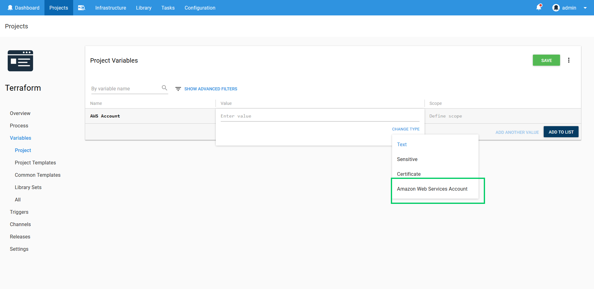
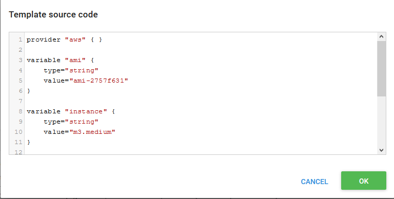

Terraform support was introduced in **Octopus 2018.3**.

Existing Terraform resources can be destroyed through the `Destroy Terraform resources` step. This step destroys the resources created using a Terraform template, optionally using AWS credentials managed by Octopus.

The proceeding instructions can be followed to configure the `Destroy Terraform resources` step.

## Terraform Backends

When running Terraform on a local PC, the state of the resources managed by Terraform is saved in a local file. This state is queried to learn which resources already exist in order to properly apply updates and destroy resources.

When Terraform is run by Octopus, this state file is not preserved between executions. This means that, for almost all practical applications of Terraform through Octopus, a remote backend must be configured. A remote backend allows this state information to be preserved between Terraform steps.

Refer to the [Terraform documentation](https://www.terraform.io/docs/backends/index.html) for more information on configuring backends.

:::warning
While neither Octopus nor Terraform will generate errors if a remote backend is not configured, most attempts to update or delete existing resources will not work as expected without a remote backend.
:::

## AWS Account Support

If you wish to use AWS credentials managed by Octopus when deploying Terraform templates, the AWS account will need to be added to Octopus, and a variable referencing the account configured in the project.

:::hint
Using AWS credentials managed by Octopus is optional. These credentials can be saved directly into the Terraform template if that approach is preferable.
:::

## Create an AWS Account

The instructions at [Creating an AWS Account](/docs/infrastructure/accounts/aws/index.md#create-an-aws-account) detail the procedure for creating an account in Octopus.

### Create a AWS Account Project Variable

AWS accounts are included in a project through a project variable of the type `Amazon Web Services Account`.



The `Add Variable` window is then displayed and lists all the AWS accounts.

Select the account that was created in the previous step to assign it to the variable.


### Selecting the Account

Under the `Managed Account` section, select `AWS Account`. This will display two additional sections where the AWS account can be selected, and the default AWS region optionally defined.

### AWS Section

Select the variable that references the `Amazon Web Services Account` under the `AWS Account` section or select whether you wish to execute using the service role of an EC2 instance.


The supplied account can optionally be used to assume a different AWS service role. This can be used to run the AWS commands with a role that limits the services that can be affected.


:::hint
If you select `Yes` to `Execute using the AWS service role for an EC2 instance`, you do not need an AWS account or account variable. Instead the AWS service role for the EC2 instance executing the deployment will be used. See the [AWS documentation](https://g.octopushq.com/AwsDocsRolesTermsAndConcepts) for more information on service roles.
:::

:::hint
Credentials defined in the Terraform template take precedence over any credentials defined in the step.
:::

### Region Section

You can optionally define the default region to use when interacting with AWS in the `Region` section.

:::hint
Regions defined in the Terraform template take precedence over the default value defined in the step.
:::

### Template Section

The Terraform template can come from two sources: directly entered source code or from files in a package.

#### Source Code

The first option is to paste the template directly into the step. This is done by selecting the `Source code` option, and clicking the `ADD SOURCE CODE` button.


This will present a dialog in which the Terraform template can be pasted, in either JSON or HCL.



Once the `OK` button is clicked, the input variables defined in the template will be shown under the `Variables` section.


Terraform variables are either strings, lists or maps.

Strings (including numbers and `true`/`false`) are supplied without quotes. For example `my string`, `true` or `3.1415`.

Lists and maps are supplied as raw HCL or JSON structures, depending on the format of the template. For example, if the template is written in HCL, a list variable would be provided as `["item1", {item2="embedded map"}]` and a map variable would be provided as `{item1="hi", item2="there"}`. If the template is written is JSON, a list variable would be provided as `["item1", {"item2": "embedded map" }]` and a map variable would be provided as `{"item1": "hi", "item2": "there"}`.

#### Package

The second option is to use the files contained in a package. This is done by selecting the `File inside a package` option, and specifying the package.

The contents of the package will be extracted, and Terraform will automatically detect the files to use. See the [Terraform documentation](https://www.terraform.io/docs/configuration/load.html) for more details on the file load order.

You can optional run Terraform from a subdirectory in the package by specifying the path in the `Terraform template directory` field. The path must be relative (i.e. without a leading slash). If your package has the Terraform templates in the root folder, leave this field blank.

:::hint
Given that Terraform templates and variable files are plain text, you may find it convenient to use the GitHub Repository Feed to provide the packages used by Terraform steps. Using GitHub releases means you do not have to manually create and upload a package, and can instead tag a release and download it directly from GitHub.
:::


#### Variable Replacements

Variable replacement is performed before the template is applied or destroyed when defined in either an inline script or a package.

When deploying a template from a package, all `*.tf`, `*.tfvar`, `*.tf.json` and `*.tfvar.json` files will have variable substitution applied to them. You can also have variable substitution applied to additional files by defining the file names in the `Target files` field.

For example, if you were deploying from a package and your template file looked like this:

```json
provider "aws" { }

resource "aws_instance" "example" {
  ami           = "#{AMI}"
  instance_type = "m3.medium"
  tags {
    Name = "My EC2 Instance"
  }
}
```

Then the value from the project variable `AMI` would be substituted for the marker `#{AMI}`.

When applying an inline template, the variable fields can also include replacement markers. For example, if a map variable for a HCL template was defined as `{"key" = "value", #{MapValues}}` and the Octopus project had a variable called `MapValues` defined as `"key2" = "value2"`, then the final variable would resolve to `{"key" = "value", "key2" = "value2"}`.

See the [variable substitution](/docs/deployment-process/variables/variable-substitutions.md) documentation for more information.

#### Additional Variable Files

The `Additional variable files` option contains a new-line separated list of variable files to use with the deployment. All files called `terraform.tfvars`, `terraform.tfvars.json`, `*.auto.tfvars` and `*.auto.tfvars.json` are automatically loaded by Terraform, and do not need to be listed here. However you may want to reference environment specific variable files by referencing them with files names built around variable substitution such as `#{Octopus.Environment.Name}.tfvars`.

Each line entered into this field will be passed to Terraform as `-var-file '<filename>'`.

## Advanced Options Section

You can optionally control how Terraform downloads plugins and where the plugins will be located in the `Advanced Options` section.

The `Terraform workspace` field can optionally be set to the desired workspace. If the workspace does not exist it will be created and selected, and if it does it exist it will be selected.

The `Terraform plugin cache directory` can be optional set to a directory where Terraform will look for existing plugins, and optionally download new plugins into. By default this directory is not shared between targets, so additional plugins have to be downloaded by all targets. By setting this value to a shared location, the plugins can be downloaded once and shared amongst all targets.

The `Allow additional plugin downloads` option can be checked to allow Terraform to download missing plugins, and unchecked to prevent these downloads.

The `Custom terraform init parameters` option can be optionally set to include any parameters to pass to the `terraform init` action.

The `Custom terraform apply parameters` option can be optionally set to include any parameters to pass to the `terraform destroy` action.


### Special Variables

Setting the variable `Octopus.Action.Terraform.CustomTerraformExecutable` to the absolute path of a custom Terraform executable will result in the step using that executable instead of the one shipped with Octopus. You can use this variable to force the Terraform steps to use a specific version of Terraform, or to use the x64 version if you wish.

For example, setting `Octopus.Action.Terraform.CustomTerraformExecutable` to `C:\Apps\terraform.exe` will cause the steps to execute `C:\Apps\terraform.exe` rather than the built in copy of Terraform.

Setting the `Octopus.Action.Terraform.AttachLogFile` variable to `True` will attach the Terraform log file as an artifact to the step.
