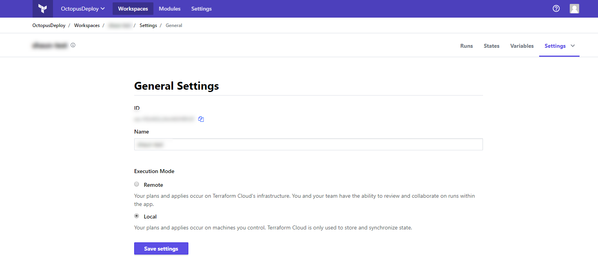

When running Terraform on a local PC, the state of the resources managed by Terraform is saved in a local file. This state is queried to learn which resources already exist in order to properly apply updates and destroy resources.

When Terraform is run by Octopus, this state file is not preserved between executions. This means a remote backend must be configured for almost all practical applications of Terraform through Octopus, allowing the state information to be preserved between Terraform steps.

Refer to the [Terraform documentation](https://www.terraform.io/docs/backends/index.html) for more information on configuring backends.

:::warning
While neither Octopus nor Terraform will generate errors if a remote backend is not configured, most attempts to update or delete existing resources will not work as expected without a remote backend.
:::

## Remote State Terraform Cloud

Using terraform enterprise for remote state requires a data source using referencing the `remote` backend

```
variable "token" {
  type = "string"
}

variable "organization" {
  type = "string"
}

variable "workspace" {
  type = "string"
}

data "terraform_remote_state" "state" {
	backend = "remote"
  	config = {
    	organization = "${var.organization}"
		workspaces = {
  			name = "${var.workspace}"
		}
		token =  "${var.token}"
  }
}
```

Just like any other data source, it must first exist remotely. In order to achieve this, you must have an empty template such as above which contains only the data source in question. You should then run `terraform init` followed by
`terraform plan` to generate the empty state. The remote state can then be seeded using `terraform state push .\.terraform\terraform.tfstate`. This is necessary as including resources as part of the template will result in errors such as
`No stored state was found for the given workspace in the given backend.` as terraform tries to first read the remote state that doesn't exist.

## Enhanced Backends

Terraform has the concept of enhanced backends which enable both storage and execution of operations such as plan and apply remotely. Octopus does not prevent you from using backends such as these, however the execution of actions remotely may not
always work as intended. It is for this reason that we recommend using remote state and keep exection of actions local. Terraform Cloud / Enterprise provides an option as part of the workspace settings which makes this rather trivial.

