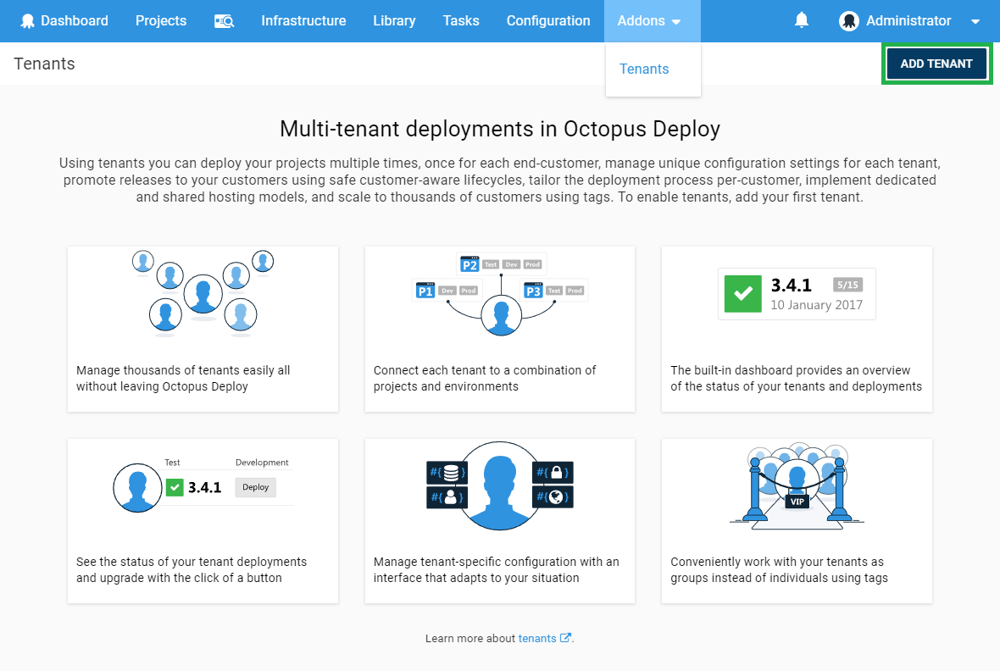
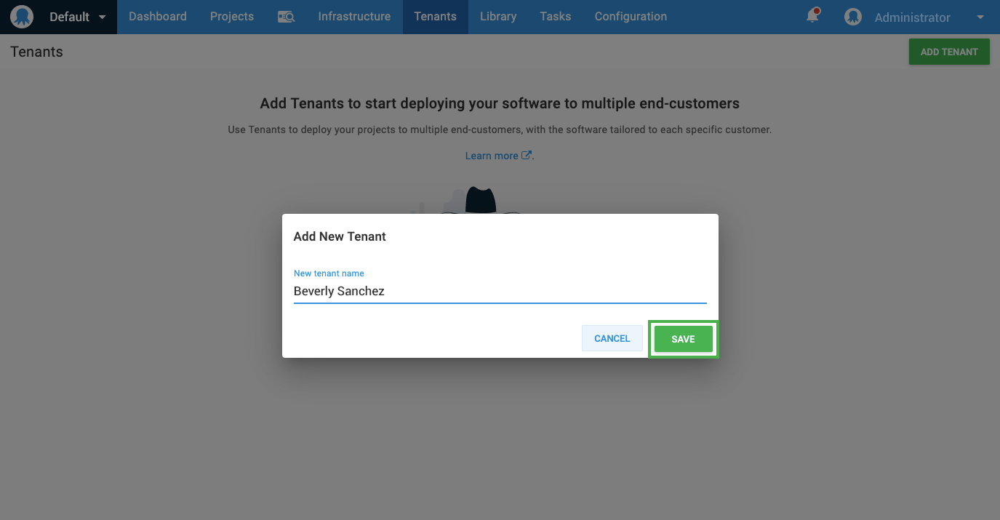

This page describes each step involved in creating your first tenant.

1. Go to **Tenants** and click the **Add tenant** button:

   

2. Enter the name you want to use for the tenant and click the **Save** button:

    

That's it - you've created your first tenant, but you may have noticed you cannot do much with that tenant right now. In the following steps we will create a project and connect this tenant to that project and deploy it into the tenant's environment.

## Add Your Logo

Try adding a logo for your tenant - this will make it much easier to distinguish your tenants from each other. You can do this by clicking on the tenant's logo placeholder or going to the Settings tab on the tenant.

In reality your tenants would be other businesses, but for our sample we've used anonymous people data from [http://api.randomuser.me/](http://api.randomuser.me/).

## Next Steps {#Creatingyourfirsttenant-Nextsteps}

In the following steps we will [create a multi-tenant project](/docs/deployment-patterns/multi-tenant-deployments/multi-tenant-deployment-guide/creating-your-first-multi-tenant-project.md) and then [deploy that project into the tenant's environment](/docs/deployment-patterns/multi-tenant-deployments/multi-tenant-deployment-guide/deploying-a-simple-multi-tenant-project.md).
