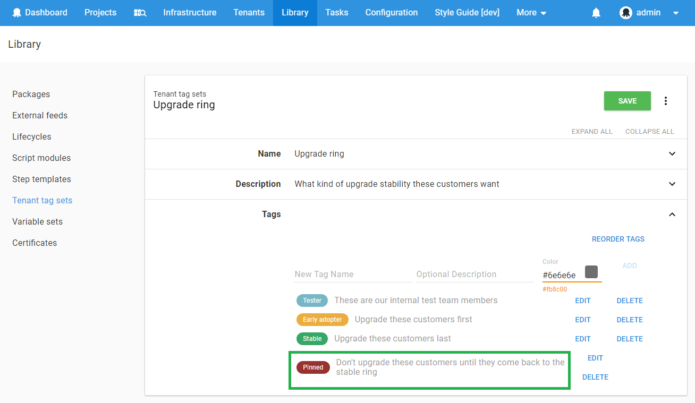

Previous step: [Designing a multi-tenant hosting model](/docs/deployment-patterns/multi-tenant-deployments/multi-tenant-deployment-guide/designing-a-multi-tenant-hosting-model.md)

This page describes how to design a multi-tenant upgrade process using some of the features built in to Octopus Deploy.

:::success
You should understand [Lifecycles](/docs/infrastructure/lifecycles/index.md) and [Tenant Tags](/docs/deployment-patterns/multi-tenant-deployments/tenant-tags.md) before continuing with this guide.
:::

## Upgrading Tenanted Applications

Quite often you want to upgrade tenanted applications by rolling the upgrade through each of your tenants in a controlled fashion, instead of upgrading every tenant simultaneously. You can achieve any upgrade process you want by deploying upgrades to your tenants one at a time, but that can be an error-prone and time-consuming task. Octopus Deploy provides features to make it safer and easier to roll upgrades through your tenants.

## Tenants and Lifecycles

Quite often you want to provide a tenant-specific "test" environment where upgrades can be tested by the customers before you upgrade their "production" environment. This is how Octopus Deploy behaves out of the box - if a tenant is connected to multiple environments of a project, you will be required to promote a release through the environments in the order defined by the [Lifecycle](/docs/infrastructure/lifecycles/index.md). Let's build on our working example and test this out. We are going to perform an untenanted deployment into the **MT Dev** environment, then promote those releases to our test team in the **MT Test** environment, upgrade the **MT Staging** environment for our tenant, and finally upgrade their instance of the application in the **MT Production** environment.

### Step 1: Configure the Lifecycle

Let's make sure all of the environments exist and configure our lifecycle. If you have been working through this guide you will already have the **MT Normal Lifecycle** with the **MT Production** environment.

1. Make sure the **MT Dev**, **MT Test**, **MT Staging** and **MT Production** environments have been configured.
2. Configure the **MT Normal Lifeycle** to promote releases to each of these environment in the order shown.


### Step 2: Configure a Test Tenant

Now we will create a new tenant for one of the people in our quality assurance or test team.

1. Configure a new tenant giving it any name and tags that make sense.
2. Connect the tenant to the project and the **MT Test** environment.

### Step 3: Configure Another Tenant with Multiple Environments

Now we will configure a tenant to deploy into multiple environments. If you have been working through this guide you will already have a tenant you can use.

1. Connect a tenant to the project and both the **MT Staging** and **MT Production** environments.

### Step 4: Deploy!

## Deploying to Individual Tenants

You can deploy to a single tenant, or a handful of tenants in a batch by selecting them manually. This can be a good way to get started with multi-tenant deployments, and it's also a good fallback when you need it.

You can also use the Project Overview to deploy to individual tenants by selecting a release and clicking the **Deploy** buttons.

## Deploying to all Tenants in an Environment

You can deploy to all of the tenants in an environment using the Octopus UI, `octo.exe` or any of the build-server extensions. Octopus will create a deployment for each tenant which is ready for that release to be deployed to the project/environment. Octopus will automatically exclude the tenants which are not ready for that release yet - perhaps they haven't met their lifecycle requirements.

### Using octo.exe

For example you can use this command-line with `octo.exe` to deploy the `1.0.1` release of `Mojo` to all the tenants in the `MT Dev` environment:

```powershell
octo.exe deploy-release --project Mojo --version 1.0.1 --deployto "MT Dev" --tenant * --server http://octopus/ --apiKey API-ABCDEF123456
```

### Using a Build-server Extension

When using the Create Release, Deploy Release or Promote Release features of the build-server extensions, you can set the **`Tenants`** value to **`*`**


## Deploying to Tenants Using Tenant Tags

You can create tenant tag sets specifically to help with deployments and rolling out upgrades. Quite often you want to deploy targeted releases to your testers, and once testing is finished you want to flight/prove that upgrade with a smaller group of tenants before rolling it out to the rest of your tenants. Let's design that kind of process using tenant tags.

### Step 1: Create a Tag Set Called "Upgrade ring"

Firstly we we create a tag set called **Upgrade ring** with tags allowing each tenant to choose how early in the development/test cycle they want to receive upgrades.

1. Create a new tenant tag set called **Upgrade ring** and add tags for **Tester**, **Early adopter**, and **Stable**.
2. Make sure to choose colors that highlight different tenants.


### Step 2: Configure a Test Tenant

Now you can configure the test tenant you created earlier as part of the test team who will receive upgrades before any of the external tenants.

1. Tag your test tenant(s) with **`Upgrade ring/Tester`**.

### Step 3: Configure Some Early Adopter Tenants and Stable Tenants

Now you can optionally configure some external tenants as opting in to early or stable releases to see the effect.

1. Find or create some tenants and tag them as either **`Upgrade ring/Stable`** or **`Upgrade ring/Early adopter`**.

### Step 5: Deploy! {#Designingamulti-tenantupgradeprocess-Step5:Deploy!}

Now it's time to deploy using tenant tags as a way to easily select multiple tenants. In this example we are going to deploy **version 1.0.1** to all of the tenants tagged with `Upgrade ring/Tester` who are connected to the the **MT Test** environment. You can use multiple tags and complex tag queries to achieve other interesting scenarios as discussed we discussed [earlier](/docs/deployment-patterns/multi-tenant-deployments/multi-tenant-deployment-guide/working-with-groups-of-tenants-using-tags.md).


You can also use the Project Overview to deploy to groups of tenants by grouping the dashboard, selecting a release and clicking the **Deploy to all** button.


## Using channels and tenant tags to restrict test releases to the test team {#Designingamulti-tenantupgradeprocess-Usingchannelsandtenanttagstorestricttestreleasestothetestteam}

You may decide to use channels as a safety measure, to restrict test releases to a limited set of test tenants. By using a combination of [Channels](/docs/deployment-process/channels.md) and [Tenant Tags](/docs/deployment-patterns/multi-tenant-deployments/tenant-tags.md) you can make sure test releases are only deployed to the correct tenants and environments.

### Step 1: Create the Lifecycle {#Designingamulti-tenantupgradeprocess-Step1:CreatetheLifecycle}

Firstly we will create a new [Lifecycle](/docs/infrastructure/lifecycles/index.md)


:::hint
Learn more about [defining a limited Lifecycle for your test Channel](/docs/deployment-process/channels.md).
:::

### Step 2: Configure a channel for the test program {#Designingamulti-tenantupgradeprocess-Step2:Configureachannelforthetestprogram}

Earlier in this guide we created the **`Upgrade ring/Tester`** tag and tagged some tenants. Now we will create a Channel leveraging that tag to restrict releases in the Channel to the Lifecycle we just created.


### Step 3: Create a test release {#Designingamulti-tenantupgradeprocess-Step3:Createatestrelease}

Now create a release in the new **1.x Test** channel giving it a [SemVer](http://semver.org/) pre-release version like **1.0.1-alpha.19** indicating this is a pre-release of **1.0.1** for testing purposes.


### Step 4: Deploy! {#Designingamulti-tenantupgradeprocess-Step4:Deploy!.1}

Now when you deploy this release, you will be able to choose from the limited set of tenants tagged with the **`Upgrade ring/Tester`** tag, and deploy into the **MT Dev** and **MT Test** environments, but no further.

## Using channels and tenant tags to implement an early access program {#Designingamulti-tenantupgradeprocess-Usingchannelsandtenanttagstoimplementanearlyaccessprogram}

Quite often you want to involve certain customers in testing early releases of major upgrades. By using a combination of [Channels](/docs/deployment-process/channels.md) and [Tenant Tags](/docs/deployment-patterns/multi-tenant-deployments/tenant-tags.md) you can implement an opt-in early access program using tenants, making sure the beta releases are only deployed to the correct tenants and environments.

### Step 1: Create the Lifecycle {#Designingamulti-tenantupgradeprocess-Step1:CreatetheLifecycle.1}

Firstly we will create a new [Lifecycle](/docs/infrastructure/lifecycles/index.md)


:::hint
Learn more about [defining a limited Lifecycle for your test Channel](/docs/deployment-process/channels.md).
:::

### Step 2: Configure the tenant tags {#Designingamulti-tenantupgradeprocess-Step2:Configurethetenanttags}


### Step 3: Select the tenants participating in the Beta program {#Designingamulti-tenantupgradeprocess-Step3:SelectthetenantsparticipatingintheBetaprogram}


### Step 4: Configure a Channel for the Beta program {#Designingamulti-tenantupgradeprocess-Step4:ConfigureaChannelfortheBetaprogram}


### Step 5: Create a Beta release {#Designingamulti-tenantupgradeprocess-Step5:CreateaBetarelease}

Create a new release of the project choosing the **2.x Beta** channel for the release, and give it a SemVer 2 version number like **2.0.0-beta.1**


### Step 6: Deploy! {#Designingamulti-tenantupgradeprocess-Step6:Deploy!}

Now when you are deploying **2.0.0-beta.1** you will be able to select tenants participating in the Beta program, and prevented from selecting tenants who are not participating.

## Pinning tenants to a release {#Designingamulti-tenantupgradeprocess-Pinningtenantstoarelease}

Quite often you will want to disable/prevent deployments to a tenant during a period of time where the customer wants guarantees of stability. You can prevent deployments to tenants using a combination of [Channels](/docs/deployment-process/channels.md) and [Tenant Tags](/docs/deployment-patterns/multi-tenant-deployments/tenant-tags.md).

### Step 1: Create the Upgrade Ring/Pinned tag {#Designingamulti-tenantupgradeprocess-Step1:CreatetheUpgradeRing/Pinnedtag}

In the tenant tag set you created earlier, add a new tag called **Pinned** with a color that really stands out.



### Step 2: Configure the Channels to prevent deployments to Pinned tenants {#Designingamulti-tenantupgradeprocess-Step2:ConfiguretheChannelstopreventdeploymentstoPinnedtenants}

Now we will configure the project channels to make sure we never deploy any releases to pinned tenants. We will do this using a similar method to the Beta program, but in this case we are making sure none of the channels allow deployments to tenants tagged as pinned.

1. Find the **1.x Normal** channel you created earlier
2. Restrict deployments of releases in this channel to `Upgrade ring/Stable`, `Upgrade ring/Early adopter`, and `Upgrade ring/Tester`
3. Make sure Upgrade ring/Pinned is not selected in any channel


### Step 3: Prevent deployments to a tenant by tagging them as Upgrade Ring/Pinned {#Designingamulti-tenantupgradeprocess-Step3:PreventdeploymentstoatenantbytaggingthemasUpgradeRing/Pinned}

Find a tenant you want to pin and apply the **Upgrade ring/Pinned** tag, removing any other tags. This will prevent you from deploying any releases to this tenant.


## Next steps {#Designingamulti-tenantupgradeprocess-Nextsteps}

Now you can continue and investigate how you can [use the Octopus security model with tenants](/docs/deployment-patterns/multi-tenant-deployments/multi-tenant-deployment-guide/multi-tenant-roles-and-security.md).
