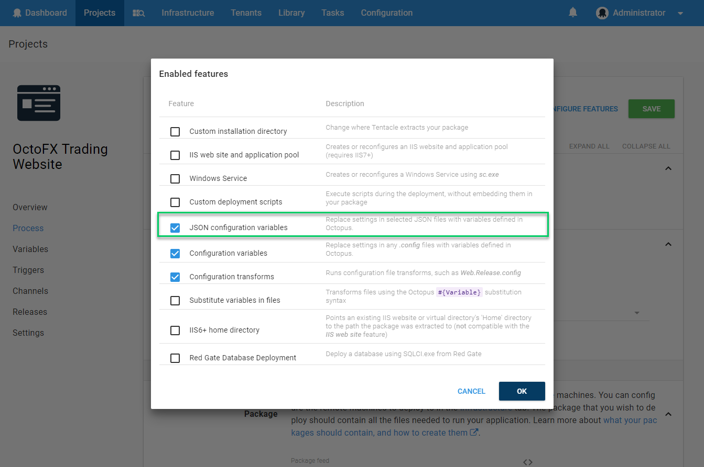

The JSON Configuration Variables feature is one of the [configuration features](/docs/deployment-process/configuration-features/index.md) you can enable as you define the [steps](/docs/deployment-process/steps/index.md) in your [deployment process](/docs/deployment-process/index.md).

The JSON Configuration Variables feature updates your JSON configuration files with the values from matching Octopus variables. In many ways this feature works similarly to the [Substitute Variables in Files](/docs/deployment-process/configuration-features/substitute-variables-in-files.md) feature, but uses a special matching syntax so you can update configuration nested in JSON object and array literals.

:::hint
This feature is designed to work natively with [.NET Core JSON configuration files](http://docs.asp.net/en/latest/fundamentals/configuration.html) but works equally as well with any JSON files.

Our ASP.NET Core web application [deployment guide](/docs/deployment-examples/asp.net-core-web-application-deployments/index.md) provides further information on how this feature fits into an Octopus project's deployment process.
:::

## Configuring the JSON Configuration Variables Feature {#JSONConfigurationVariablesFeature-ConfiguringtheJSONconfigurationvariablesfeature}

### Step 1: Enable the Feature {#JSONConfigurationVariablesFeature-Step1:Enablethefeature}

To configure a package step to replace matching app settings in your JSON configuration files ensure the **JSON configuration variables** feature is enabled.



### Step 2: Configure Which Files to Update {#JSONConfigurationVariablesFeature-Step2:Configurewhichfilestoupdate}

Next, specify the relative paths within the package to your JSON configuration files.

:::success
**Relative path example**
Your relative path may look something like:

```
approot\packages\ASPNET.Core.Sample\1.0.0\root\appSettings.json
```
:::

Note that you can even use the [Variable Substitution Syntax](/docs/deployment-process/variables/variable-substitution-syntax.md) patterns in this file selection input box itself to do things like reference environment specific files, or conditionally include them based on scoped variables.


Any matching variables in the JSON file will have their values replaced with the variables you have configured in Octopus.

## How Your JSON Configuration Settings Are Updated by Octopus {#JSONConfigurationVariablesFeature-HowyourJSONconfigurationsettingsareupdatedbyOctopus}

When this feature is enabled, Octopus will find the target files and replace any matching configuration settings with the value of matching Octopus variables.

### Simple Variables {#JSONConfigurationVariablesFeature-Simplevariables}

Given this example of a target config file:

**Simple target file**

```json
{
   "weatherApiUrl": "dev.weather.com",
   "weatherApiKey": "DEV1234567",
   "tempImageFolder": "C:\temp\img"
}
```

If you have the Octopus Variables `weatherApiUrl` and `weatherApiKey` set to the values `test.weather.com` and `TEST7654321` the target config file is updated to become, noticing the `tempImageFolder` setting remains untouched:

**Simple JSON**

```json
{
   "weatherApiUrl": "test.weather.com",
   "weatherApiKey": "TEST7654321",
   "tempImageFolder": "C:\temp\img"
}
```

### Hierarchical Variables {#JSONConfigurationVariablesFeature-Hierarchicalvariables}

It is common (and encouraged) to use hierarchical variables in JSON configuration files.  This is supported in Octopus Deploy variables by using a nested path syntax delimited by *colon* characters.

For example, to update the value of `weatherApi.url` and `weatherApi.key` in the target config file you would configure the Octopus Variables `weatherApi:url` and `weatherApi:key`.

**Hierarchical JSON**

```json
{
   "weatherApi": {
      "url": "dev.weather.com",
      "key": "DEV1234567"
   }
}
```

You can also replace an entire object. For the example above you could set Octopus Variable `weatherApi` to a value of `{"weatherApi":{"url":"test.weather.com","key":"TEST7654321"}}`

### Array Variables {#JSONConfigurationVariablesFeature-Arrayvariables}

Octopus Deploy can also replace a value in a JSON array by using the zero-based index of the array in the variable name.

For example, the variable `foo:bar:1` with a value `qux` will update the value of the second element in the array to be `qux`:

**Hierarchical JSON**

```json
{
   "foo": {
      "bar": [
		"baz",
		"qux"
	  ]
   }
}
```

You can also replace an entire array. For the example above you could set Octopus Variable `foo:bar` to a value of ` ["baz","qux"]`.
