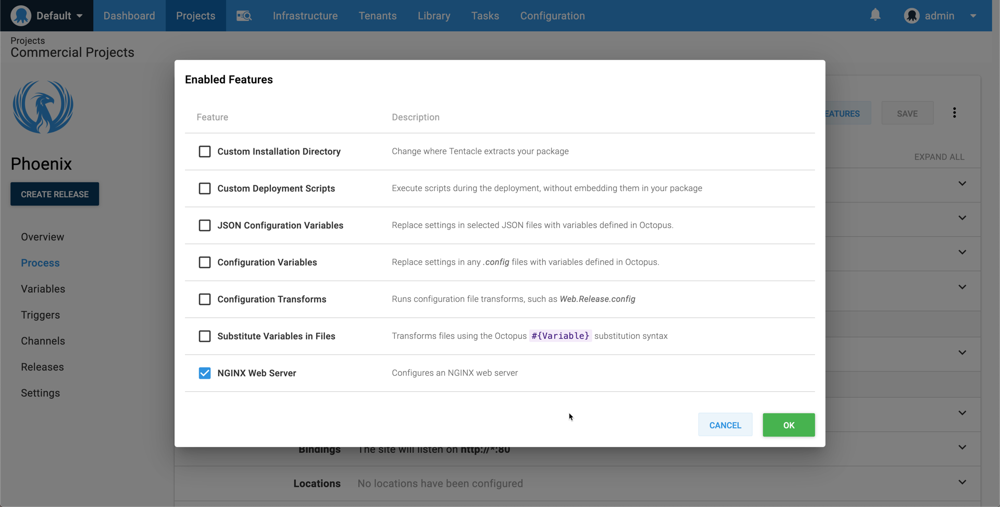

The NGINX feature is one of the [configuration features](/docs/deployment-process/configuration-features/index.md) you can enable as you define the [steps](/docs/deployment-process/steps/index.md) in your [deployment process](/docs/deployment-process/index.md).

The **NGINX** feature is available on **deploy a package** steps, however, there is also a **Deploy to NGINX** step which let you configure NGINX during deployment. See [NGINX on Linux deployment](/docs/deployment-examples/nginx-on-linux-deployments/index.md) for more details.

## Reverse Proxy

When configuring a `location` as a reverse proxy, we will add the following `header`s and `directives` by default.

### Headers
- `Upgrade $http_upgrade`,
- `Connection keep-alive`,
- `Host $host`,
- `X-Forwarded-For $proxy_add_x_forwarded_for`,
- `X-Forwarded-Proto $scheme`

### Directives
- `proxy_http_version 1.1`,
- `proxy_cache_bypass $http_upgrade`

## Limitations

### Supported Operating Systems

Currently the **NGINX** feature only support Linux based operating systems. See [NGINX supported distributions](https://docs.nginx.com/nginx/technical-specs/#supported-distributions) for more details.
