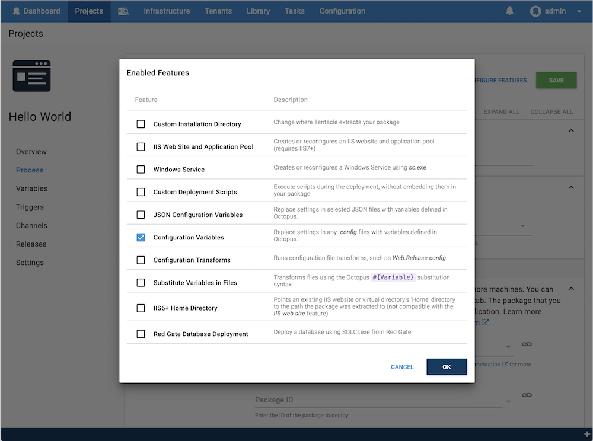

The Configuration Variables feature is one of the [configuration features](/docs/deployment-process/configuration-features/index.md) you can enable as you define the [steps](/docs/deployment-process/steps/index.md) in your [deployment process](/docs/deployment-process/index.md).

This feature can be enabled for package deploy steps.



Octopus will extract your package and parse your `*.config` files looking for any `appSettings`, `connectionStrings`, and `applicationSettings` elements where the name matches one of your [variables](/docs/deployment-process/variables/index.md).

:::hint
You can perform simple convention-based replacements in XML configuration files using this feature. We also have a feature tailored to [JSON configuration files](/docs/deployment-process/configuration-features/json-configuration-variables-feature.md).

If you are looking for something more flexible, we have the [Substitute Variables in Files feature](/docs/deployment-process/configuration-features/substitute-variables-in-files.md) enabling you to perform complex transformations on any kind of file.
:::

## How to Use this feature

The following example shows you how to use the this feature to provide your application with different configuration settings for each different environment you're deploying to. In this example we're deploying to a **Test** and **Production** environment.

Suppose you have this `web.config` or `MyApp.exe.config` file in your package which is configured for your local development environment:

```xml
<configuration>
  <appSettings>
    <add key="AWSAccessKey" value="dev-key"/>
    <add key="AWSSecretKey" value="dev-secret"/>
  </appSettings>
  <connectionStrings>
    <add name="DBConnectionString" connectionString="Server=(local)\SQLExpress;Database=Dev-Database;Integrated Security=SSPI" />
  </connectionStrings>
  <applicationSettings>
    <AppSettings.Properties.Settings>
      <setting name="WelcomeMessage" serializeAs="String">
        <value>Hello developer!</value>
      </setting>
    </AppSettings.Properties.Settings>
  </applicationSettings>
</configuration>
```

1. Create the variables in Octopus. From the [project](/docs/deployment-process/projects/index.md) overview page, click **Variables**.
  - Enter a the name for the variable, for instance, `AWSAccessKey`. **This name must match the key in your configuration file.**
  - Enter the value for the variable, for instance, `ABCDEFG`.
  - Scope the variable to the environment, for instance, `Test`.
  - Repeat the process for the **Production** environment, to give you a different value for the `AWSAccessKey` variable for each environment.
2. Repeat this for each element you want to replace in your configuration file.
3. Click **SAVE**.

In this example, you would have variables similar to the following:

| Variable Name    | Value     | Sensitive    | Scope    |
| ----------------------- | --------------- | -------- |
| `AWSAccessKey` | `ABCDEFG` | `No` | `Test` |
| `AWSAccessKey` | `HIJKLMN` | `No` | `Production` |
| `AWSSecretKey` | `1111111` | `Yes` | `Test` |
| `AWSSecretKey` | `2222222` | `Yes` | `Production` |
| `DBConnectionString` | `Server=testserver.mycompany.com;Database=Test-Database;Integrated Security=SSPI` | `No` | `Test` |
| `DBConnectionString` | `Server=prodserver.mycompany.com;Database=Prod-Database;Integrated Security=SSPI` | `No` | `Production` |
| `WelcomeMessage` | `Hello tester!` | `No` | `Test` |
| `WelcomeMessage` | `Hello customer!` | `No` | `Production` |

:::warning
Variables marked sensitive (`AWSSecretKey` in this example) are encrypted in the Octopus database. During deployment they are encrypted during transport, but eventually decrypted and written in clear-text to the configuration files so your application can use the value.
:::

4. Deploy your project to the `Test` environment, and Octopus will update the configuration file to:

```xml
<configuration>
  <appSettings>
    <add key="AWSAccessKey" value="ABCDEFG"/>
    <add key="AWSSecretKey" value="1111111"/>
  </appSettings>
  <connectionStrings>
    <add name="DBConnectionString" connectionString="Server=testserver.mycompany.com;Database=Test-Database;Integrated Security=SSPI" />
  </connectionStrings>
  <applicationSettings>
    <AppSettings.Properties.Settings>
      <setting name="WelcomeMessage" serializeAs="String">
        <value>Hello tester!</value>
      </setting>
    </AppSettings.Properties.Settings>
  </applicationSettings>
</configuration>
```

5. Deploy your project to the `Production` environment, and Octopus will update the configuration file to:

```xml
<configuration>
  <appSettings>
    <add key="AWSAccessKey" value="HIJKLMN"/>
    <add key="AWSSecretKey" value="2222222"/>
  </appSettings>
  <connectionStrings>
    <add name="DBConnectionString" connectionString="Server=prodserver.mycompany.com;Database=Prod-Database;Integrated Security=SSPI" />
  </connectionStrings>
  <applicationSettings>
    <AppSettings.Properties.Settings>
      <setting name="WelcomeMessage" serializeAs="String">
        <value>Hello customer!</value>
      </setting>
    </AppSettings.Properties.Settings>
  </applicationSettings>
</configuration>
```

:::success
Values are matched based on the `key` attribute for `appSettings`, and the `name` element for `applicationSettings` and `connectionStrings`.
:::

## Replacing Variables Outside appSettings, applicationSettings and connectionStrings {#Configurationfiles-VariablesInFilesReplacingvariablesoutsideappSettings,applicationSettingsandconnectionStrings}

There may be other variables you would like Octopus to replace in your configuration files that are outside both the `appSettings`, `connectionStrings`, and `applicationSettings` areas. For example, changing the `loginUrl` for forms authentication in an ASP.NET application:

```xml
    <authentication mode="Forms">
      <forms loginUrl="HOW-CAN-I-CHANGE-THIS!" timeout="2880" />
    </authentication>
```

Learn how to do this [with a fully worked example](/docs/deployment-examples/configure-environment-specific-configuration-transforms-while-keeping-sensitive-values-in-octopus.md) which describes how Octopus can take care of your deployment environments, without impacting how you configure your application for your local development environment.

This example uses the [XML Configuration Transforms feature](/docs/deployment-process/configuration-features/configuration-transforms.md) and [Substitute Variables in Files feature](/docs/deployment-process/configuration-features/substitute-variables-in-files.md) together.
