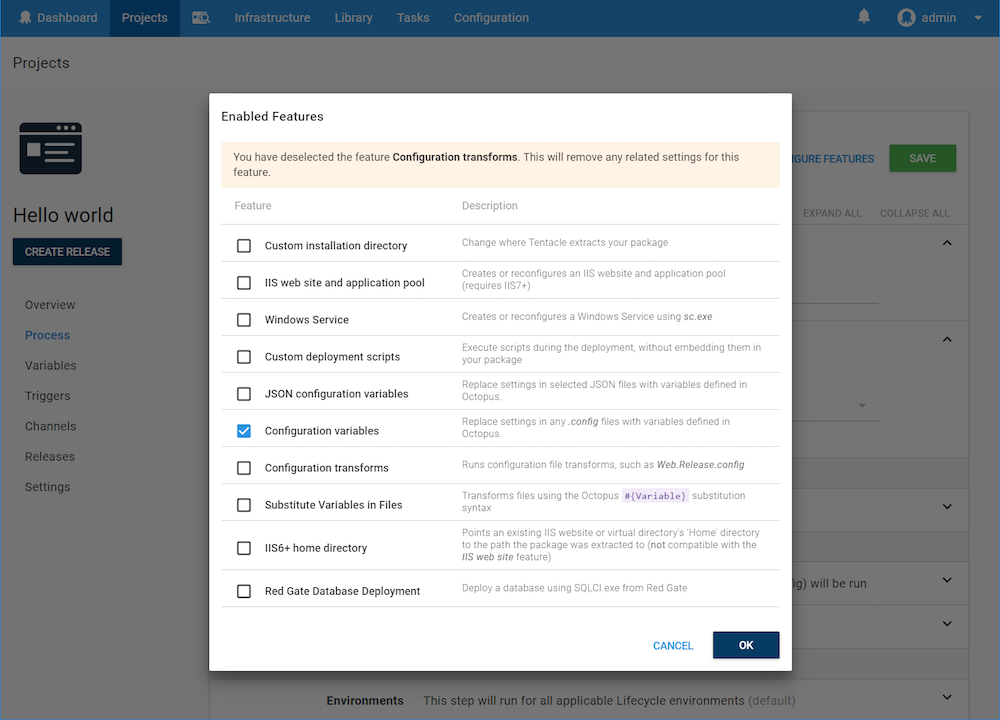

One of the essential steps in deploying software is configuring it to work in a specific environment. This might mean pointing your application to the right database connection string, or tweaking settings to run in production.

## Configuration Variables {#Configurationfiles-ConfigurationVariablesConfigurationvariables}

This feature can be enabled for package deploy steps.



If a [variable](/docs/deployment-process/variables/index.md) is defined in the Octopus web portal, and an **appSettings, applicationSettings** or **connectionStrings** element exists for it in any of your **.config** files, Tentacle will automatically replace the value after extracting your package.

For example, suppose you have this configuration file:

```xml
<configuration>
  <appSettings>
    <add key="AWSAccessKey" value="testkey"/>
    <add key="AWSSecretKey" value="testsecret"/>
  </appSettings>
  <connectionStrings>
    <add name="DBConnectionString" connectionString="Server=(local)\SQLExpress;Database=OnlineStore;Integrated Security=SSPI" />
  </connectionStrings>
  <applicationSettings>
    <AppSettings.Properties.Settings>
      <setting name="WelcomeMessage" serializeAs="String">
        <value>Hello</value>
      </setting>
    </AppSettings.Properties.Settings>
  </applicationSettings>
</configuration>
```

The variables **AWSAccessKey**, **AWSSecretKey**, and **DBConnectionString** can be access in the project menu under variables.

After deploying to an environment named "**Production**", Octopus will have updated the file to:

```xml
<configuration>
  <appSettings>
    <add key="AWSAccessKey" value="ABCDEFGHIJKLMNOP"/>
    <add key="AWSSecretKey" value="MfOWQdSJWi8JDYc/6YmoaHafz8jByBl9aksCoSLB"/>
  </appSettings>

  <connectionStrings>
    <add name="DBConnectionString" connectionString="Server=PRDSQL02;Database=OnlineStore;Integrated Security=SSPI" />
  </connectionStrings>
</configuration>
```

:::warning
Variables marked sensitive (`AWSSecretKey` in this example) will be decrypted and written in clear-text to the configuration files just like normal variables.
:::

The same concept applies to strongly-typed **applicationSettings** using the [Application Settings Architecture](https://msdn.microsoft.com/en-us/library/8eyb2ct1.aspx) built in to .NET. An equivalent example would be:

```xml
<configuration>
  <applicationSettings>
    <MyApplication.Properties.Settings>
      <setting name="AWSAccessKey" serializeAs="String">
        <value>ABCDEFGHIJKLMNOP</value>
      </setting>
      <setting name="AWSSecretKey" serializeAs="String">
        <value>MfOWQdSJWi8JDYc</value>
      </setting>
      <setting name="DBConnectionString" serializeAs="String">
        <value>Server=PRDSQL02;Database=OnlineStore;Integrated Security=SSPI</value>
      </setting>
    </MyApplication.Properties.Settings>
  </applicationSettings>
</configuration>
```

:::success
Values are matched based on the **key** attribute for **appSettings**, and the **name** element for **applicationSettings** and **connectionStrings**.
:::

## Replacing Variables Outside appSettings, applicationSettings and connectionStrings {#Configurationfiles-VariablesInFilesReplacingvariablesoutsideappSettings,applicationSettingsandconnectionStrings}

There may be other variables you would like Octopus to replace in your configuration files that are outside both the appSettings and connectionStrings areas.

There are three ways you can do this, two of which involve using [Octopus Variables](/docs/deployment-process/variables/index.md).

1. Insert `#{OctopusVariables}` where you would like the replacement to happen and use the [Substitute Variables in Files](/docs/deployment-process/configuration-files/substitute-variables-in-files.md) feature in the package step (see below for sample)
2. Insert `#{OctopusVariables}` where you would like the replacement to happen and then use the [Regular Expression Find and Replace](https://library.octopusdeploy.com/step-templates/0bef8c07-5739-4030-8c04-287ceeb51153/actiontemplate-file-system-regular-expression-find-and-replace-(updated)) library template (this means you can replace any Octopus Variable in any file outside of the package step, the only distinction to the first option)
3. Write and use a PowerShell script to find and replace variables inside of your configuration files

```powershell
    <authentication mode="Forms">
      <forms loginUrl="#{LoginURL}" timeout="2880" />
    </authentication>
```

There are pros and cons to each of these methods. For the first two it can break your configuration files locally. But if you make use of environment transforms (see below) you can avoid this. See the [Substitute Variables in Files](/docs/deployment-process/configuration-files/substitute-variables-in-files.md) documentation for an example of using Octopus Variables in your config files.

:::success
Using the Substitute Variables in Files feature will change the order that variables are replaced. Using Configuration Transformations and Configuration Variables, does the transformation and then replaces variables. Defining files within the substitution will have all of their variables replaced first prior to the transformation. But this will only happen for any configuration or transformation files that are explicitly listed in the Substitute files list. Read about the order of [package step feature ordering here](/docs/deployment-process/steps/deploying-packages/package-deployment-feature-ordering.md).
:::

## Configuration Transforms {#Configurationfiles-ConfigurationTransformationConfigurationtransforms}


If this feature is enabled, Tentacle will also look for any files that follow the Microsoft [web.config transformation process](https://msdn.microsoft.com/en-us/library/dd465326.aspx) – **even files that are not web.config files!** *Keep reading for examples.*

An example web.config transformation that removes the `<compilation debug="true">` attribute is below:

```xml
<?xml version="1.0"?>
<configuration xmlns:xdt="http://schemas.microsoft.com/XML-Document-Transform">
  <system.web>
    <compilation xdt:Transform="RemoveAttributes(debug)" />
  </system.web>
</configuration>
```

:::success
**Testing configuration transforms**
The team at [AppHarbor](https://appharbor.com/) created a useful tool to [help test configuration file transformations](https://webconfigtransformationtester.apphb.com/).
:::

### Naming Configuration Transform Files {#Configurationfiles-Namingconfigurationtransformfiles}

This feature will run your configuration transforms based on looking for transform files named with the following conventions. The configuration transformation files can either be named `*.Release.config`, or `*.<Environment>.config` and will be executed in this order:

1. `*.Release.config`
2. `*.<Environment>.config`

For an **ASP.NET Web Application**, suppose you have the following files in your package:

- `Web.config`
- `Web.Release.config`
- `Web.Production.config`
- `Web.Test.config`

When deploying to an environment named "**Production**", Octopus will execute the transforms in this order: `Web.Release.config`, followed by `Web.Production.config`.

For **other applications**, like Console or Windows Service applications, suppose you have the following in your package:

- `YourService.exe.config`
- `YourService.exe.Release.config`
- `YourService.exe.Production.config`
- `YourService.exe.Test.config`

When deploying to an environment named "**Test**", Octopus will execute the transforms in this order: `YourService.exe.Release.config`, followed by `YourService.exe.Test.config`.

:::success
You can see how this is actually done by our [open source Calamari project](https://github.com/OctopusDeploy/Calamari/blob/master/source/Calamari/Deployment/Conventions/ConfigurationTransformsConvention.cs).
:::

:::hint
**Windows Service and Console Application configuration transforms need special treatment**
Octopus looks for configuration transform files that match your executable's configuration file. Visual Studio has built-in support for this scenario for ASP.NET Web Applications, but it doesn't offer the same support for Windows Services and Console applications - you will need to take care of this yourself.

In Visual Studio your configuration file will be **`app.config`** and is renamed during the build process to match the executable - e.g., The **`app.config`** file for **`YourService.exe`** is renamed to **`YourService.exe.config`**.

To make sure Octopus can run the configuration transforms for your Windows Services and Console Applications:

1. Make sure you name your configuration transform files properly based on the target executable filename e.g., `YourService.exe.Release.config`, `YourService.exe.Production.config`
2. Set the **Copy to Output Directory** property for the configuration transform files to **Copy If Newer**.
3. Double-check the package you build for deployment actually contains the **`YourService.exe.config`** and all of the expected configuration transform files.


:::

## Additional Configuration Transforms {#Configurationfiles-AdditionalConfigurationTransforms}

You might have additional transforms to run outside of Debug, Environment or Release. You can define these in the Additional transforms box. If defined, these transforms will run regardless of the state of the `Automatically run configuration transformation files` checkbox.


Octopus supports explicit, wildcard and relative path configuration transform definitions on any XML file with any file extension. Octopus will iterate through all files in all directories (ie, recursively) of your deployed application to find any matching files. Your target file also must exist; it will not be created by Octopus.
As a general rule, you should not include the path to the files unless the transform file is in a different directory to the target, in which case it needs to be relative to the target file (as explained below in the relative path scenario). Absolute paths are supported for transform files, but not for target files.

### Explicit {#Configurationfiles-Explicit}

**Explicit config transform**

```powershell
Transform.config => Target.config
```

The above transform definition will apply **Transform.config** to **Target.config** when the files are in the same directory.

### Relative Path {#Configurationfiles-Relativepath}

**Relative path config transform**

```powershell
Path\Transform.config => Target.config
```

The above transform definition will apply **Transform.config** to **Target.config** when **Transform.config** is in the directory **Path** relative to **Target.config**.

### Wildcard {#Configurationfiles-Wildcard}

Wildcards can be used to select any matching file. For example, **\*.config** will match **app.config** as well as **web.config**.

They can be used anywhere in the transform filename (the left side), but only at the start of the destination filename (the right side).

**Wildcard config transform**

```powershell
*.Transform.config => *.config
```

The above transform definition will apply **foo.Transform.config** to **foo.config** and **bar.Transform.config** to **bar.config**.

**Wildcard config transform**

```powershell
*.Transform.config => Target.config
```

The above transform definition will apply **foo.Transform.config** and **bar.Transform.config** to **Target.config**.

**Wildcard config transform**

```powershell
Transform.config => Path\*.config
```

The above transform definition will apply **Transform.config** to **foo.config** and **bar.config** when **foo.config** and **bar.config** are in the directory **Path** relative to **Transform.config**.

:::success
If you would like to define the order of all of your transformations, if you list them in the order of transformation inside the Additional transforms feature then Octopus will use that order to run the transforms.
:::

## Suppressing Configuration Transformation Errors {#Configurationfiles-SuppressingConfigurationTransformationErrors}

As of Octopus 3.0, any exceptions that are thrown by the Microsoft config transformation process will be treated as errors by Octopus, failing the deployment. This typically involves explicit transformations for elements that don't exist in the source .config file and will surface with errors similar to the below:

```text
Warning    14:56:06
(31:18) Argument 'debug' did not match any attributes
Error    14:56:06
Object reference not set to an instance of an object.
System.NullReferenceException: Object reference not set to an instance of an object.
   at Microsoft.Web.XmlTransform.XmlTransformationLogger.LogWarning(XmlNode referenceNode, String message, Object[] messageArgs)
   at Microsoft.Web.XmlTransform.RemoveAttributes.Apply()
   at Microsoft.Web.XmlTransform.Transform.ApplyOnAllTargetNodes()
Fatal    14:56:06
One or more errors were encountered when applying the XML configuration transformation file: e:\Octopus\Applications\MyEnv\MyApp\1.0.0.1234\Web.Release.config. View the deployment log for more details, or set the special variable Octopus.Action.Package.IgnoreConfigTranformationErrors to True to ignore this error.
```

To suppress these errors and report them as informational only, use the `Octopus.Action.Package.IgnoreConfigTransformationErrors` variable defined in the [System Variables](/docs/deployment-process/variables/system-variables.md) section of the documentation.

## PowerShell {#Configurationfiles-PowerShell}

If these conventions aren’t enough to configure your application, you can always [use PowerShell to perform custom configuration tasks](/docs/deploying-applications/custom-scripts/index.md). Variables will be passed to your PowerShell script, and PowerShell has [rich XML API's](https://www.codeproject.com/Articles/61900/PowerShell-and-XML).

## Troubleshooting {#Configurationfiles-Troubleshooting}

If you're new to configuration transformation, first check the package(s) part of the deployment are structured and contain what you expect. Following on from that review the deployment logs and output of the package(s) on your deployment targets to get investigate any unexpected behavior. You can try using the `Octopus.Action.Package.TreatConfigTransformationWarningsAsErrors` variable defined in the [System Variables](/docs/deployment-process/variables/system-variables.md) section of the documentation while you set it up the first time.
