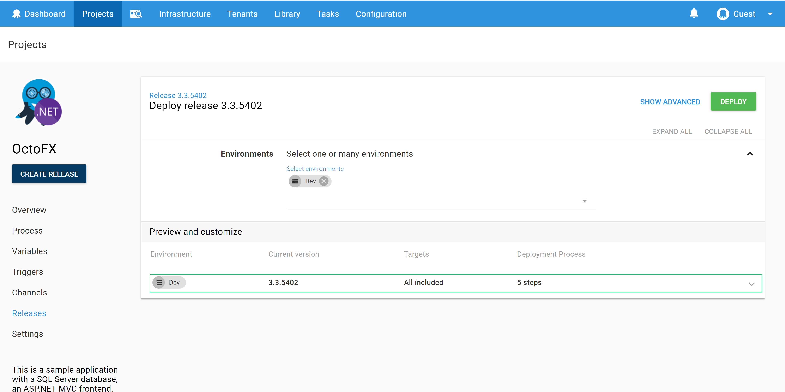
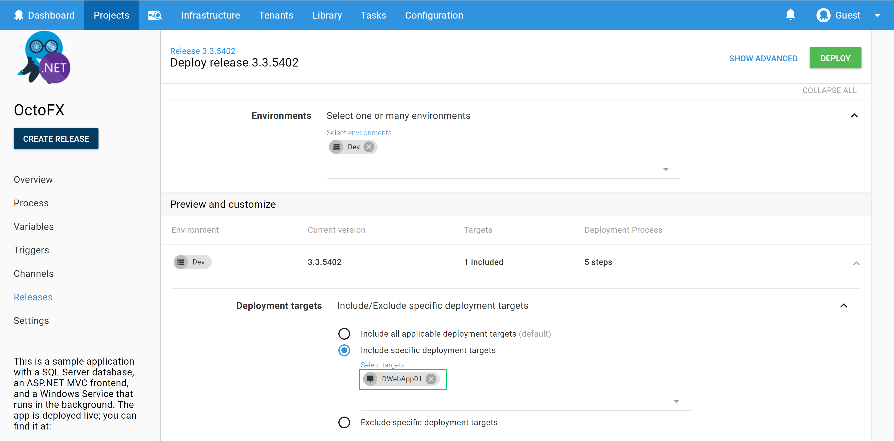

When deploying a Release to an Environment, you can specify a subset of targets within the Environment.

On the *Create Deployment* view, expand the dropdown under *Preview and customize* section.

Expand the *Deployment Targets* section, and select *Include specific deployment targets*.

You can now specify the set of targets the release will be deployed to.

