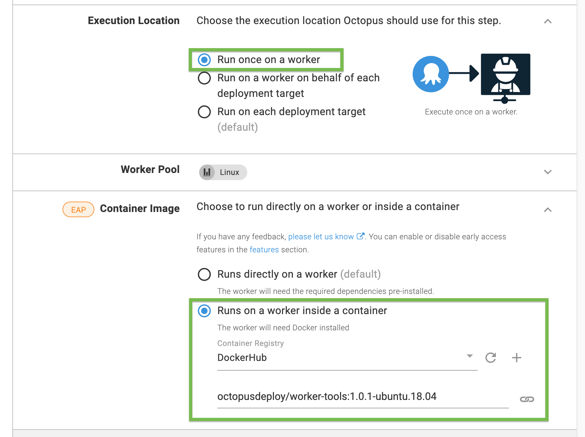

For a [step](/docs/deployment-process/steps/index.md) running on a [worker](docs/infrastructure/workers/index.md) or on [Octopus Server](docs/infrastructure/workers/built-in-worker.md) that you define in your [deployment processes](/docs/deployment-process/index.md), you can select a container for the step's execution.

:::warning
Execution containers for workers are not supported for [Dynamic Worker pools](/docs/infrastructure/workers/dynamic-worker-pools.md)
:::

## Minimum requirements
You need Docker installed and running on the [worker](docs/infrastructure/workers/index.md)/Octopus Server ([built-in worker](/docs/infrastructure/workers/built-in-worker.md)), in order to use execution containers for workers

## How to use execution containers for workers 

- Configure a [feed](/docs/packaging-applications/package-repositories/docker-registries/index.md) in Octopus Deploy for a Docker registry.
  - [Add Docker Hub as an external feed](https://octopus.com/blog/build-a-real-world-docker-cicd-pipeline#add-docker-hub-as-an-external-feed)
- Add a project and define a deployment process.
- Set the `Execution Location` for your step to `Run on a worker`.
- In `Container Image` select `Runs on a worker inside a container`.
- Choose the previously added container registry.
- Enter the name of the image (aka execution container) you want your step to run in. (e.g. !docker-image <octopusdeploy/worker-tools:ubuntu.18.04>).
- Click **Save**.
- Click **Create release & deploy**.

:::hint
The same process can be repeated for a runbook.
:::

## First deployment on a docker container
Your first deployment on a Docker container might take a while as it will download all the dependencies on the docker image. These dependencies will be installed as a part of deployment process execution automatically. Alternatively, you can pre-pull the desired docker image before your first deployment to avoid any delays.

## What docker image should I use?

You can find our recommended images on DockerHub [octopusdeploy/worker-tools](https://hub.docker.com/r/octopusdeploy/worker-tools)

Pick an image that is suitable for your needs based on:
- OS + distribution

The image also needs to supports the version formats:
- Major
- Major.Minor
- Major.Minor.Patch

If the operating system on your worker is Linux, you can use any of the following images: 

- octopusdeploy/worker-tools:ubuntu.18.04
- octopusdeploy/worker-tools:1-ubuntu.18.04
- octopusdeploy/worker-tools:1.0-ubuntu.18.04
- octopusdeploy/worker-tools:1.0.1-ubuntu.18.04

:::hint
We highly recommend using our `worker-tools` image as a starting point for your own custom image to run on a worker
:::
