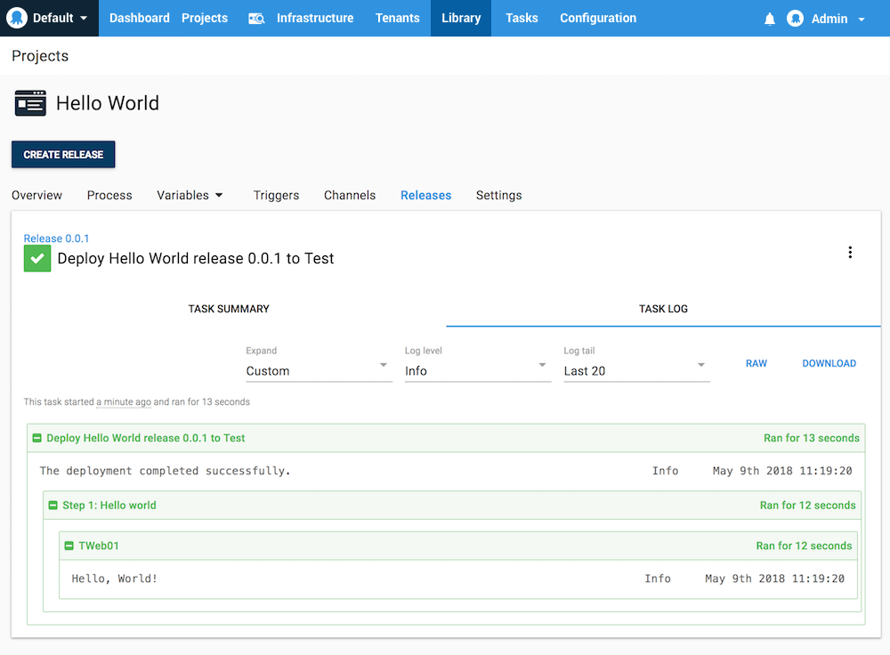

Now that you have [Octopus installed](docs/installation/index.md), your [infrastructure configured](docs/infrastructure/index.md), and your [applications packaged](docs/packaging-applications/index.md), you are ready to start deploying your software. This section explains the process and explores the options that are available.

The deployment process is like a recipe for deploying your software. You define the recipe by adding steps and variables to a project. Each step contains a specific action (or set of actions) that is executed as part of the deployment process each time your software is deployed. After the initial setup, your deployment process shouldn't change between deployments even though the software being deployed will change as part of the development process.

## A Simple Hello World Deployment Process

For this example process, we'll use Octopus Deploy to create a simple process with only one step that runs a script on a deployment target. The process uses a **Test** environment with one **Deployment Target** that has the target role **server**.

If you need a refresher on **Environments**, **Deployment Targets**, or how to configure them, review the [Infrastructure docs](docs/infrastructure/index.md).

1. From the Octopus Web portal, select **Projects** from the main navigation, and click **ADD PROJECT**.
2. Name the project, for instance, *Hello World*, and click **Save**.
3. From your new project's overview page, click **DEFINE YOUR DEPLOYMENT PROCESS**.
4. Click **ADD STEP**, and then select the **Run a Script** step.
5. Give the step a name, for instance, *Say Hello*.
6. For the execution plan, leave the selection at the default *Deployment targets* and select the target role *server*.
7. For the script section, expand the **Script content** section by clicking on it. Paste the PowerShell script into the text box and click **Save**:

​```
Write-Host "Hello, World!"
​```

8. From the project's overview page, click **CREATE RELEASE**, and then click **Save**.
9. Click **DEPLOY TO TEST**, then click **DEPLOY**.

This will deploy the release. In the task summary, you'll see the release was deployed to your *Test* environment, and the step *Hello world* ran on the deployment target, in this case *TWeb01*.




## Working with the Octopus API

Octopus Deploy is built API-first, which means everything you can do through the Octopus UI can be done with the API. In the API we model the deployment process the same way, starting at the Project:

- Project
- Deployment Process
- Steps
- Actions

We have provided lots of helpful functions for building your deployment process in the [.NET SDK](/docs/api-and-integration/octopus.client.md), or you can use the raw HTTP API if that suits your needs better.

Learn about using the [Octopus REST API](/docs/api-and-integration/api/index.md).

:::success
Record the HTTP requests made by the Octopus UI to see how we build your deployment processes using the Octopus API. You can do this in the Chrome developer tools, or using a tool like Fiddler.
:::
