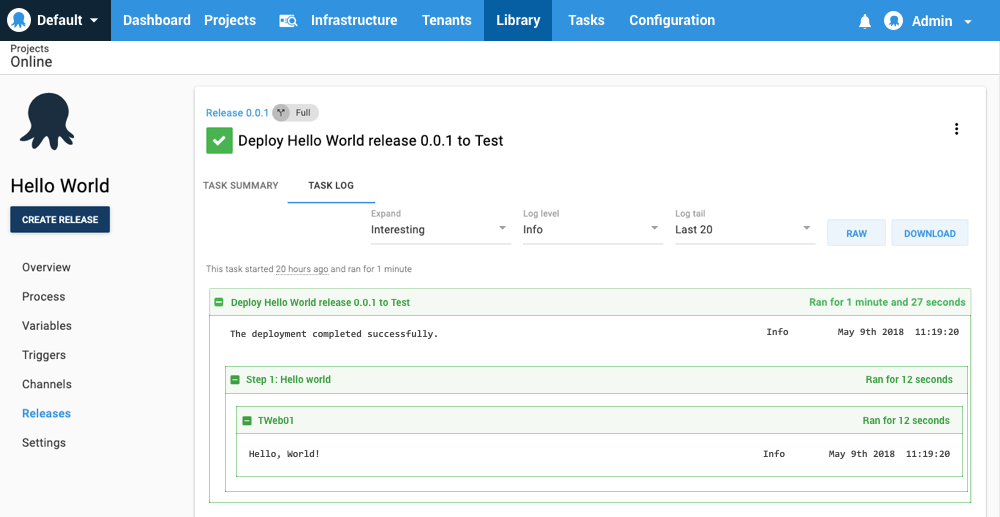

Now that you have the [ Central Octopus server installed](docs/installation/index.md), your [infrastructure configured](docs/infrastructure/index.md), and your [applications packaged](docs/packaging-applications/index.md), you are ready to start deploying your software. This section explains the process and explores the options that are available.

The deployment process is like a recipe for deploying your software. You define the recipe by adding steps and variables to a project. Each step contains a specific action (or set of actions) that is executed as part of the deployment process each time your software is deployed. After the initial setup, your deployment process shouldn't change between deployments even though the software being deployed will change as part of the development process.

## A Simple Hello World Deployment Process

For this example process, we'll use Octopus Deploy to create a simple process with only one step that runs a script on a deployment target. The process uses a **Test** environment with one **Deployment Target** that has the target role **server**.

If you need a refresher on **Environments**, **Deployment Targets**, or how to configure them, review the [Infrastructure docs](docs/infrastructure/index.md).

1. From the Octopus Web portal, select **Projects** from the main navigation, and click **ADD PROJECT**.
2. Name the project, for instance, *Hello World*, and click **Save**.
3. From your new project's overview page, click **DEFINE YOUR DEPLOYMENT PROCESS**.
4. Click **ADD STEP**, and then select the **Run a Script** step.
5. Give the step a name, for instance, *Say Hello*.
6. For the execution plan, leave the selection at the default *Deployment targets* and select the target role *server*.
7. For the script section, expand the **Script content** section by clicking on it. Paste the PowerShell script into the text box and click **Save**:

​```
Write-Host "Hello, World!"
​```

8. From the project's overview page, click **CREATE RELEASE**, and then click **Save**.
9. Click **DEPLOY TO TEST**, then click **DEPLOY**.

This will deploy the release. In the task summary, you'll see the release was deployed to your *Test* environment, and the step *Hello world* ran on the deployment target, in this case *TWeb01*.



This is an example of a very simple process, the following sections go into more detail about each part of the process and link to supporting documentation.

## Projects

Before you can define you how your software is deployed, you must create a project for the deployment process. Projects contain the deployment steps and configuration variables that define how your software is deployed.

### Create a Project

1. Select **Projects** from the main navigation, and click **ADD PROJECT**.
2. Give the project a name that's meaningful to you, and anybody else who'll work on the project.
3. Click **Save** and you will be taken to the newly created project's overview page.

Learn more about managing [projects](docs/deployment-process/projects/index.md).

<!--

## Define Your Deployment Process

Deployment processes can have one or many steps, steps can run in sequence or parallel, in addition to a variety of deployment steps, you can include manual intervention steps to get sign off before deployment, include notification steps to keep everybody informed about your process, or even skip steps under different circumstances.

To define your process you can choose from the installed steps or community provided steps.

In this example, we'll use the *Run a Script* step.

1. From your new project's overview page, click **DEFINE YOUR DEPLOYMENT PROCESS**.
2. Click **ADD STEP**, and then select the **Run a Script** step. Learn more about the available [steps](docs/deployment-process/steps/index.md).
3. Give the step a name, for instance, *Say Hello*.
4. For the execution plan, leave the selection at the default *Deployment targets* and select the target role *web-server*. Learn more about [target roles](docs/infrastructure/target-roles/index.md).
5. For the script section of the process, leave the *Script Source* selection on the default *The Script is defined below*.
6. Expand the *Script content* section, by clicking on it. We're using a PowerShell script, paste the script into the text box:
​```powershell
Write-Host "Hello, World!"
​```
7. For Environments, either let the process run for all available environments if you only have the test environment, or you can select **Run only for specific environments** and choose your test environment, or select **Skip specific environments** and select the environments you want to exclude.
8. The rest of the options can be left with the defaults selected.
9. Click **Save**.

Learn more about [steps](docs/deployment-process/steps/index.md).

## Create a Release and Deploy

Now that the process has been defined, you can create a release and deploy the software.

1. From the project's overview page, click **CREATE RELEASE**.
2. Give the release a version number, for instance, `1.0.0`. Subsequent releases will automatically increment the release number, but you can override the number and provide your own.
3. Optionally, enter some text for the release notes describing what's changed in the release.
4. Click **Save**.

This will deploy the release.

You'll be taken to a screen where you can see the progression of the release.

Because this a simple deployment process there isn't much to see, but if you click on the **task** in the **Progression** section of the page, you'll be taken the task summary for the deployment. From there, you can click on the text under task deployment, and you'll find more details about the process and the deployment targets it ran on. In this case, you'll see the *Hello, World!* script ran on the deployment target in the *test* environment tagged with the target role *web-server*.

Learn more about [releases](docs/deployment-process/releases/index.md).

##  Update the Software and Create a New Release

Now that the deployment process has been defined, you can update your software and deploy a new release.

In the case of our hello world script you would perform the following steps:

1. Navigate to the **Projects** section of the Octopus Web Portal and select the *Hello World* project.
2. Click **Process** and select the step you want to update.
3. Click the **Script Content** section of the step, edit the script, and click **Save**.
4. Click **CREATE RELEASE**.
5. From here you can accept the automatic increment that's been applied to the version or provide your own. You can also add release notes describing your changes.
6. Click **Save**.

This will deploy the new release of the software.

In a real world scenario, where the software you're developing is more complicated than a simple script, you could configure your continuous integration/build server to compile the code, package the software, and push it the built-in repository for automatic deployment.

Learn more about configuring your continuous integration/build server to work with Octopus in the [API and Integrations documentation](docs/api-and-integration/index.md).


-->

## Working with the Octopus API

Octopus Deploy is built API-first, which means everything you can do through the Octopus UI can be done with the API. In the API we model the deployment process the same way, starting at the Project:

- Project
- Deployment Process
- Steps
- Actions

We have provided lots of helpful functions for building your deployment process in the [.NET SDK](/docs/api-and-integration/octopus.client.md), or you can use the raw HTTP API if that suits your needs better.

Learn about using the [Octopus REST API](/docs/api-and-integration/api/index.md).

:::success
Record the HTTP requests made by the Octopus UI to see how we build your deployment processes using the Octopus API. You can do this in the Chrome developer tools, or using a tool like Fiddler.
:::
