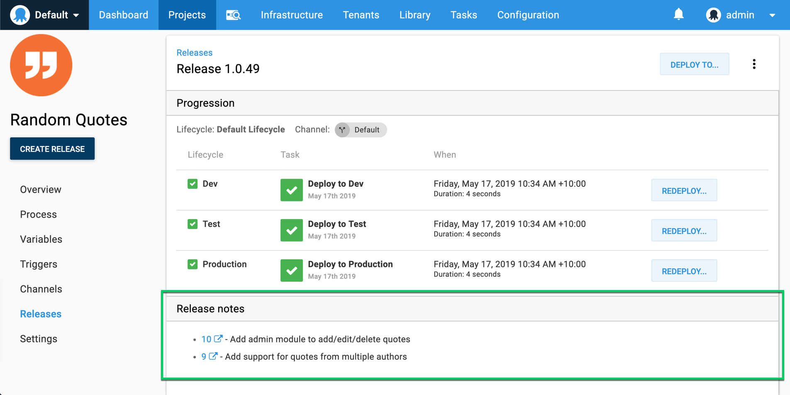

**Octopus 2019.7.3** introduced support to integrate Octopus with Azure DevOps work items. The integration includes the ability to:
- Automatically add links to Azure DevOps work items from releases and deployments in Octopus.
- Retrieve release notes from Azure DevOps work item comments to assist in automating release note generation.

## How Azure DevOps Integration Works

<!-- FIXME

-->

1. Associate code changes with their relevant work items in any of the following ways:
    - Edit a pull request in Azure DevOps, and use the **Work Items** panel to select a work item.
    - Edit a work item in Azure DevOps, and use the **Development** panel to add a pull request link (before build), or a commit link, or a build link.
    - When you commit code, include "#" followed by a valid work item ID in the commit message. *Note: Requires first enabling the repository setting "Automatically create links for work items mentioned in a commit comment" under Project Settings (Repositories).*
2. The Octopus Deploy [plugin](/docs/packaging-applications/build-servers/index.md) for your build server [pushes the commits to Octopus](/docs/packaging-applications/build-servers/index.md#passing-build-information-to-octopus).  These are associated with a package ID and version (The package can be in the built-in Octopus repository or an external repository).
3. The Azure DevOps Issue Tracker extension in Octopus uses the build information to request work item references from Azure DevOps.
4. When creating the release which contains the package version, the work items are associated with the release.  These are available for use in [release notes](/docs/packaging-applications/build-servers/index.md#release-notes), and will be visible on [deployments](/docs/deployment-process/releases/deployment-notes.md).  

### Limitations

**Limited Build Server Support**  
The ability to push the build information to Octopus, which is required for Azure DevOps integration, is currently only available in the official Octopus [JetBrains TeamCity](https://plugins.jetbrains.com/plugin/9038-octopus-deploy-integration), [Atlassian Bamboo](https://marketplace.atlassian.com/apps/1217235/octopus-deploy-bamboo-add-on?hosting=server&tab=overview), and [Azure DevOps](https://marketplace.visualstudio.com/items?itemName=octopusdeploy.octopus-deploy-build-release-tasks) plugins.  We will be rolling this out to the Jenkins plugin soon.

## Configuring Azure DevOps Integration

The following steps should be followed to integrate Octopus with Azure DevOps:

1. [Configure your build server to push build information to Octopus.](#configure-your-build-server) This is required to allow Octopus to know which work items are associated with a release.  
2. [Configure the Azure DevOps connection in Octopus Deploy.](#connect-octopus-to-azure-devops)

## Configure your Build Server to Push Build Information to Octopus {#configure-your-build-server}

To integrate with Azure DevOps work items, Octopus needs to understand which work items are associated with a [release](/docs/deployment-process/releases/index.md).   
Octopus does this by using the build information associated with any packages contained in the release to request work item references from Azure DevOps.

To supply the build information:

1. Install one of our official build server plugins with support for our metadata step. This list currently includes [JetBrains TeamCity](https://plugins.jetbrains.com/plugin/9038-octopus-deploy-integration), [Atlassian Bamboo](https://marketplace.atlassian.com/apps/1217235/octopus-deploy-bamboo-add-on?hosting=server&tab=overview), and [Azure DevOps](https://marketplace.visualstudio.com/items?itemName=octopusdeploy.octopus-deploy-build-release-tasks). We're currently working on adding support for the Jenkins plugin.

2. Update your build process to add and configure the Octopus Metadata step.

3. Ensure your Octopus Metadata step has set the 'Process commit messages' or 'Work Items Source' field.

## Connect Octopus to Azure DevOps {#connect-octopus-to-azure-devops}

1. Configure the Azure DevOps Issue Tracker extension in Octopus Deploy.

    In the Octopus web portal, navigate to **{{Configuration,Settings,Azure DevOps Issue Tracker}}** and set the following values:

    - **Azure DevOps Base URL**. This tells Octopus where the Azure DevOps instance is located.

    - Unless the Azure DevOps instance is public, you'll need to supply a **Personal Access Token**, created in the Azure DevOps User Settings (under Personal access tokens), with authorization to read scopes **Build** and **Work items**.

    - Ensure the **Is Enabled** property is set as well.

2. Configure the Release Note Options _(optional)_.

    - **Release Note Prefix**: If specified, Octopus will look for a work item comment that starts with the given prefix text and use whatever text appears after the prefix as the release note, which will be available in the [build information](/docs/packaging-applications/build-servers/index.md#build-information) as the work item's description. If no comment is found with the prefix then Octopus will default back to using the title for that work item.

    For example, a prefix of `Release note:` can be used to identify a customer friendly work item title vs a technical feature or bug fix title.

When configured, this integration will retrieve Azure DevOps work item details and add details to your releases and deployments.

## Troubleshooting

### Error message: "Unable to obtain some work item data."

The rest of the message will have more information about what went wrong, but this typically indicates a failure to do one of the following:

* contact Azure DevOps over the network
* authenticate using the specified Personal Access Token to read scopes **Build** and **Work items**
* retrieve build and work item data, and work item comments
* interpret the data

If you can't resolve the problem and want to create a release, some options are:

* disable the Azure DevOps Issue Tracker extension under **{{Configuration,Settings,Azure DevOps Issue Tracker}}**
* push packages without metadata, for example by disabling the build task **Push Package Metadata to Octopus**

## Next

 - Learn about other [build information](/docs/packaging-applications/build-servers/index.md#build-information).
