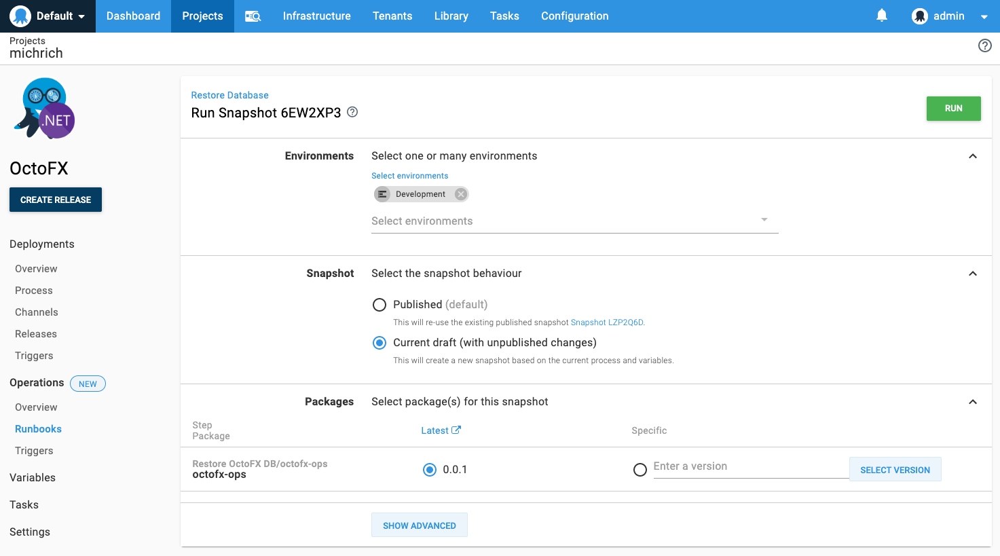

Runbooks were introduced in **Octopus 2019.11**.

A deployment is only one phase in the life of an application. There are typically many other tasks which are performed to keep an application operating. A large part of DevOps is running operations separate from deploying applications, and this is where Runbooks come into play.

Runbooks can be used to automate routine maintenance and emergency operations tasks like infrastructure provisioning, database management, and website failover and restoration.

:::warning
**Early Access**
This is an early access feature. Early access features are still in development and we encourage you to experiment with this feature.
:::

## Projects

Before you can define how your scripts are run, you must create a project for the runbook. Projects contain the configuration variables that can help define how scripts defined in your runbook steps are run.

Learn more about managing [projects](/docs/deployment-process/projects/index.md).

## Runbooks vs Deployments

For users familiar with Octopus prior to the introduction of runbooks, an obvious question may be _how are runbooks different to a deployment process?_  They are similar in many ways: a runbook process is a series of steps, which can reference packages and variables. The key differences are:

- No release needs to be created to execute a runbook 
- Lifecycles do not apply to runbooks
- Runbook executions are not displayed on the deployment dashboards
- Many runbooks can live in the same project, along with a deployment process  
- Runbooks are restricted by different roles and permissions to deployments 

## Variables 

A [project's variables](/docs/deployment-process/variables/index.md) are shared between the deployment process and any runbooks in the project (though specific values can be scoped exclusively to specific runbooks or to the deployment process). This means configuration such as the following can be shared between your deployment process and runbooks: 
- Database connection strings
- Passwords
- Certificates
- Accounts

### Current Limitations

**Scoping to Steps/Actions**
- You cannot scope project variables to a Deployment Process step as well as a Runbook Process step currently, but we do aim to support this in the near future.

## Publishing

Publishing makes a runbook available to scheduled triggers and consumers (anyone with an appropriately scoped `RunbookRun` permission, but lacking `RunbookEdit`).  Triggers and consumers will always execute the published snapshot. 

The published snapshot contains the process, variables, and packages. This allows editing and testing the runbook without impacting the published version.   

To publish a snapshot, click the publish button on the task page after executing a runbook, or click publish on the runbook's process page. 

Publish from completed task:

Publish from process:

When a producer (anyone with an appropriately scoped `RunbookEdit` permission) executes a runbook, they will have the option between executing the published version or the current draft. 

Running the current draft allows testing changes before publishing.  The latest version of the process and variables will be used, and package versions will be prompted for.

## Runbook Snapshots and Runs

It is important to understand the difference between **Snapshot** and **Run**.

As you defined your runbook process, you specified the steps that must be taken, the packages and services to run, the scripts to run, and the variables to be used that are required to run your software.

When you create a **Snapshot**, you are capturing the runbook process and all the associated assets (packages, scripts, variables, etc) as they existed at that time. The snapshot is given a unique name, and you can run that snapshot as many times as you need to. You can even run that specific snapshot as it existed at the time the snapshot was created, even if parts of the runbook process have changed (those changes will be included in future snapshots).

When you **Run** a snapshot, you are executing the runbook process with all the associated details, as they existed when the snapshot was created.

You can **Run** a **Snapshot** as many times as you want to.

## Environments

Runbooks can be executed against any environment for which the user has an appropriately scoped `RunbookRun` permission.

Lifecycles do not apply to runbooks (only deployments).

## Permissions and Roles

Permissions are available to help you manage access to Runbooks, these include `RunbookView` (for viewing), `RunbookEdit` (for creating, editing, deleting and snapshotting), and `RunbookRunView`, `RunbookRunCreate` and `RunbookRunDelete` permissions (following the same pattern used for Deployments).

| Permission  | Description |
| ------------- | ------------- |
| RunbookView  | You can view all things runbooks-related (from the runbooks themselves, to their process, runs and snapshots). |
| RunbookEdit  | You can edit all things runbooks-related. |
| RunbookRunView  | You can view runbook runs. |
| RunbookRunDelete  | You can delete runbook runs. |
| RunbookRunCreate  | You can create runbook runs (equivalent of `DeploymentCreate` in the deployment world). |

If you want to lock down the ability for your teams to create runbooks, you need to disable these permissions.

There are roles we include out-of-the-box to encapsulate these new permissions:

| Role | Description |
| ------------- | ------------- |
| Runbook producer | Runbook producers can view, edit and execute runbooks. This is useful for authors of runbooks, who need to edit, iterate-on, publish and execute their runbooks |
| Runbook consumer | Runbook consumers can view and execute runbooks. This is useful for users who are not authoring runbooks, but need to be able to view and run them. |

## Working with Runbooks via the Octopus API

Octopus Deploy is built API-first, which means everything you can do through the Octopus UI can be done with the API. In the API, we model the runbook and its process the same way, starting at the Project:

- Project
- Runbooks _(a project can have many runbooks, with RunbookView/RunbookEdit permissions)_
- RunbookProcess _(a runbook has one process / collection of steps, with ProcessEdit permissions)_
- RunbookSnapshots _(a runbook can have many snapshots, each with a unique name, with RunbookEdit permissions)_
- RunbookRuns _(a runbook snapshot will then be run/executed against an environment, with RunbookRunCreate permissions)_

We have provided lots of helpful functions for building your runbook process in the [.NET SDK](/docs/octopus-rest-api/octopus.client.md), or you can use the raw HTTP API if that suits your needs better.

Learn about using the [Octopus REST API](/docs/octopus-rest-api/index.md).

:::success
Record the HTTP requests made by the Octopus UI to see how we build your runbook processes using the Octopus API. You can do this in the Chrome developer tools, or using a tool like Fiddler.
:::
