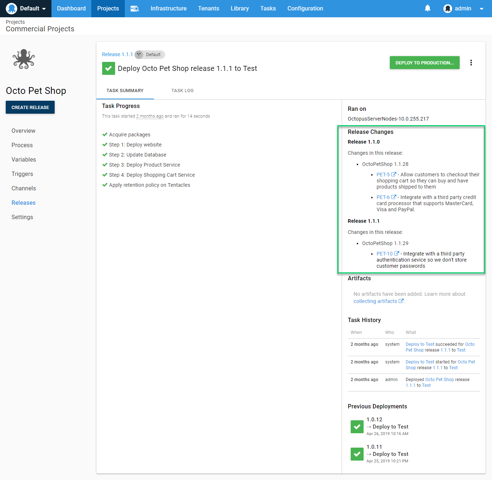
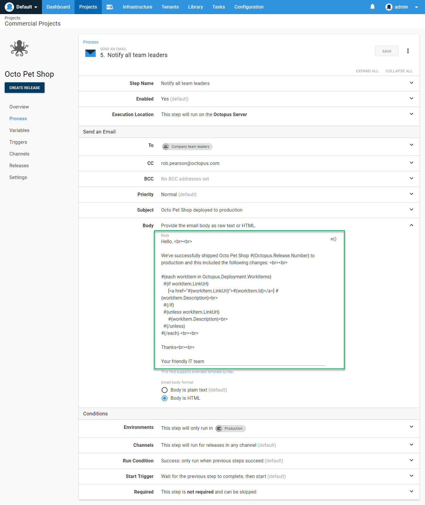

When a release is deployed to an environment, it can be thought of as deploying all changes contained in all releases since the previous deployment to the environment.

Deployment notes summarize these changes by rolling up the [release notes](/docs/deployment-process/releases/release-notes.md) from all releases since the previous deployment of the project to the environment.  



## Versioning and Pre-releases  {#Versioning}

[Pre-release versions](/docs/packaging-applications/create-packages/versioning.md#semver) are handled differently to other versions for release changes and deployment notes. Deployments of a pre-release will only ever include changes for that single version, they do not accumulate across versions like other scenarios.

This is because in some scenarios different pre-release versions could be getting deployed to an environment where they co-exist. As an example, consider deployments for an application installer or a NuGet package, you could have multiple branched versions of those co-existing in an environment at any given point, so the accumulation of work across releases has to be treated differently.

Octopus treats pre-releases as a *work in progress* that will fall under the banner of *full* release when they are completed/merged. At that point, the changes are then considered for accumulation across the *full* versions.

## Deployment Change Variables

It can be useful to access the changes associated with a deployment in the deployment process.
[Deployment change variables](/docs/deployment-process/variables/system-variables.md#deployment-notes) are available during a deployment.

A common example of this is for use in the [Email step](/docs/deployment-process/steps/email-notifications.md).  



In scenarios where you want to use Release Notes Templates and Emails steps together, there can be some complications depending on the layout of the email content you need. The easiest option is to use the release notes directly from the releases:

```
Deployment contained releases:<br/>
#{each change in Octopus.Deployment.Changes}
<h2>#{change.Version}</h2>
<p>#{change.ReleaseNotes | MarkdownToHtml}</p>
#{/each}

```

This outputs the details per release, with the work items appearing per release. If you wanted a single set of release notes, with a list of work items below it, you'd have to omit the work item details from the release notes templates itself and use an email body like follows:

```
Deployment contained releases:<br/>
#{each change in Octopus.Deployment.Changes}
<h2>#{change.Version}</h2>
<p>#{change.ReleaseNotes | MarkdownToHtml}</p>
#{/each}
Which addressed the following issues:</br>
#{each workItem in Octopus.Deployment.WorkItems}
  #{if workItem.LinkUrl}
      [<a href="#{workItem.LinkUrl}">#{workItem.Id}</a>] #{workItem.Description}</br>
  #{/if}
  #{unless workItem.LinkUrl}
      #{workItem.Description}</br>
  #{/unless}
#{/each}
```

## Deployment Changes Templates {#Templates}

Starting from `2019.9.0` you can specify a template for deployment changes output. The output of the template is used in the portal for rendering the changes on both the deployment preview and on the deployment details.

The output is also available for use during a deployment, using the `Octopus.Deployment.ChangesMarkdown` variable. The content of the email listed above could then equally be used as the deployment changes template for the project and the email step could use something as simple as 

```Deployment contained releases:<br/>
#{Octopus.Deployment.ChangesMarkdown | MarkdownToHtml}
```

Use this method you would then see exactly the same content in the portal for the deployment preview, on the deployment details, and on the email that gets sent.

All variables available during the deployment are available to the template, with the exception of the machine scoped variables. This is because the templates is applied at the deployment level when the deployment is created, not at the machine level as each target is deployed to. There is a new variable available if you want target information, see below for details.

All environment and tenant related variables are available to the template.

The default template, when the field in the project settings is left blank, is as follows

```
#{each release in Octopus.Deployment.Changes}
**Release #{release.Version}**

#{release.ReleaseNotes}
#{each workItem in release.WorkItems}
- [#{workItem.Id}](#{workItem.LinkUrl}) - #{workItem.Description}
#{/each}
#{/each}
```


### Deployment changes and targets

The is one variable that is available to the deployment changes template that is not available during the deployment itself. The variable is `Octopus.Deployment.Targets`. It contains a dictionary of `Id` and `Name` values for all of the targets in the scope of the deployment (keyed by Id). You can iterate over the targets in a template as follows

```
#{each target in Octopus.Deployment.Targets}
- #{target.Name}
#{/each}
```

