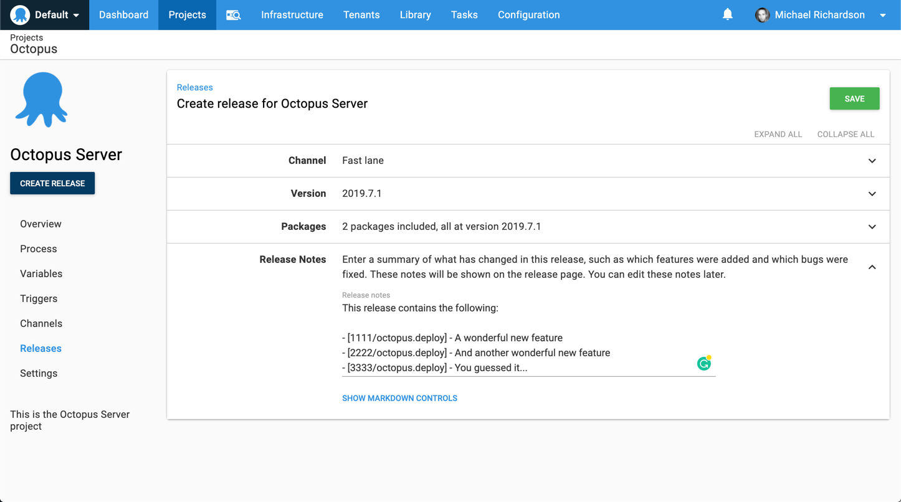

## Variables

Release notes may contain variable expressions. These will be evaluated and substituted when the release is created.

Only variables in scope when the release is created will be available for use in release notes. Variables scoped to environments, tenants, target roles, or targets will _not_ be available as these scopes apply only during deployments.   

## Release Notes Templates {#Release-Notes-Templates}

A release notes template can be configured in {{Project,Settings,Release Notes Template}}

A release notes template is a convenient way to keep release notes consistent and avoid entering the same text repeatedly.   
