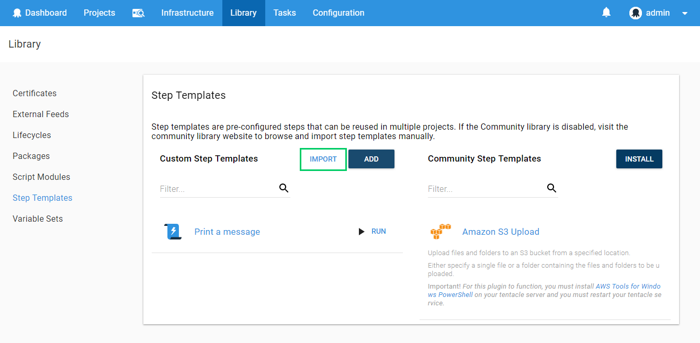
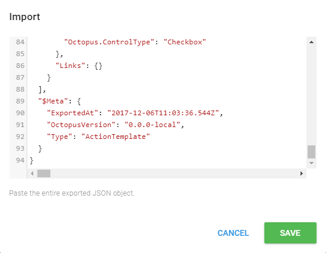
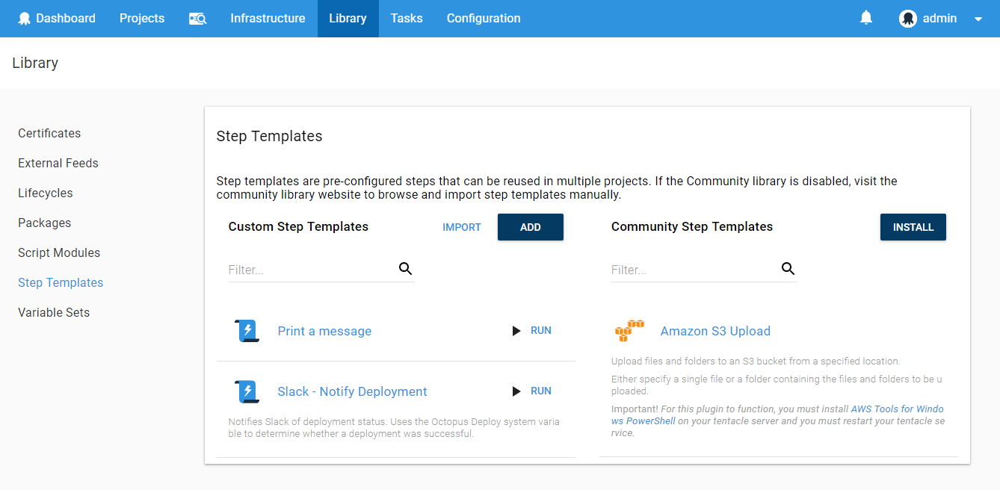

Community step templates are publicly available step templates that have been contributed and updated by the Octopus Community. These are incredibly useful, and if you can't find a built-in step template that includes the actions you need, you should check the community step template. There is a large number and variety of step templates (and it's growing all the time) that can help you automate your deployment without writing any scripts yourself.

Community step templates are third party code which is licensed under [the Apache 2.0 license](https://github.com/OctopusDeploy/Library/blob/master/LICENSE.txt).

Octopus Community step templates integration was introduced in Octopus 3.7 and is enabled by default, but it can be disabled.

The Community Step Templates are synchronized with the Octopus server. The synchronization process is executed as a standard Octopus task and you can view its execution details from the **Tasks** area. The Octopus server synchronizes with the Octopus Library on startup and then every 24 hours over the Internet thus it requires Internet access. If there are any updates or changes, the sync process retrieves all the step templates and stores the relevant community step templates in the Octopus database. Step templates are persisted locally, but they cannot be used in a deployment process until they are explicitly installed.

NOTE: The relevant permissions to install and manage step templates are ActionTemplateCreate, ActionTemplateEdit, ActionTemplateView and ActionTemplateDelete.

## Enable/Disable Community Step Templates Integration

1. Navigate to **{{Configuration,Features}}**.
2. Expand the **Octopus Community Step Template** section by clicking on it.
3. Toggle the selection to either **Enabled** or **Disabled**, and click **SAVE**.

## Adding Community Step Templates

Unlike the built-in steps included in Octopus, you need to install Community Step Templates. There are three ways you can do this:

1. As you define your deployment processes.
2. From the **Library** area of the Octopus Web Portal.
3. By importing them from the [Community Library](http://library.octopus.com/).

## Add a Community Step Template as you Define the Deployment Process

1. Navigate to your [project's](/docs/deployment-process/projects/index.md) overview page by selecting **Projects** and clicking on the project you are working with.
2. Click the **DEFINE YOUR DEPLOYMENT PROCESS** button, and click **ADD STEP**.
3. Scroll past the built-in step templates, and find the Community Step Template you want either by choosing from the available technologies or clicking **SHOW ALL**.
4. Before you install the template you can click **VIEW DETAILS** to view the parameters of the step and the source code.
5. To install the step template, hover over the step template's card and click **INSTALL AND ADD** and **SAVE**.

After the step template has been installed it will be available alongside the built-in step templates.

## Add a Community Step Template in the Octopus Library

1. In the Octopus Web Portal, navigate to **{{Library, Step Templates}}**.
2. Click **BROWSE LIBRARY**.
3. Find the Community Step Template you want either by choosing from the available technologies or clicking **SHOW ALL**.
4. Before you install the template you can click **VIEW DETAILS** to view the parameters of the step and the source code.
5. To install the step template, hover over the step template's card and click **INSTALL** and **SAVE**.

After the step template has been installed it will be available alongside the built-in step templates.

## Import a Community Step Template From the Community Library

If the Community Library feature has been disabled, you can still use community step templates by manually importing the JSON from the [Community Library](http://library.octopus.com/) into the step template library within Octopus.

1. Navigate to the [Community Library](http://library.octopus.com/) website, find the template you want to use and click on the **Copy to clipboard** button. *Step Templates are transported as a JSON document containing all of the information required by Octopus.*

2. Navigate to {{Library,Step templates}} area within the Octopus web portal and select **Import** from the custom step templates section.
3. Paste in the JSON document for the Step Template and click the **Import** button.

4. Now you can add this new kind of step to your deployment process.

## Adding an updated version of a community step template {#Addingsteps-Addinganupdatedversionofacommunitysteptemplate}

Sometimes updates are available for step templates.  In this case, you will notice the step template has an option to update the step.  If you select update, this will take you to the community step details with the option to update the latest version of the step template.  Community step templates can also be updated in the library as needed.

## Troubleshooting {#Octopuscommunitysteptemplatesintegration-Troubleshooting}

If the Octopus community step templates feature toggle is enabled but you don't see any community steps, navigate to the **Features** tab in the **Configuration** area.  Click on the last sync period (i.e. 5 minutes ago or 10 hours ago) to view the most recent sync task and review it's log.  If there are any errors, compare them with the list below.

*The Octopus server failed to connect to our community library.*

- This means the Octopus server sync task could not connect to the Octopus Library over the internet.  It attempts to connect to [http://library.octopus.com/](http://library.octopus.com/) over http (port 80) therefore the appropriate ports need to be open.
- If problems persist, it's recommended that you review your firewall and network configuration.  Verify outbound traffic is enabled on port 80.
