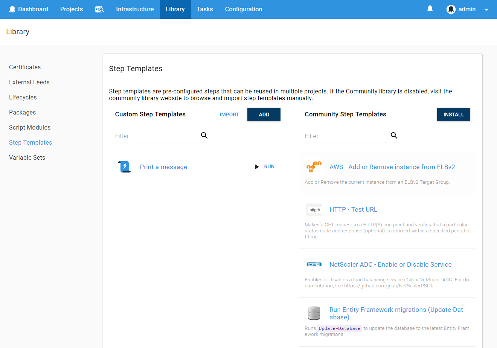
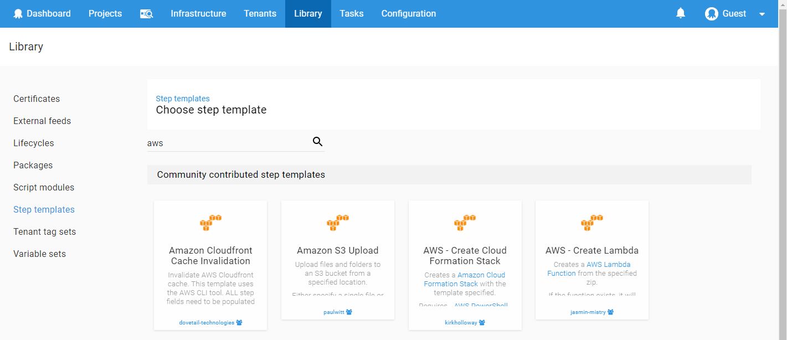
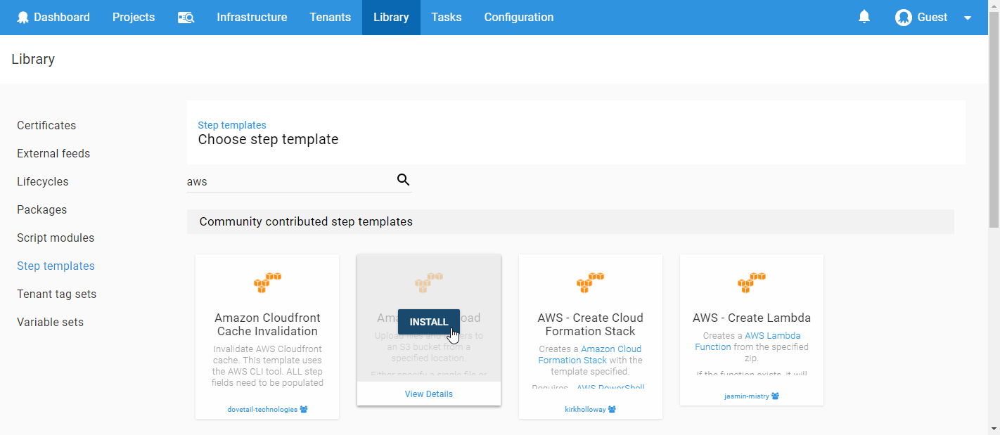
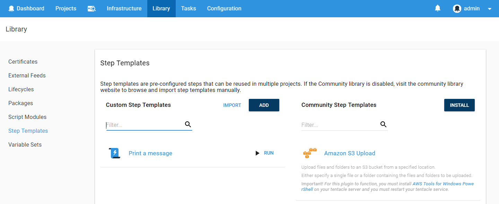
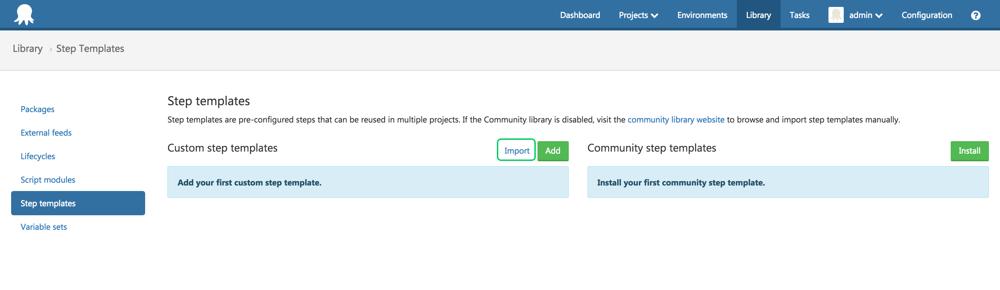

Community step templates are publically available step templates that are contributed and updated by the community. There is a growing number (over 200 at the time of writing this) of templates that can help you automate your deployment without writing any scripts yourself. The community step templates are third party code which is licensed under apache.

Octopus community step templates integration is enabled by default but this can be changed in the **Features** tab in the **Configuration** area. For more information, see [Octopus community step templates integration](/docs/administration/octopus-community-step-templates-integration.md).

:::success
The [Community Library](http://library.octopus.com/) is an open source [repository](https://github.com/octopusdeploy/library/) of community contributed step templates automating a diverse set of actions.  If you still don't find what you are looking for, don't forget: Octopus can do anything, as long as you can script the instructions. Maybe you could [contribute](https://github.com/OctopusDeploy/Library/blob/master/.github/CONTRIBUTING.md) your scripts back to the community?
:::

## The Community Library {#StepTemplates-TheCommunityLibrary}

Is there something Octopus doesn't support out-of-the-box? Take a look at the [Community Library](https://library.octopus.com/) which is full of step templates that have been contributed and are maintained by the Octopus community.

:::hint
Octopus 3.7 introduced integration with the Community Library and community contributed step templates are now synchronized with the Octopus server. This change makes it a quick and easy process to install and add community step templates. The import and export process is still available for older versions of Octopus.
:::

Installing a community step template into Octopus is quick and easy.

- [Install and add a community step template directly from your project's deployment process](/docs/deployment-process/steps/index.md#Addingsteps-Addingacommunitycontributedsteptemplates)
- [Install a step template from the **Step templates** tab within the **Library** area](/docs/deployment-process/steps/community-step-templates.md#StepTemplates-InstallingasteptemplatefromtheCommunityLibrary)
- [Manually import a step template from the **Step templates** tab within the **Library** area](/docs/deployment-process/steps/community-step-templates.md#StepTemplates-ImportingasteptemplatefromtheCommunityLibrary)

It's also possible to create your own step templates.

## Installing a step template from the Community Library {#StepTemplates-InstallingasteptemplatefromtheCommunityLibrary}

To install a step template from the Community Library, perform the following.

1. Navigate to {{Library, Step templates}} area and select **Install** from the community step templates section
    
2. Search for a specific step template or browse the categories to find the template you want to use
    
3. Select **Install** or view the details of the step
    
4. To confirm, select **install**
    
5. Now you can add this new kind of step to your deployment process
    

## Importing a step template from the Community Library {#StepTemplates-ImportingasteptemplatefromtheCommunityLibrary}

If you don't have the Community Library feature turned on you can still use community step templates by manually importing the JSON from the [Community Library](http://library.octopus.com/) into the step template library within Octopus.

1. Navigate to the [Community Library](http://library.octopus.com/) website, find the template you want to use and click on the **Copy to clipboard** button. *Step Templates are transported as a JSON document containing all of the information required by Octopus.*
   
2. Navigate to {{Library,Step templates}} area within the Octopus web portal and select **Import** from the custom step templates section
   
3. Paste in the JSON document for the Step Template and click the **Import** button
   
4. Now you can add this new kind of step to your deployment process
   
