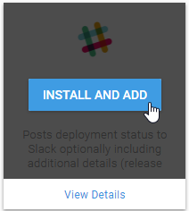

Community step templates are publicly available step templates that are contributed and updated by the community. These are incredibly useful. If you can't find a built-in step template that includes the actions you need, check the community step template. There is a large number and variety of step templates (and it's growing all the time) that can help you automate your deployment without writing any scripts yourself. The community step templates are third party code which is licensed under [the Apache 2.0 license](https://github.com/OctopusDeploy/Library/blob/master/LICENSE.txt).

Octopus community step templates integration was introduced in Octopus 3.7 and is enabled by default.

## Enable/Disable Community Step Templates Integration

1. Navigate to **{{Configuration,Features}}**.
2. Expand the **Octopus Community Step Template** section by clicking on it.
3. Toggle the selection to either **Enabled** or **Disabled**, and click **SAVE**.

## Adding a community contributed step templates {#Addingsteps-Addingacommunitycontributedsteptemplates}

The add step page also displays community contributed step templates available to install and add.  You can search for a specific template or you can browse through the categories.  Installing a community step template is easy.  Hover over a step and select Install and add step.  This will display a pop-up dialog where you can confirm to install and add the step.  This will take you to the configuration page for the step template.

If you select view details, this will take you to the community step details page which shows you the complete details of the step include the source code.  You can install the step or go back to the list of steps.

## Installing a step template from the Community Library {#StepTemplates-InstallingasteptemplatefromtheCommunityLibrary}

To install a step template from the Community Library, perform the following.

1. Navigate to {{Library, Step templates}} area and select **Install** from the community step templates section

2. Search for a specific step template or browse the categories to find the template you want to use

3. Select **Install** or view the details of the step

4. To confirm, select **install**

5. Now you can add this new kind of step to your deployment process

## Importing a step template from the Community Library {#StepTemplates-ImportingasteptemplatefromtheCommunityLibrary}

If the Community Library feature has been disabled, you can still use community step templates by manually importing the JSON from the [Community Library](http://library.octopus.com/) into the step template library within Octopus.

1. Navigate to the [Community Library](http://library.octopus.com/) website, find the template you want to use and click on the **Copy to clipboard** button. *Step Templates are transported as a JSON document containing all of the information required by Octopus.*

2. Navigate to {{Library,Step templates}} area within the Octopus web portal and select **Import** from the custom step templates section.
3. Paste in the JSON document for the Step Template and click the **Import** button.

4. Now you can add this new kind of step to your deployment process.

## Adding an updated version of a community step template {#Addingsteps-Addinganupdatedversionofacommunitysteptemplate}

Sometimes updates are available for step templates.  In this case, you will notice the step template has an option to update the step.  If you select update, this will take you to the community step details with the option to update the latest version of the step template.  Community step templates can also be updated in the library as needed.

