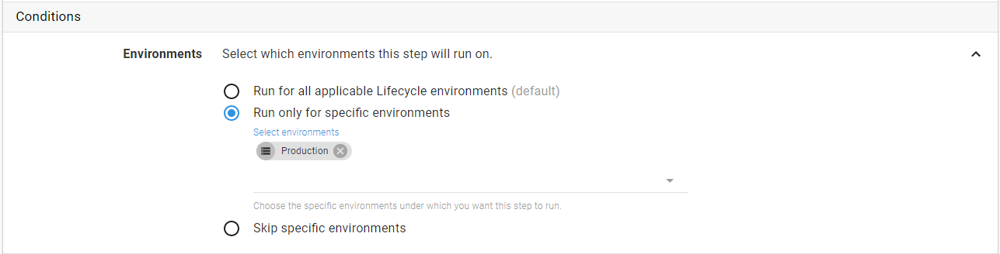
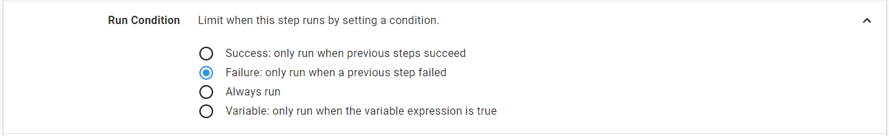
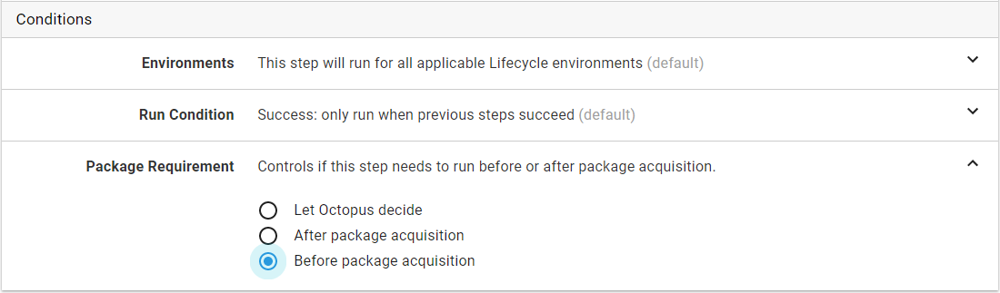

## Environments

Steps and actions can also have conditions. You can restrict a step so that it only runs when deploying to specific [environments](/docs/infrastructure/environments/index.md) (e.g., an Email step that only runs on production deployments).

## Channels

If you have created some [channels](/docs/deployment-process/channels.md), you can also specify whether a step runs only when deploying a release through specific channels (e.g., a Script step that only runs for deployments through certain channels to configure extra telemetry). *This will only appear if you have created one or more non-default channels.*

## Run condition

You can also specify whether a step runs only when previous steps are successful (default), when a previous step fails, or always.

## Package requirement

The package requirement condition allows you to specify when package acquisition should occur. By default, a deployment will acquire packages immediately before the first step that uses a packages. This option can be used to explcitily indicate if a step should run before or after package acqusition.

There are three options to choose from:

- Let Octopus Decide (default): Packages may be acquired before or after this step runs - Octopus will determine the best time
- After package acquisition: Packages will be acquired before this step runs
- Before package acqusition: Packages will be acquired after this step runs

This option is hidden when it does not make sense, for example, when a script step is configured to run after a package step (packages must be acquired by this point).
