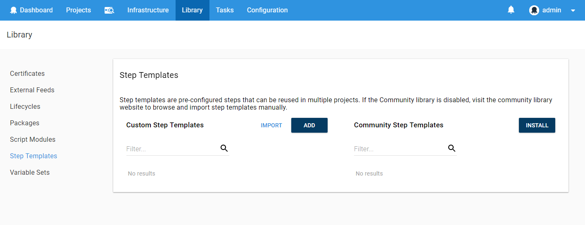
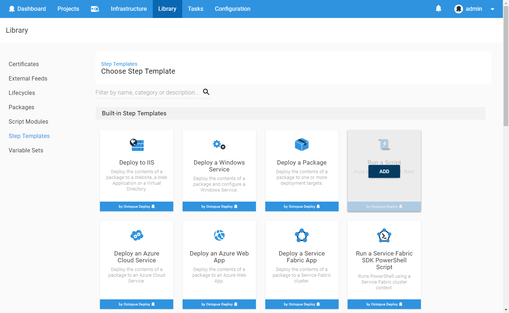

Custom step templates can be based on a built-in or an installed community step template. These step templates can be reused in projects and managed in the step template library.

## Creating custom step templates {#StepTemplates-Creatingcustomsteptemplates}

Sometimes there isn't a step template for your situation available in the [Community Library](https://library.octopusdeploy.com/). Or perhaps several of your projects have similar or identical steps. You can create your own custom step templates to share with the community, or to reuse across your projects.

To create your own step template, perform the following.

1. Navigate to the {{Library,Step templates}} area and click the **Add** button  
   
2. Select a built-in step to base your custom step template on.  
   
3. Populate the step template.   
   

:::success
You can create Step Templates for any of the built-in step types provided by Octopus.
:::

There are three parts to any step template: step details, additional parameters, and settings.

### Step {#StepTemplates-Step}

The Step tab is where you fill out the details of what the step will do. This tab gives you exactly the same fields as you would see if you added the step type directly to your project, so it will be the most familiar.

Any details that need to be specified at the project level can be handled using Parameters. Any parameters specified in the Parameters tab will be exposed to you as [variables](/docs/deployment-process/variables/index.md) and can be used in the same way.

### Parameters {#StepTemplates-Parameters}

The Parameters tab allows you to specify fields that will be filled out by the users of this step.

You're required to give the parameter a variable name and label to use, as well as some optional help text and a default value.

Finally, you can choose the way the field will appear to a user with the **Control type** field. There are a number of options available, however keep in mind the end result will be a variable with a string value.

Any variables you configure as Parameters will be available as variables that can be used in the Step tab of the step template.

### Settings {#StepTemplates-Settings}

The Settings tab allows you to give your step a name and optional description.

### Usage {#StepTemplates-Usage}

After saving your step, you'll notice another tab called Usage. This tab shows where the step is being used and whether the version being used is current or a previous version.

You'll also see a handy counter next to the Usage tab so you can see at a glance how many projects are out-of-date.

### Custom logo {#StepTemplates-Customlogo}

Custom step templates inherit their logo from the template that was used to create them. This means that most of them will share the same logo. Fortunately this can be easily changed and each custom template can have its own unique logo. To do that navigate to the Settings tab and upload a custom logo from there.

### Linking custom step templates to community step templates {#StepTemplates-Linkingcustomsteptemplatestocommunitysteptemplates}

Once a day Octopus retrieves the latest step templates from the [Community Library](https://library.octopus.com/). At the end of that process it also tries to link them to the existing custom templates which might have been imported manually in the past. Once the link is established the custom template can receive updates directly from the [Community Library](https://library.octopus.com/). In Octopus 3.7.0 the link is created only when the custom template and the community template are identical. We decided to be strict to make sure we don't cause trouble by linking wrong templates together. Then we learned that the Import process in Octopus doesn't preserve the Version property which means none of the existing custom templates will be linked. In Octopus 3.7.2 we made this process a bit less strict and now the Version property doesn't have to match. We believe that if all other properties (except Version) match then we still are safe to link templates.

If the linking process isn't linking a template that you believe should be linked then more than likely you don't have the very latest version of the template. The easiest way to fix this problem is to manually update the template with the data from the [Community Library](https://library.octopus.com/).

:::hint
Name, all Parameters and Script Body property have to match for the linking process to consider two templates identical.
:::

### Running script based custom step templates {#StepTemplates-Runningscriptbasedcustomsteptemplates}

Octopus 3.7 introduced the ability to run script based custom step templates on a group of machines. This can be very handy to execute script based step templates to test them before starting to use them in your projects as well as performing regular admin or operations functions. This should be familiar to people who have used the script console (link) in the past.

:::hint
It's important to note that you can only run script based custom step templates. It's not currently possible to execute step templates based off other step types.
:::

To run a script based step template, perform the following.

1. Navigate to {{Library,Step templates}} area and click the **Run** button next to the script based custom step template or alternately, select a script template and click the **Run** button from the template editor page
   
2. Select a group of targets to run the step on. This can be done by target name or by environments and roles.
   
3. Enter any required parameters.
   
4. Click the **Run now** button. This will execute the step as a new task and provide the full script. 
   
   
   

To re-run the script against different deployment targets or modify the input parameters, simply click the **Modify and re-run** button.
