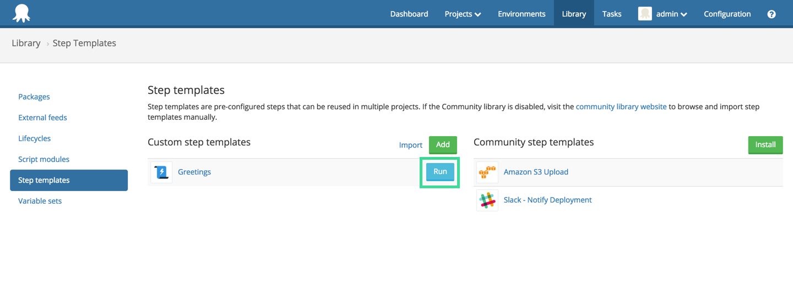
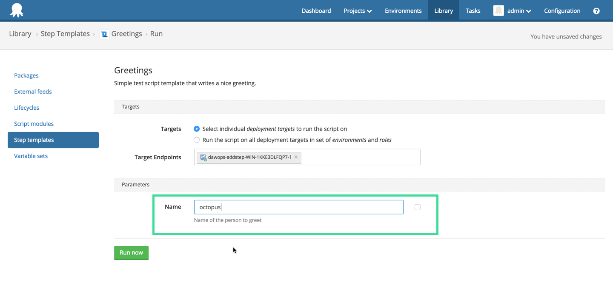
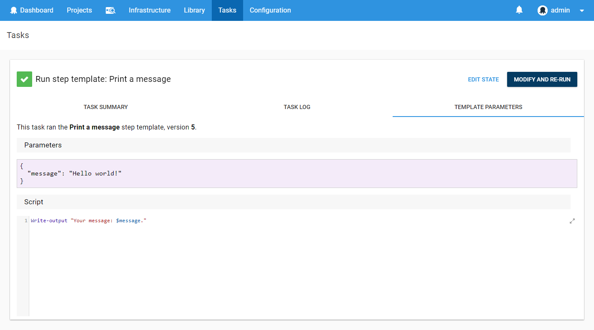

Sometimes there isn't a built-in step template or a [community step template](/docs/deployment-process/steps/community-step-templates.md) available that does what you need. Or perhaps several of your projects have similar or identical steps. You can create your own custom step templates to reuse across your projects. You can also share them with the community.

Custom step templates can be based on a built-in or installed community step templates. These custom step templates can be reused in projects and managed in the step template library.

## Creating Custom Step Templates

To create your own step template, perform the following.

1. Navigate to the **{{Library,Step templates}}** area and click **Add**.
2. Select a built-in step to base your custom step template on.  
3. Populate the step template. 

There are three parts to any step template:

1. Step details.
2. Additional parameters.
3. Settings.

## Step

The Step tab is where you fill out the details of what the step will do. This tab gives you exactly the same fields as you would see if you added the step type directly to your project, so it will be the most familiar.

Any details that need to be specified at the project level can be handled using Parameters. Any parameters specified in the Parameters tab will be exposed to you as [variables](/docs/deployment-process/variables/index.md) and can be used in the same way.

## Parameters

The Parameters tab allows you to specify fields that will be filled out by the users of this step.

You're required to give the parameter a variable name and label to use, as well as some optional help text and a default value.

Finally, you can choose the way the field will appear to a user with the **Control type** field. There are a number of options available, however keep in mind the end result will be a variable with a string value.

Any variables you configure as Parameters will be available as variables that can be used in the Step tab of the step template.

## Settings

The Settings tab allows you to give your step a name and optional description.

## Usage

After saving your step, you'll notice another tab called Usage. This tab shows where the step is being used and whether the version being used is current or a previous version.

You'll also see a handy counter next to the Usage tab so you can see at a glance how many projects are out-of-date.

## Custom Logo

Custom step templates inherit their logo from the template that was used to create them. This means that most of them will share the same logo. Fortunately this can be easily changed and each custom template can have its own unique logo. To do that navigate to the Settings tab and upload a custom logo from there.

## Export Your Custom Step Template

If you want to transport, backup, or share your custom step templates with the community, you can export a template by finding your template in **{{Library,Step templates}}**, and clicking the **Export** link.

Now you can take that exported template document and commit it to source control, or share it on the [Community Library](https://library.octopus.com/).

:::success
Take a look at the [contributing guide](https://github.com/OctopusDeploy/Library/blob/master/.github/CONTRIBUTING.md) for the Community Library and submit your step template as a [pull request](https://github.com/OctopusDeploy/Library/pulls).
:::

## Linking Custom Step Templates to Community Step Templates

Once a day Octopus retrieves the latest step templates from the [Community Library](https://library.octopus.com/). At the end of that process it also tries to link the community step templates to the any existing custom templates that have been imported manually in the past. Once the link is established the custom template can receive updates directly from the [Community Library](https://library.octopus.com/). If all the properties **except the version property** match the custom step template and the community step template will be linked.

If the linking process isn't linking a template that you believe should be linked then more than likely you don't have the very latest version of the template. The easiest way to fix this problem is to manually update the template with the data from the [Community Library](https://library.octopus.com/).

## Running Script Based Custom Step Templates

**Octopus 3.7** introduced the ability to run script based custom step templates on a group of machines. This can be very handy to execute script based step templates to test them before starting to use them in your projects as well as performing regular admin or operations functions. This should be familiar to people who have used the [script console](/docs/administration/managing-infrastructure/performance/enable-web-request-logging.md) in the past.

:::hint
It's important to note that you can only run script based custom step templates. It's not currently possible to execute step templates based on other step types.
:::

To run a script based step template, perform the following.

1. Navigate to **{{Library,Step templates}}** area and click the **Run** button next to the script based custom step template or alternately, select a script template and click the **Run** button from the template editor page:

   

2. Select a group of targets to run the step on. This can be done by target name or by environments and roles:

   

3. Enter any required parameters:

   

4. Click the **Run now** button. This will execute the step as a new task and provide the full script:

   
   
   

To re-run the script against different deployment targets or modify the input parameters, simply click the **Modify and re-run** button.

## Common Step Properties

All steps have a name, which is used to identify the step.

:::success
Be careful when changing names! Octopus commonly uses names as a convenient identity or handle to things, and the steps and actions in a deployment process are special in that way. For example you can use [output variables](/docs/deployment-process/variables/output-variables.md) to chain steps together, and you use the name as the indexer for the output variable. For example: `#{Octopus.Action[StepA].Output.TestResult}`
:::
