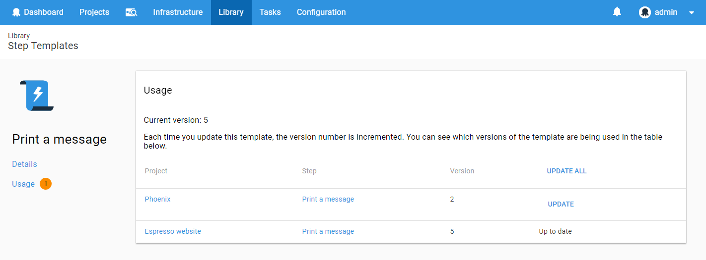
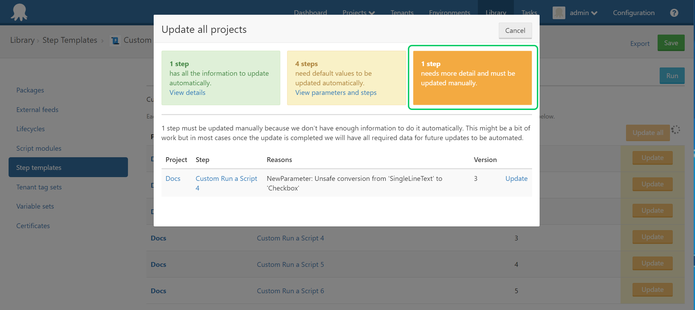

Step Templates are effectively copied to projects using them. That means if you update a step template, you'll need to update the step in the project using it for your changes to have an effect.

If your project is using an out-of-date step template, you will see a warning when editing that step in the deployment process of your project. You can click the `Update` button to start using the latest version.

If you have a lot of projects using a step template, updating them one by one can be time consuming.  Fortunately,  there is a way to update all of them at once. To do that, navigate to {{Library,Step templates, Name of the Step Template, Usage}}.

Once you are there you should see a list of steps that are using the step template. The steps that are not on the latest version will have `Update` action next to them. Steps can be updated individually or all at once by using `Update all` action.

Most of the time the steps will be updated automatically but there will be cases when the update process will need some input from you.  When this happens we will do our best to make sure you only have to update manually the steps that need it. All other steps will have an option to be updated automatically.

## Merge conflicts caused by new step template parameters

One of the cases when we will need your assistance is when you add a new parameter without a default value. There is a reason why a new parameter is added and if we updated steps without having a default value we could break your deployments. This is why we ask you to provide default values that are missing or to confirm that you are ok to use empty values as default values.

## Merge conflicts caused by unsafe changes to the step template

When you make a change to a step template that can't be applied automatically we will ask you to update each step manually. This should not happen often but when a type of a parameter changes or we don't have the previous version of the step template we need you to tell us what the correct merge result looks like.  

## Manual merge

The manual merge process shows you the current values of the properties and what we think the new values should be. The new values are editable and you can change them if they are incorrect.

