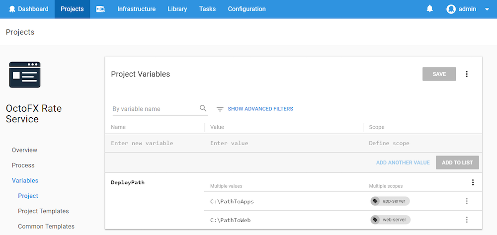

Almost all the steps that run on a deployment target can be scoped to one or more roles. This means that the step will only execute on targets with at least one of those roles. This does not mean that if the step is scoped to multiple roles that it will run for each role. Instead it will run that step for _all machines that have any roles that match any of the step roles._

To scope a step to a specific role, select the role from the execution plan field:

After you save the step, all the roles you’ve scoped it for can be viewed from the Deployment Process screen:

According to the screenshot above, our deployment process will run on deployment targets with the role **web-server**.

## Using Roles with Variables {#MachineRoles-Usingroleswithvariables}

Variables can also be [scoped to specific roles](/docs/deployment-process/variables/index.md). This means that the variable will take the specified value only when it is used on a deployment step that runs on a deployment target with the specified role. This feature can be really handy when you want to use the same variable name multiple times and have their values changed depending on the target they are running on.

Let’s say you have the following targets with their respective roles:

| Target   | Role       |
| ---------- | ---------- |
| Target 1 | app-server |
| Target 2 | web-server |

You want to deploy the same package on each server but the deployment path will be different between servers. In this case you can set the same variable (we’ll call it *DeployPath*) with a different value for each target role:

Then, on your deployment step, you can set the **[Custom Install Directory](/docs/deployment-process/steps/custom-installation-directory.md)** to `#{DeployPath}`.

:::warning
**Being Smart with Target Roles**
By definition, a role is "the function assumed by a thing in a particular situation". Roles are not **Environments** or **OS versions**. Try to use roles to tag servers by their utility and watch out if you find yourself putting more than 3 roles on the same server.
:::
