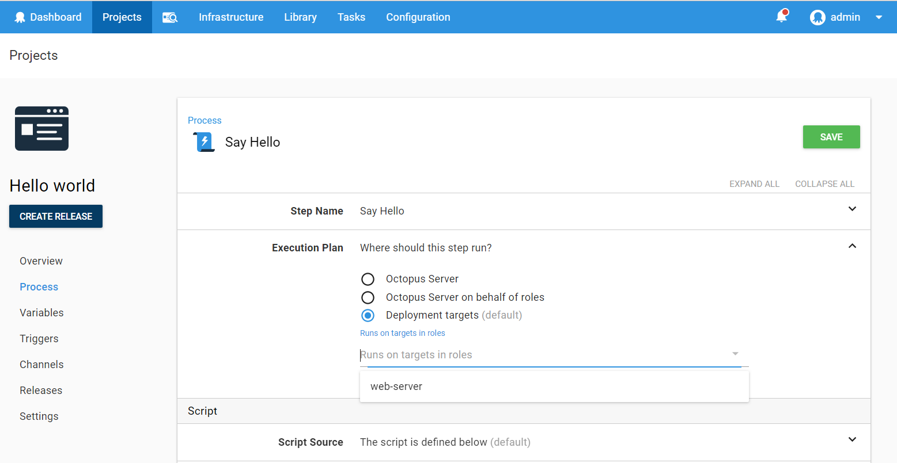
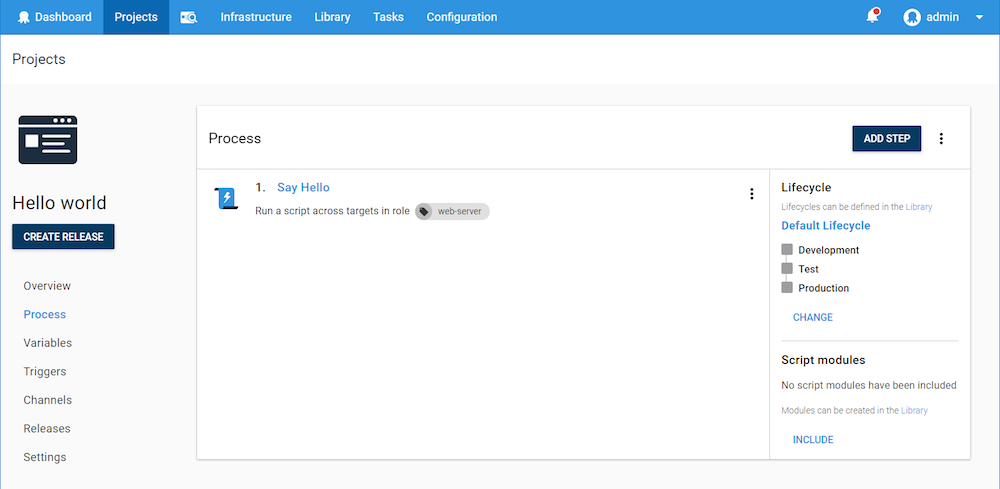

Almost all the steps that run on a deployment target can be scoped to one or more roles. This means that the step will only execute on targets with at least one of those roles. This does not mean that if the step is scoped to multiple roles that it will run for each role. Instead it will run that step for _all machines that have any roles that match any of the step roles._

To scope a step to a specific role, select the role from the execution plan field:

After you save the step, all the roles you’ve scoped it for can be viewed from the Deployment Process screen:

According to the screenshot above, our deployment process will run on deployment targets with the role **web-server**.

:::warning
**Being Smart with Target Roles**
By definition, a role is "the function assumed by a thing in a particular situation". Roles are not **Environments** or **OS versions**. Try to use roles to tag servers by their utility and watch out if you find yourself putting more than 3 roles on the same server.
:::
