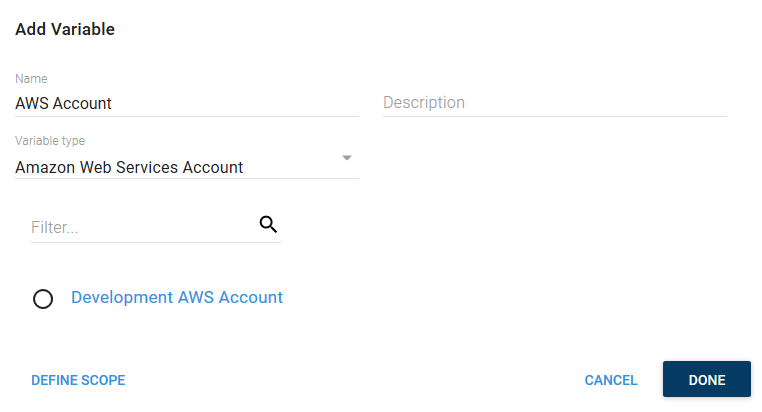

[AWS accounts](/docs/infrastructure/aws/index.md) are included in a project through a project [variable](/docs/deployment-process/variables/index.md) of the type **Amazon Web Services Account**. Before you create an **AWS Account Variable**, you need to [create an AWS Account](/docs/infrastructure/aws/index.md) in Octopus:


The **Add Variable** window is then displayed and lists all the AWS accounts.

Select the AWS account you want to access from the project to assign it to the variable:




## AWS Account Variable Properties

The AWS Account Variable also exposes the following properties that you can reference in a PowerShell script:

| Name and Description | Example |
| -------------------- | ------------------------|
| **`AccessKey`** <br/> The Access Key for the AWS Account| |
| **`SecretKey`** <br/> The Secret Key for the AWS Account| |

### Accessing the Properties in a Script

Each of the above properties can be referenced in PowerShell.

```powershell
# For an account with a variable name of 'aws account'

# Using $OctopusParameters
Write-Host 'AwsAccount.Id=' $OctopusParameters["aws account"]
Write-Host 'AwsAccount.AccessKey=' $OctopusParameters["aws account.AccessKey"]

# Directly as a variable
Write-Host 'AzureAccount.Id=' $awsaccount
Write-Host 'AzureAccount.Client=' $awsccountAccessKey
```
