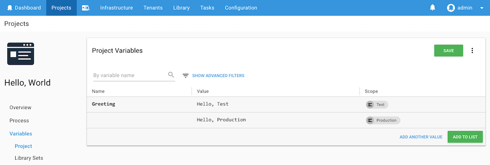
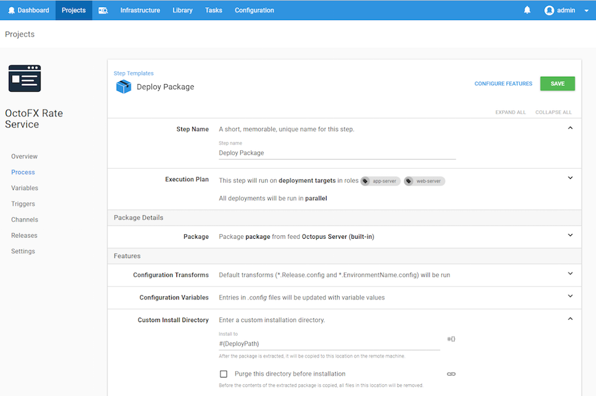

Octopus lets you define variables with values that change based on the scope you've assigned to the variables and the scope of your deployments. For instance, as you define your [deployment processes](/docs/deployment-process/index.md) there will be [steps](/docs/deployment-process/steps/index.md) in your [projects](/docs/deployment-process/projects/index.md) that need different database connection strings (or any number of other parameters, i.e., application settings, web service URLs, etc) depending on the environment you're deploying to.

Using variables, you can define a variable with one value (the database connection string for the test database) scoped to the test environment and another value (the database connection string for the production database) scoped to the production environment. Then, when your deployment process runs, it will use the value with the test database connection string when deploying to the test environment, and it will use the value with the production database connection string when deploying to the production environment.

Using variables means you don't need to hardcode any of these values. You define your variables and the values you provide will be used at deployment time, allowing you to create applications and deployments that are agnostic of the target environment.

## Creating Hello World Variables

In this example, we'll add a variable to a Hello World project that runs a script to say hello. The project uses the variable to vary the message it displays based on the environment the script is deployed to.

1. To add a variable to your [project](/docs/deployment-process/projects/index.md), navigate to the Project's Overview page, and click **Variables** to access the variable editor.
1. Give the variable a name, for instance, *Greeting*.
1. Enter the first value for the variable, for instance, *Hello, Test*, in the value field.
1. Define the scope for the value, for instance, by selecting the *Test* environment.
1. Click **ADD ANOTHER VALUE** and enter the second value for the variable, for instance, *Hello, Production*.
1. Define the scope for this value, for instance, by selecting the *Production* environment.



1. Save the variable by clicking **SAVE**.
1. In this example, we'll reference this variable from a **Run a Script** step.
1. Define your step (Click **{{Process,ADD STEP,Run A Script}}**) and in the **Script Content** section, enter the following PowerShell script into the script editor:

​```
Write-Host
​```

1. Select the variable *Greeting* from the insert variable tool (**#\{\}**) next to the script editor, and click **SAVE**.


When a release of the project is deployed, the script step will run with the string *Hello, Test* on the Test environment, and with the string *Hello, Production*, on the Production environment.

## Scoping Variables {#scoping-variables}

The variables that you define for your projects in Octopus can be scoped in the following ways:

- Environments (most common).
- Deployment targets.
- Target roles.
- Deployment steps.
- Channels.
- Tenants.

Scoping the values of your variables lets you determine which values will be used in which situations. For example, suppose this variable exists:

| Name | Value | Environment scope |
| --- | --- | --- |
| LogLevel | Info |  |
| LogLevel | Warn | Production, Staging |

During deployment, Octopus will try to select the most specifically scoped variable that applies. For example, when deploying to Production and staging, the *LogLevel* property would be *Warn*, but to any other environment, it would fall back to the less-specific variable and have a value of *Info* instead.

### Assigning Scopes {#Scopingvariables-Assigningscopes}

You can set the scope of a variable values when you are creating or editing your variables, either from the **variable** section of the project, or in the **Variable Sets** section of the Library; however, when you assign scope to variables that are part of a library **variable set**, the variables cannot be scoped to deployment steps or channels.


### Using Multiple Scopes

You can scope the values of your variables in multiple ways. For instance, you might scope a value to both the **Dev** and **Test** Environments, and to a step within your process.

When the process runs, Octopus will used the scoped value for the **Dev** OR **Test** environments, AND the steps the value was scoped to.

| Variable | Value | Scope |
| -------- | ----- | ----- |
| MyVariable | Scoped | Environment: Dev, Test; Steps: Step 1 |
| MyVariable | unscoped |  |

With the above *MyVariable* variable, the scoped and unscoped values would be implemented as follows:

| | Step 1 | Step 2|
| ---- | ---- | ---- |
| Dev Environment | Scoped | Unscoped |
| Test Environment | Scoped | Unscoped |
| Stage Environment |  Unscoped | Unscoped |


### Scope Specificity {#Scopingvariables-Scopespecificity}

Imagine you have one variable scoped to an environment (Production), and another scoped to a machine within the environment. Which value should Octopus choose?

Since variables can be scoped in many different ways, there needs to be a predictable, deterministic order in which they are resolved. The list below is the priority in which variable scopes take precedence - the top items are considered higher priority than the bottom ones:

1. The current step/action (most specific).
1. The current machine.
1. Roles applied to the current machine and targeted by the current step.
1. Roles applied to the current machine.
1. The target tenant (if tenant-features are enabled).
1. The target tenant-tag (if tenant-features are enabled).
1. The target environment.
1. The target channel (if channels are enabled).
1. No scope (least specific).

For example, imagine a **LogLevel** variable with a value scoped to an environment is considered by Octopus to be "less specific" than a value scoped to a machine role. So when two possible values for a variable exist, Octopus will choose the "more specific" scope value over the less specific one.

Variable scoping also works like CSS rules; a value scoped twice is more specific than a value scoped once. For example, a variable scoped to an environment and a role is more specific than a variable scoped to just a role.

If two variables are scoped equally, Octopus will choose project-defined variables ahead of library-defined ones. If this still does not resolve the conflict the result is non-deterministic and you should not depend on a specific value being used. Instead, you should take care when scoping variables so that they are unlikely to conflict.

Scope specificity can quickly become very complicated. Read our blog post for a [better understanding of why scope specificity works the way it does](http://octopus.com/blog/variable-specificity-and-complexity).


### Using Variables with Target Roles

Variables can also be scoped to specific [target roles](docs/infrastructure/deployment-targets/target-roles/index.md). This means that the variable will take the specified value only when it is used on a deployment step that runs on a deployment target with the specified role. This feature can be really handy when you want to use the same variable name multiple times and have their values changed depending on the target they are running on.

Let’s say you have the following targets with their respective roles:

| Target   | Role       |
| ---------- | ---------- |
| Target 1 | app-server |
| Target 2 | web-server |

You want to deploy the same package on each server but the deployment path will be different between servers. In this case you can set the same variable (we’ll call it *DeployPath*) with a different value for each target role:


Then, on your deployment step, you can set the **[Custom Install Directory](/docs/deployment-process/configuration-features/custom-installation-directory.md)** to `#{DeployPath}`.



### Variables and Permissions

When applying permissions on variables via scopes, the only options that are checked against permissions are Environments, Targets and Tenants.

## Using Variables in Step Definitions {#Bindingsyntax-Referencingvariablesinstepdefinitions}

This binding syntax can also be used to dynamically change the values of deployment step settings. If [variables are scoped](/docs/deployment-process/variables/index.md#scoping-variables), this makes it really easy to alter a deployment step settings based on the target environment.

Most text fields that support binding to variables will have a variable insert button:


For settings that support variables but aren't text (such as drop downs or checkboxes), a button is displayed to toggle custom expression modes:


!include <using-variables-in-scripts>

:::warning
If you are using Spaces as part of your Octopus Deploy installation, please remember that any Variables you configure, will only be available to the space they are configured for.
:::

## Variables in Octopus

Variables are an important and useful concept in Octopus, so this section describes different ways in which variables can be used.

|                                          |                                          |
| ---------------------------------------- | ---------------------------------------- |
| **[Library variable sets](/docs/deployment-process/variables/library-variable-sets.md)** | Library variable sets let you re-use common variables between projects rather than creating them for every project that needs them. |
| **[Prompted variables](/docs/deployment-process/variables/prompted-variables.md)** | Sometimes the value of a variable changes for each deployment. You can prompt a user for a variable value when scheduling deployments. |
| **[Sensitive variables](/docs/deployment-process/variables/sensitive-variables.md)** | Octopus can securely store sensitive values, for instance, passwords and API keys. |
| **[System variables](/docs/deployment-process/variables/system-variables.md)** | Many built-in variables are available within Octopus, such as the current environment name. |
| **[Output variables](/docs/deployment-process/variables/output-variables.md)** | Output variables let you programmatically set variables during a deployment, and then use those values in subsequent steps. |
| **[Variable templates](/docs/deployment-process/variables/variable-templates.md)** | Variable template are used with projects that are deployed to Multi-tenants and let you define which variables are required by tenants for your projects to be successfully deployed. |
| **[Certificate variables](docs/deployment-process/variables/certificate-variables.md)** | Octopus supports a certificate variable type that lets you create a variable with a certificate managed by Octopus as the value. |
| **[Variable Substitution Syntax](docs/deployment-process/variables/variable-substitutions.md)** | Variable substitutions are a flexible way to adjust configuration based on your variables and the context of your deployment. |
| **[AWS Account Variables](docs/deployment-process/variables/certificate-variables.md)** | AWS accounts are included in a project through a project variable of the type Amazon Web Services Account. |
| **[Azure Account Variables](docs/deployment-process/variables/certificate-variables.md)** | Azure accounts can be referenced in a project through a project variable of the type Azure Account. |
