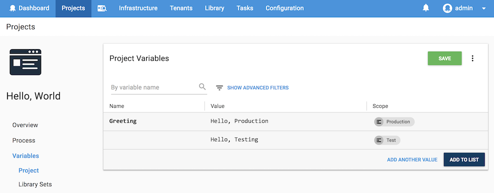
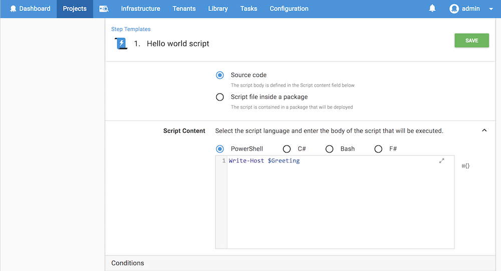

Octopus lets you define variables with values that change based on the [scope](/docs/deployment-process/variables/scoping-variables.md) you've assigned to the variables and the scope of your deployments. As you define your [deployment processes](/docs/deployment-process/index.md) there will be [steps](/docs/deployment-process/steps/index.md) in your [projects](/docs/deployment-process/projects/index.md) that need different database connection strings, application settings, web service URLs, or many other parameters. Using variables means you don't need to hardcode any of these values. You define your variables and the values you provide will be used at deployment time, allowing you to create applications and deployment scripts that are agnostic of the target environment.

For instance, you might need to define [custom installation directories](/docs/deployment-process/configuration-features/custom-installation-directory.md) for the testing environment and the production environment. In this instance, you would have something like:

| Variable Name    | Value     | Scope    |
| ----------------------- | --------------- | -------- |
| CustomInstallDirectory | \path\to\test\directory\ | Test |
| CustomInstallDirectory | \path\to\production\directory\ | Production |

Then when the software is deployed to the Test environment, Octopus will use the value provided for the **CustomerInstallDirectory** scoped to the **Test** Environment, and when the software is deployed to the Production environment, Octopus will use the value provided for the **CustomInstallDirectory** scoped to the **Production** Environment.

## Creating Hello World Variables

In this example, we'll create a Hello World project that runs a script to say hello. The project will uses variables to vary the message it displays based on the environment the script is deployed to.

1. Navigate to **Projects** and click **ADD PROJECT**.
2. Give the project a name, for instance, *Hello, World*, and click **SAVE**.
3. From the Project Overview page, click **Variables** to access the variable editor.
4. Create your variables. For this example, we'll enter the name *Greeting* for each of the variables we create, for the first variable we'll add the value *Hello, Production*, [scoped](/docs/deployment-process/variables/scoping-variables.md) to the production environment. For the second variable we'll add the value *Hello, Testing*, [scoped](/docs/deployment-process/variables/scoping-variables.md) to the testing environment. After you've created the variables, click **Save**.



5. Now we need to define our project. From the Project Overview page, click **DEFINE YOUR DEPLOYMENT PROCESS**, on the next page click **ADD STEP**.
6. This is a script project so select the **Run a Script** step template.
7. Give the step a name, for instance, *Hello world script*.
8. In the execution plan section, select **Deployment targets**.
9. Select the [targets roles ](/docs/infrastructure/target-roles/index.md) the step will run on.
10. In the **Script Content**, enter the following PowerShell script into the script editor:

​```
Write-Host
​```

11. Select the variable *Greeting* from the insert variable tool next to the script editor, and click **SAVE**



12. From the Project Overview Page, Click **Create Release**, enter a *Version number* or accept the default, and enter any release notes you'd like to include. Click **SAVE**.

Depending on the conditions in the [Lifecycle](/docs/deployment-process/lifecycles/index.md), the release will be deployed automatically or you will need to manually deploy the release.

The script step will run with the string *Hello, Production*, on the deployment target in the Production environment, and with the string *Hello, Test*, on the deployment target in the Test environment. You can view the output after the deployment has completed by clicking on the large Green Tick icons in the task column, and then clicking through the results for the deployment.

## Variable Snapshot

When you create releases, a snapshot is taken of the project variables. You can review the variables in the **Variable Snapshot** section of the release page by clicking **SHOW SNAPSHOT**. This lets you see the variables as they existed when the release was created.

You can update the variables by clicking **UPDATE VARIABLES**. This can be useful when:

* The release has not been deployed yet, but the variables have changed since the release was created.
* The release needs to be **redeployed** and the variables have changed since the release was created.
* The release failed to deploy due to a problem with the variables and you need to update the variables and redeploy the release.

## Variables in Octopus

Variables are an important and useful concept in Octopus, so this section describes different ways in which variables can be used.

|                                          |                                          |
| ---------------------------------------- | ---------------------------------------- |
| **[Scoping variables](/docs/deployment-process/variables/scoping-variables.md)** | Variables can be scoped to different environments, deployment targets, target roles, and deployment steps which allows you to provide different values for the variables for each scope. |
| **[Binding syntax](/docs/deployment-process/variables/binding-syntax.md)** | Octopus's binding syntax lets you reference variables throughout Octopus. You can also reference variables from other variables. |
| **[Library variable sets](/docs/deployment-process/variables/library-variable-sets.md)** | Library variable sets let you re-use common variables between projects rather than creating them for every project that needs them. |
| **[Prompted variables](/docs/deployment-process/variables/prompted-variables.md)** | Sometimes the value of a variable changes for each deployment. You can prompt a user for a variable value when scheduling a deployment. |
| **[Sensitive variables](/docs/deployment-process/variables/sensitive-variables.md)** | Octopus can securely store sensitive values, like passwords and API keys. |
| **[System variables](/docs/deployment-process/variables/system-variables.md)** | Many built-in variables are available within Octopus, such as the current environment name. |
| **[Output variables](/docs/deployment-process/variables/output-variables.md)** | Output variables let you programmatically set variables during a deployment, and then use those values in subsequent steps. |
| **[Variable templates](/docs/deployment-process/variables/variable-templates.md)** | Variable template are used with projects that are deployed to Multi-tenants and let you define which variables are required by tenants for your projects to be successfully deployed. |
| **[Certificate variables](docs/deployment-process/variables/certificate-variables.md)** | Octopus supports a certificate variable type that lets you create a variable with a certificate managed by Octopus as the value. |
| **[Variable Substitution Syntax](docs/deployment-process/variables/variable-substitution-syntax.md)** | Variable substitutions are a flexible way to adjust configuration based on your variables and the context of your deployment. |
| **[AWS Account Variables](docs/deployment-process/variables/certificate-variables.md)** |
AWS accounts are included in a project through a project variable of the type Amazon Web Services Account. |
| **[Azure Account Variables](docs/deployment-process/variables/certificate-variables.md)** |
Azure accounts can be referenced in a project through a project variable of the type Azure Account. |
