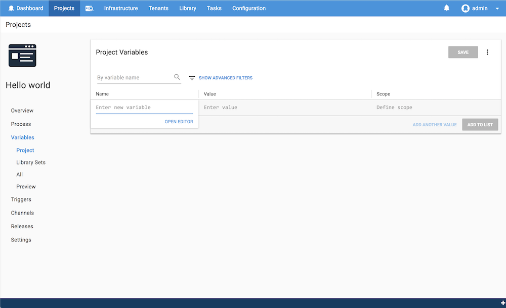

As you work with [variables](/docs/deployment-process/variables/index.md) in Octopus, there will be times when you work with applications that require configuration values that are considered sensitive information. These should be kept secret, but used as clear-text during deployment. Think of something like a password or API Key to an external resource. Octopus provides support for this scenario with Sensitive Variables.

## Configuring Sensitive Variables {#Sensitivevariables-Configuringsensitivevariables}

Variables such as passwords or API keys can be marked as being **sensitive**. Just like non-sensitive variables they can [reference other variables](docs/deployment-process/variables/binding-syntax.md#Bindingsyntax-Referencingvariablesinstepdefinitions) but be careful with any part of your sensitive variable that could [unintentionally be interpreted](docs/deployment-process/variables/sensitive-variables.md#Sensitivevariables-Avoidingcommonmistakes-SubstituionSyntax) as an attempted substitution. See also, other [common mistakes](#avoiding-common-mistakes).


## Defining Sensitive Variables

To make a variable a **sensitive variable**, you need to enter the variable editor when you are creating or editing the variable. On any of the variable fields, click **OPEN EDITOR**:



For variable type, select **Sensitive**.


## How Octopus Handles Your Sensitive Variables {#Sensitivevariables-HowOctopushandlesyoursensitivevariables}

:::hint
Learn more about [security and encryption](/docs/administration/security/data-encryption.md) in Octopus Deploy.
:::

When dealing with sensitive variables, Octopus encrypts these values using **AES128 encryption** any time they are in transmission, or "at rest" like when they are stored in the Octopus database or staged on a deployment target as part of a deployment. You can use these sensitive values in your deployment process just like normal [variables](/docs/deployment-process/variables/index.md), with two notable exceptions:

- Once the variable is saved, Octopus will **never allow you to retrieve the value** via the [REST API](/docs/api-and-integration/api/index.md) or the Octopus web portal; and
- Whenever possible, Octopus will **mask these sensitive values in logs**.

:::success
**Use a password manager or key vault**
If you need to retrieve these values for other purposes, consider using a password manager or key vault. The support we provide in Octopus is to securely store values that will be used during deployment, and cannot be retrieved for any other purposes. There are plenty available, and some are free, like [KeePass](http://keepass.info/), or [HashiCorp Vault](https://www.vaultproject.io/).
:::

## Choosing Which Variables Should Be Sensitive

Any value you want can be treated as a secret by Octopus. It is up to you to choose the most appropriate balance of secrecy and usability. As a rule of thumb, any individual value which should be encrypted, or masked in logs, should be made sensitive in Octopus.

The most straightforward example is a password or key. Make the password or key sensitive and it will be encrypted into the database and masked in the Octopus task logs.

Another common example is building a compound value using the [variable substitution syntax](docs/deployment-process/variables/variable-substitution-syntax.md), like a database connection string. Imagine a variable called `DB.ConnectionString` with the value `Server=#{DB.Server};Database=#{DB.Database};User=#{DB.Username};Password#{DB.Password};`. In this case you should at least make the `DB.Password` variable sensitive so it will be encrypted in the database and masked from any Octopus task log messages like this `Server=db01.mycompany.com;Database=mydatabase;User=myuser;Password=*****`. You could also make `DB.Username` or any of the other components of this template sensitive.

## Avoiding Common Mistakes {#Sensitivevariables-Avoidingcommonmistakes}

Here are some common pitfalls to avoid:

- **Avoid logging your sensitive values**: you won't really get any benefit from logging your sensitive variables since they will be masked by Octopus. The masking is in provided in case a downstream system logs the sensitive value inadvertently logging it to the Octopus deployment logs.
- **Avoid short values:** only sensitive variables with length **greater than 3** characters will be masked. This is done to prevent false positives causing excessive obfuscation of the logs. Consider 8-30 characters depending on the requirements of your deployment.
- **Avoid common language**: see the example below of "broke", use a password generator with high entropy [like this one](http://passwordsgenerator.net/).
- **Avoid sequences that are interpreted by your scripting language of choice**: For example, certain escape sequences like `$^` will be misinterpreted by PowerShell potentially logging out your sensitive variable in clear-text.
- **Sensitivity is not transitive/infectious**: For example, imagine you have a sensitive variable called `DB.Password` and another variable called `DB.ConnectionString` with the value `Server=#{DB.Server};...;Password=#{DB.Password}`; the `DB.ConnectionString` does not become sensitive just because `DB.Password` is sensitive. However, if you happen to write the database connection string to the task log, the password component will be masked like this `Server=db01.mycompany.com;...;Password=*****` which is probably the desired outcome.
- **Avoid mixing binding expressions and sensitivity**: For example, if you have a variable called `Service.Credential` with the value `Password=#{Service.Password}` and make that variable sensitive, Octopus treats the **literal** value `Password=#{Service.Password}` as sensitive instead of treating the **evaluated** value as sensitive, which might be different to what you would expect. Instead, you should make the variable called `Service.Password` sensitive so the password itself will be encrypted in the database, and subsequently masked in any logs like this `Password=*****`.
- **Avoid sequences that are part of the variable substitution syntax** {#Sensitivevariables-Avoidingcommonmistakes-SubstituionSyntax}: For example, the sequence `##{` will be replaced by `#{` by logic that's part of [referencing variables](docs/deployment-process/variables/binding-syntax.md#Bindingsyntax-Referencingvariablesinstepdefinitions) so you would need to escape it by modifying it to be `###{` which will result in `##{`, see also [variable substitution syntax](docs/deployment-process/variables/variable-substitution-syntax.md).

- **Octopus is not a 2-way key vault**: use a password manager or key vault like [KeePass](http://keepass.info/) or [HashiCorp Vault](https://www.vaultproject.io/).

## Logging {#Sensitivevariables-LoggingLogging}

:::success
Try to avoid logging sensitive values! Whilst Octopus will attempt to mask sensitive values, it is better there is no value to mask in the first place!
:::

Octopus/Tentacle will do its best to prevent sensitive values from inadvertently appearing in any logs. For example, if a custom PowerShell script accidentally did this:

```powershell
Write-Output "Hello, the password is $Password"
```

Octopus would mask the value from the deployment log, leaving:

```text
Hello, the password is *****
```

Note that this method isn't 100% foolproof. If your top secret password is "broke", and someone happened to deploy with a PowerShell script with:

```powershell
Write-Output "Or watch the things you gave your life to, broken"
```

Then the password might be given away when Octopus prints:

```powershell
Or watch the things you gave your life to, *******en
```

The obvious solution is, don't use passwords that are likely to occur in normal logging/language, and avoid writing the values of your secure variables to logs anyway.
