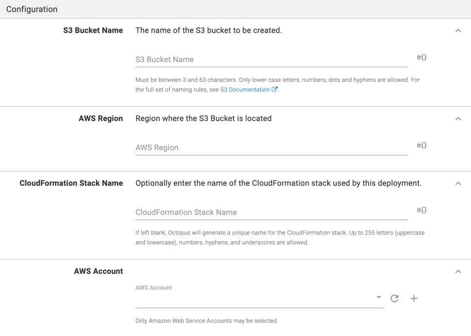

Octopus supports creating a new S3 bucket through the `Create an Amazon S3 Bucket` step.
This step provides a way to create or manage an arbitrary Amazon S3 Bucket via CloudFormation. This could be especially useful in conjunction with AWS Lambda functions.

:::hint
The `Create an Amazon S3 Bucket` step was added in **Octopus 2022.1**.
:::

The following instructions can be followed to configure the `Create an Amazon S3 Bucket` step.

## Add the Create an Amazon S3 Bucket step

Add the `Create an Amazon S3 Bucket` step to the project, and provide it a name.

## Provide the required configuration

Provide the information required to create the bucket.

The following settings will need to be configured:

* AWS Region
* AWS Account

:::hint
Note: The **S3 Bucket Name** will be automatically generated if not provided.
:::

### Tags section

Specify a list of tags and their values. These tags will be added to Bucket as well as the CloudFormation Stack.

### Advanced section

The S3 bucket is created and managed through a CloudFormation stack. You can optionally specify a CloudFormation Stack Name to use, otherwise, one will be automatically generated.

## Output variables

Presently, the step outputs the following variables.

| Name        | Description |
| ------------| ----------- |
|`BucketName` | The name of the bucket that was created  |
|`StackName`  | The name of the CloudFormation stack     |
|`StackId`    | The ID (ARN) of the CloudFormation stack |
|`Region`     | The AWS region in which the operations were executed |

## Errors

If a deployment failure is detected, you may receive one of the following errors.

### Create S3 Bucket Validation Error

This error indicates that one or more of the step's inputs are invalid. Typically, this can happen when values are supplied as bound expressions and cannot be resolved until a new release is deployed. The step will run an additional validation check before attempting to perform the deployment. Some examples of input values that can cause this error are:
* Non-unique tag and/or environment variable keys.
* Bound expressions resolving to empty values when the field is required.