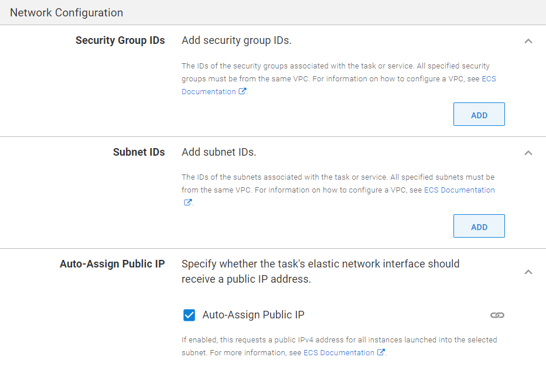
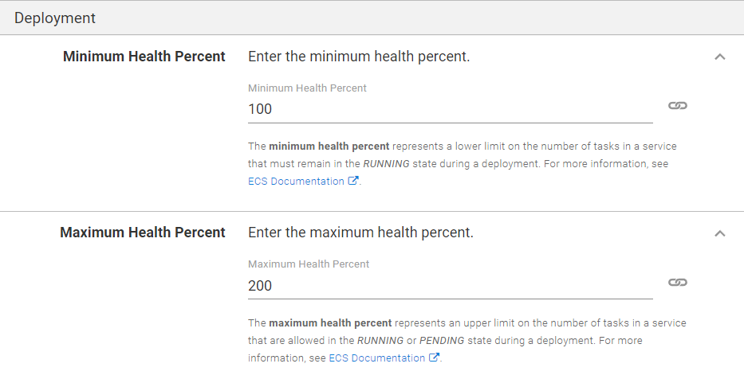
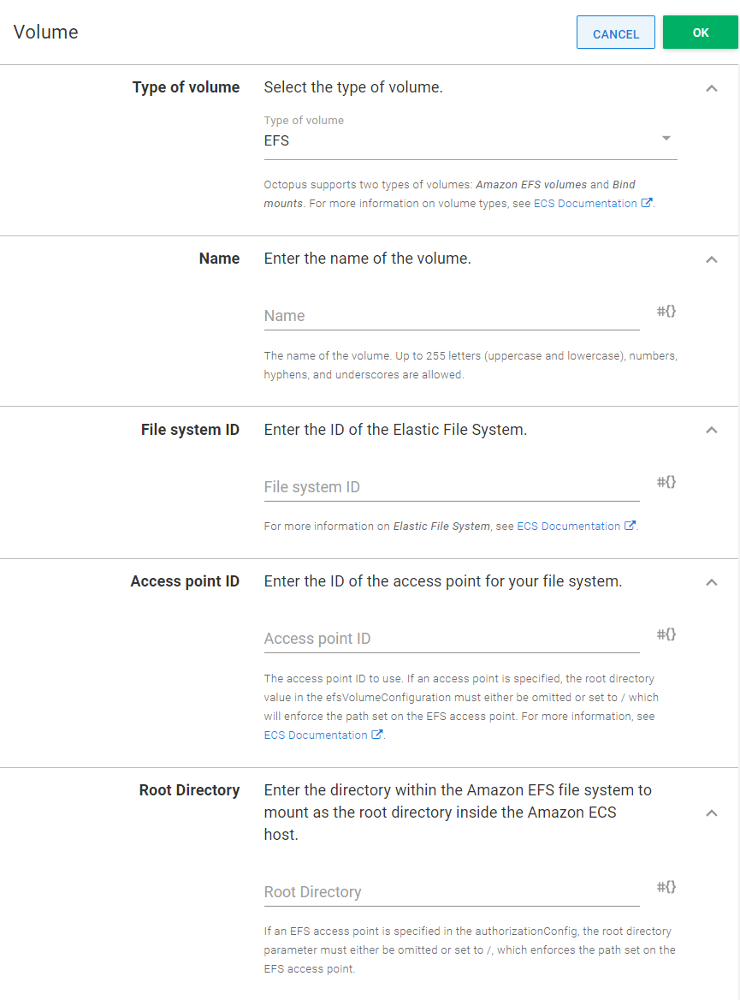
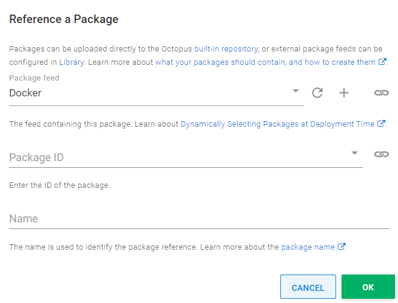

Octopus supports deployments to ECS clusters through the `Deploy Amazon ECS Service` step. This step provides a friendly user interface for configuring both service and task definitions in a single screen. At deployment time the step generates an AWS CloudFormation template, executes it, and verifies the state of the resulting stack.

:::hint
Presently only Fargate clusters are supported. We might add support for EC2 clusters in the future.
:::

The proceeding instructions can be followed to configure the `Deploy Amazon ECS Service` step. We have deliberately chosen not to document some fields here as they map directly to ECS settings and are well documented in AWS docs (a link to the relevant docs section is typically provided in the fields' notes section). 

## Make a note of your ECS Cluster's settings

Configuring an ECS service for the very first time can be quite intimidating due to a large number of available options. Fortunately, most of them are optional and at a minimum the following settings will need to be provided:
* Name of the ECS cluster
* Cluster's region
* Ids of the subnets belonging to cluster's VPC
* Ids of the security groups attached to the cluster's VPC

## Create a deployment target for the ECS cluster

`Deploy Amazon ECS Service` step requires [a deployment target](/docs/getting-started/first-deployment/add-deployment-targets) to be defined.

Select the `AWS Account` under `ECS Cluster` section and provide the cluster's AWS region and name. If you don't have an `AWS Account` defined yet, check our [documentation on how to set one up](/docs/infrastructure/accounts/aws).

## Add the ECS step

Add the `Deploy Amazon ECS Service` step to the project, and provide it a name.

As the step is using a deployment target a target role will also need to be specified. The role will be used to determine which ECS cluster to deploy to.

### Configuration section

Specify the name for the resulting task definition.

:::hint
CloudFormation stack and service names will be automatically generated and cannot be changed manually.
:::

### Task Execution IAM Role section

Under the `Task Execution IAM Role` section, the Task Execution Role can optionally be defined. If one wasn't specified the step will create one automatically and assign the `arn:aws:iam::aws:policy/service-role/AmazonECSTaskExecutionRolePolicy` role to it.

### Task Size section

Specify the total memory and CPU limits for the task definition. The sum of each individual containers' limits cannot exceed the total limit defined here.

### Network Configuration section

Specify the Security Groups and Subnets in the clusters VPC that will be attached to the resulting service.

### Tags section

Specify whether to enable Amazon ECS managed tags. Changing this value will force the service to be re-created.

:::hint
Octopus automatically adds stack-level tags that propagate to the task definition and the service. The full list of these auto-generated tags can be found in our [Architecture repository](https://github.com/OctopusDeploy/Architecture/blob/main/Steps/StepDesignGuidelines.md#tags-and-labels).
:::

### Container Definitions section

At least one container definition must be specified when registering a task definition.

Specify container name that will be used to reference the particular container definition, Docker feed and image name (particular image version will be specified later, when creating a deployment).

To authenticate with private repositories you can either rely on the default IAM authentication by assigning required secrets to task execution role, or manually provide the full secret's ARN. For more information, refer to [AWS documentation](https://g.octopushq.com/ECSContainerDefinitionRegistryAuth). For images stored in Amazon ECR no further configuration is required.

Specify the ports exposed by the container here. These can be referenced in the `Load Balancer Mappings` section to publicly expose these ports.

#### Health Check section

This section directly corresponds to Docker health check parameters. For more information, refer to [Docker documentation](https://docs.docker.com/engine/reference/builder/#healthcheck).

#### Environment section

Specify additional options for the running container, such as `Entry Point`, `Working Directory` and `Environment Variables`.

#### Container Storage and Logging section

In this section you can specify mount points for the running container. Mount points can refer to the volumes specified in `Volumes` section of the ECS step.

For container logging the step can either auto-configure CloudWatch logs or you can provide logging configuration manually. If you choose to have CloudWatch logs auto-configured, please ensure that you have specified a Task Execution Role ARN for this step. 

### Deployment section

Specify the minimum and maximum health percentages for the resulting service.

### Deployment Options section

You can also optionally change whether the step should wait until the CloudFormation stack fully deploys by changing the `Wait Option` selection. By default, the step will wait until the CloudFormation stack deployment is complete and the resulting ECS Task is running (or failed to run).

:::hint
Selecting `Don't wait` option means that the step will not fail if the CloudFormation deployment fails.
:::

Snippet of deployment verification logic can be seen in the diagram provided below in `CloudFormation deployment workflow` section.

### Load Balancer Mappings section

Specify how exposed container ports map to Target Groups attached to your Load Balancer. `Container Name` and `Container Port` fields must match the values specified in `Container Definitions` section of the same task definition. For more information refer to [AWS Documentation](https://docs.aws.amazon.com/elasticloadbalancing/latest/application/load-balancer-target-groups.html).

### Volumes section

Specify volumes that can be referenced by each individual container within the task definition. `Bind` and `EFS` volume types are supported.

### Export to CloudFormation template

The ECS step operates entirely via CloudFormation templates, which means that every input field corresponds to a set of options in the generated template. To cater for more advanced deployment scenarios the step provides an option to export the CloudFormation template as YAML text. This template can be used via AWS CLI or as input in the `Deploy an AWS CloudFormation Template` step.

Some options will be converted to CloudFormation parameters with default values matching the specific values provided in the step. This allows you to easily override these values, while maintaining a simple conversion process between the ECS step and the `Deploy an AWS CloudFormation Template` step.

:::hint
Some values cannot be resolved until deployment time and will be replaced with their respective Octopus variable representations. Namely, container image reference will be exported as `#{Octopus.Action.Package[YOUR_IMAGE_NAME].Image`, which represents a fully qualified container image, including tag (for example, `docker.io/nginx:latest`). If you use the template in other Octopus steps, such as `Deploy an AWS CloudFormation Template` step, your image reference name must match the one exported from the ECS step.

:::

To access the `Export to CloudFormation template` use the step's overflow menu in the top right-hand corner directly below the dotted menu for the overall deployment process.

The dialog window will appear, showing the complete CloudFormation template and an option to copy it.

#### Variable replacements

Any of the input fields can be bound to an Octostache expression. Variable replacement will be performed before the template is deployed.

### Output variables

Presently, the step does not output any Octopus variables specific to the step or the resulting CloudFormation stack. It is expected to be added in future versions of the step.

## CloudFormation deployment workflow

The AWS CLI makes a clear distinction between creating and updating CloudFormation stacks. When using the CLI directly, it is up to you to know if the stack exists, and what state the stack is in, in order to know whether to create or update the stack.

Octopus takes a different approach. The CloudFormation steps are designed to be idempotent, which means you can run them multiple times and the result will be the same. This means that Octopus will create the stack if it doesn't exist, update the stack if it does exist, and ignore cases where the stack has no updates. Likewise, deleting a stack will complete successfully if there is no stack to delete.

In addition, there are several states that a stack can be in where the only way to apply updates is to first delete the stack. A stack can enter one of these states for a variety of reasons, such as failing to be successfully created the first time.

The following states are those that require the stack to be deleted before it can be recreated:

* CREATE_FAILED
* ROLLBACK_COMPLETE
* ROLLBACK_FAILED
* DELETE_FAILED
* UPDATE_ROLLBACK_FAILED

The [AWS documentation](http://docs.aws.amazon.com/AWSCloudFormation/latest/UserGuide/using-cfn-describing-stacks.html#w2ab2c15c15c17c11) contains more details on the CloudFormation state states.

## Error messages

If a deployment failure is detected the step will attempt to extract error messages from both the CloudFormation stack and the task spawned from service and task definitions. In some cases these messages can include errors and warnings from previous deployment attempts. Unfortunately, the step cannot distinguish which errors are relevant and will err on the side of over-communication. In most cases the error log should provide enough information to resolve any issues without having to refer to AWS Dashboard or other tools.