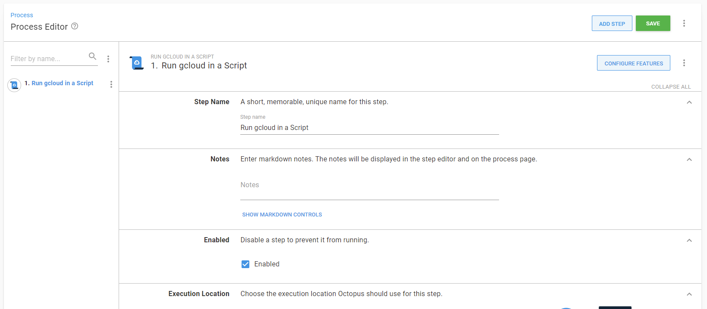

Octopus Deploy can help you run scripts on targets within Google cloud platforms.

These scripts typically rely on tools being available on the target worker.

We recommend that you provision your own tools on your worker - this way you can control what version of the tools are provisioned, and ensure their compatibility with the scripts you are trying to execute.

When executing a script against GCP, Octopus Deploy will automatically use your provided Google cloud account details to authenticate you to the target instance, or you can choose to use the service account associated with the target instance.

This functionality requires the gcloud CLI to be installed on the worker.

## Run a gcloud script step {#RunningGcloudScript}

Octopus Deploy provides a *Run gcloud in a Script* step type, for executing script in the context of a Google cloud platform instance. For information about adding a step to the deployment process, see the [add step](/docs/projects/steps/index.md) section.

## Learn more

- How to create [Google cloud accounts](/docs/infrastructure/accounts/google-cloud/index.md)