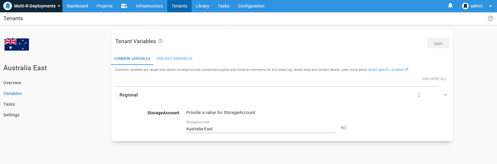
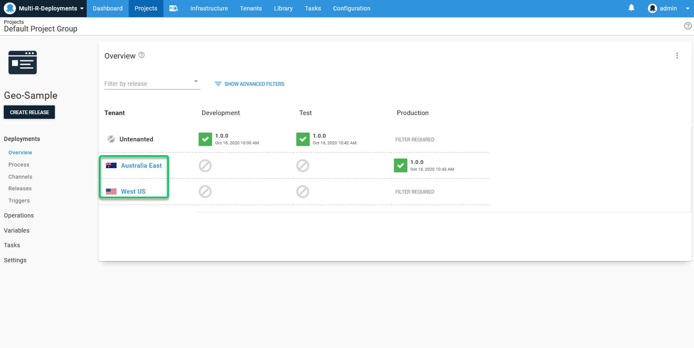
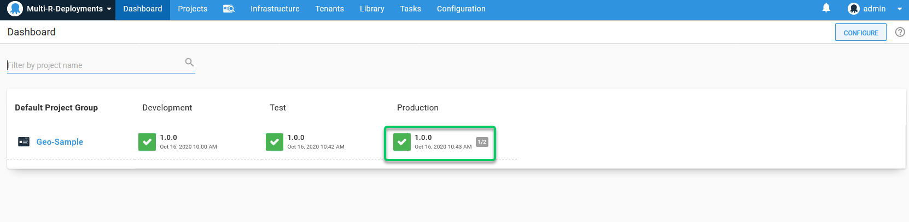
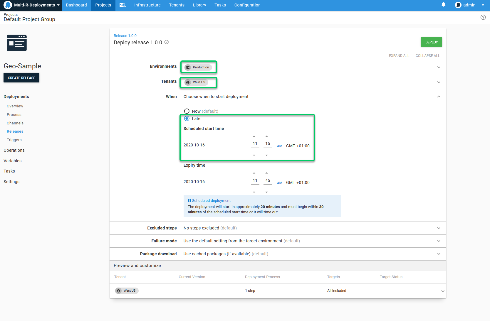

## Scenario

Your application is deployed to multiple geographic regions (or multiple Data Centers) to provide for your end-customer's performance (think latency) or legal requirements (like data sovereignty).

## Strict solution using environments

You can use [Environments](/docs/infrastructure/environments/index.md) to represent each region or data center. In the example below we have defined a Dev and Test Environment as per normal, and then configured two "production" Environments, one for each region we want to deploy into.

By using this pattern you can:

1. Use [lifecycles](/docs/releases/lifecycles/index.md) to define a strict process for promotion of releases between your regions. *Lifecycles can be used to design both simple and complex promotion processes.*
    * For example, you may want to test releases in Australia before rolling them out to the USA, and then to Europe.
    * In another example, you may want to test releases in Australia before rolling them out simultaneously to all other regions.
2. Scope region-specific variables to the region-specific Environments.
3. Quickly see which releases are deployed to which regions on the main dashboard.
4. Quickly promote releases through your regions using the Project Overview.
5. Use [Scheduled Deployments](/docs/releases/index.md#scheduling-a-deployment) to plan deployments for times of low usage.

:::success
Environments and Lifecycles are a really good solution if you want to enforce a particular order of deployments through your regions.
:::

## Rolling solution

[Cloud Regions](/docs/infrastructure/deployment-targets/cloud-regions.md) enable you to configure [Rolling deployments](/docs/deployments/patterns/rolling-deployments.md) across your regions or data centers. In this case you can scope variables to the Cloud Regions and deploy to all regions at once, but you cannot control the order in which the rolling deployment executes.

By using this pattern you can:

1. Scope region-specific variables to the Cloud Region targets.
2. Conveniently deploy to all regions at the same time.

:::success
If you don't mind which order your regions are deployed, or you always upgrade all regions at the same time, Cloud Regions are probably the right fit for you.
:::

## Tenanted solution

Alternatively you could create [Tenants](/docs/tenants/index.md) to represent each region or data center. By doing so you can:

1. Use [variable templates](/docs/projects/variables/variable-templates.md) to prompt you for the variables required for each region (like the storage account details for that region) and when you introduce a new region Octopus will prompt you for the missing variables:

    

2. Provide logos for your regions to make them easier to distinguish:

    

3. Quickly see the progress of deploying the latest release to your entire production environment on the main dashboard:

    

4. Quickly see which releases have been deployed to which regions using the Dashboard and Project Overview:

    

5. Quickly promote releases to your production regions, in a particular sequence, or simultaneously:

    

6. Use [Scheduled Deployments](/docs/releases/index.md#scheduling-a-deployment) to plan deployments for times of low usage:

    

You do give up the advantage of enforcing the order in which you deploy your application to your regions, but you gain the flexibility to promote to your regions in different order depending on the circumstances.

:::success
Tenants offer a balanced approach to modeling multi-region deployments, offering a measure of control and flexibility.
:::

## Conclusion

[Environments](/docs/infrastructure/environments/index.md), [Tenants](/docs/tenants/index.md) and [Cloud Regions](/docs/infrastructure/deployment-targets/cloud-regions.md) can be used to model multi-region deployments in Octopus, but each different choice is optimized to a particular style of situation. Choose the one that suits your needs best!

## Learn more

- [Deployment patterns blog posts](https://octopus.com/blog/tag/Deployment%20Patterns).
