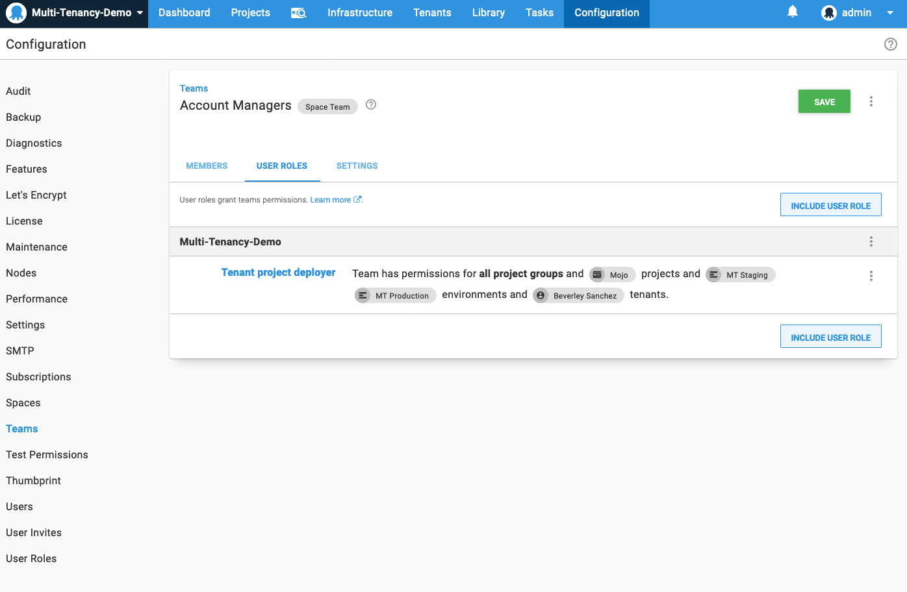
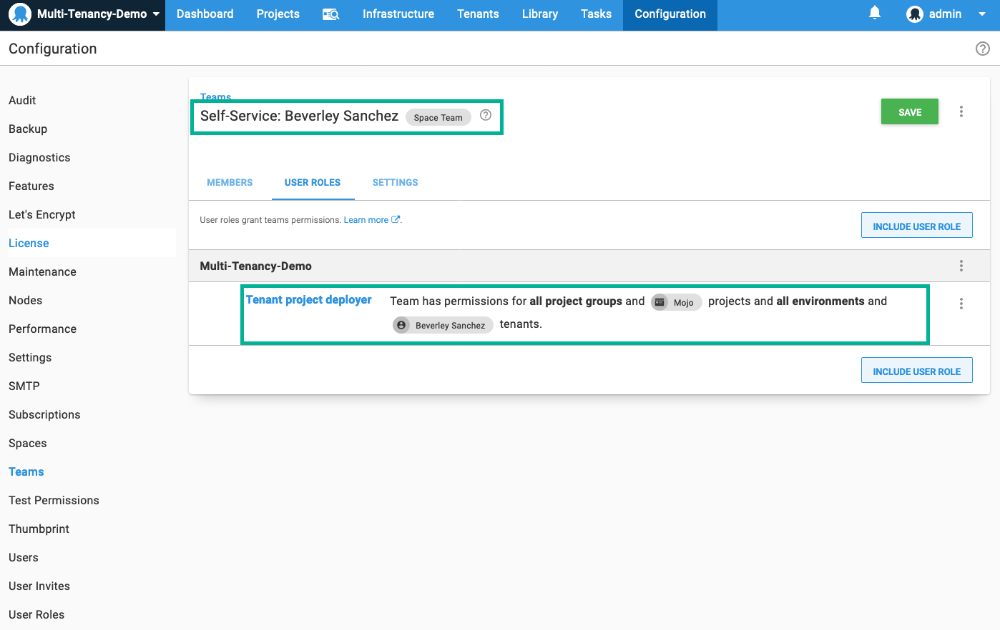

Previous step: [Designing a multi-tenant upgrade process](/docs/deployments/patterns/multi-tenant-deployments/multi-tenant-deployment-guide/designing-a-multi-tenant-upgrade-process.md).

This page describes several conventional approaches to structuring roles and teams to secure a multi-tenant Octopus instance. Using the permissions system in Octopus, you can configure internal team members with different roles who interact with tenants in different ways. You can also configure Octopus to provide access for your external customers. This page explores several of those roles for both internal and external parties.

:::success
To get the most out of this guide you will need to understand how to [manage users and teams](/docs/security/users-and-teams/index.md) and how to [work with custom roles](/docs/security/users-and-teams/user-roles.md). Octopus provides an expressive permissions system, and you can customize the security configuration to your particular scenario.
:::

## Account manager

Toby is a member of the sales team and manages the relationships for several of your largest customers. In his role Toby:

- The main point of contact for specific tenants.
- Manages the details/variables of particular tenants and keeps them up to date.
- Works with customers to deploy releases to their environments on their behalf.

### Step 1: Configure the tenant project deployer role

Firstly we will create a custom role with the permissions required to deploy releases into tenant environments.

:::hint
This role is loosely based on the built-in **Project deployer** role but removing the permissions to edit the project.
:::

:::success
It is usually a good idea to build smaller roles that can be composed together into a team to provide easier management of your team permissions. In this example, we are creating a single role to grant all of the required permissions to keep the example simple. In this case, you could create a **Tenant project viewer** role and a **Tenant project deployer** role and combine them into a single team.
:::

1. In **{{Configuration,Teams,Roles}}** click **Add custom role** and call it **Tenant project deployer**.
2. Set the description to **Tenant project deployers can deploy releases on behalf of tenants**
3. Choose the following permissions under [**Space Permissions**](/docs/security/users-and-teams/system-and-space-permissions.md):
   1. AccountView
   2. ArtifactView
   3. DeploymentCreate
   4. DeploymentView
   5. EnvironmentView
   6. EventView
   7. FeedView
   8. InterruptionView
   9. InterruptionViewSubmitResponsible
   10. LibraryVariableSetView
   11. LifecycleView
   12. MachinePolicyView
   13. MachineView
   14. ProcessView
   15. ProjectGroupView
   16. ProjectView
   17. ReleaseView
   18. TaskCancel
   19. TaskCreate
   20. TaskView
   21. TeamView
   22. TenantEdit
   23. TenantView
   24. VariableView
   25. VariableViewUnscoped

### Step 2: Configure the account managers team

Now we will create a team for all the Account Managers and add the role we created in the last step.

1. In **{{Configuration,Teams}}** click Add team and call it **Account Managers**. Be sure to select "Accessible in the X space only" unless you have tenants spread over multiple [Spaces](/docs/administration/spaces/index.md) and then select **Save**.

2. Under **User Roles** select **Include User Role** button.

3. From the dropdown, select the **Tenant project deployer role**.

4. Under **{{Members,Add member}}**  and add any user accounts that will form part of this team.

### Step 3: Test

Now it's time to test the results of our configuration.

1. Create a test user account and add them to your new **Account Managers** team.
2. Sign in as the test user and see the results.
3. Experiment with what you can and can't do.

You will probably notice you can see all tenants, projects, and environments. We will experiment with reducing scope in the next steps.

### Step 4: Reduce the scope of the team

Quite often, you will want to allocate certain tenants to a team or restrict which projects/environments a team can access. Using the team you just created, you can experiment with reducing scope. You can limit the team to a specific list of tenants, projects, and/or environments.

## Infrastructure manager

Bob is a member of the IT infrastructure team, and he manages all the virtual servers in the cloud. His only interaction with tenants is to associate them with the appropriate [deployment targets](/docs/infrastructure/index.md) and [environments](/docs/infrastructure/environments/index.md).  He should have read-only access to tenant details required and have the ability to manage deployment targets and accounts. This time we will configure the team using a composition of built-in and custom roles.

### Step 1: Configure the tenant viewer role

Similarly to the previous example, we will create a custom role with minimum permissions to view tenant details. Later on, we will create a team that combines multiple roles to achieve the desired effect.

1. Create a role called **Tenant viewer** with the following permissions:
  - TenantView

### Step 2: Configure the tenant environment managers team

In this example, we will create a new team and combine multiple roles to achieve the desired result.

1. Create a new team called Tenant Environment Managers.
2. Add the Tenant viewer and Environment manager roles to the team:
   
3. Add any specific tenant/environment scoping that makes sense.
4. Add any specific members to the team that makes sense.

### Step 3: Test

Similarly to the previous example, assign a user account, sign in, and test out the resulting behavior. You should notice you can configure new or existing deployment targets including tenant configuration as we described in [Designing a multi-tenant hosting model](/docs/deployments/patterns/multi-tenant-deployments/multi-tenant-deployment-guide/designing-a-multi-tenant-hosting-model.md).

### Step 4: Reduce the scope of the team

You can also reduce this team's scope to a certain set of tenants or environments, which makes sense for your scenario. For example, a team might be allocated to manage infrastructure for a particular group of tenants.

## Self-service

You may want to provide your customers with their user account in Octopus and see a personalized dashboard, and potentially perform their upgrades. This is possible by using the techniques we've already used by scoping a team to a single tenant.

:::success
You may want to provide the capabilities of Octopus Deploy to your customers without them knowing its Octopus under the covers. Octopus is built API-first. You can use the [Octopus API](/docs/octopus-rest-api/index.md) to build your own web user interface over the top of Octopus to provide all the capabilities of Octopus with your own user experience.
:::

### Step 1: Configure a team for the tenant

Firstly we need to create a team with a scope limited to the single tenant.

1. Create a new team called **Self-Service: <TenantName>** like **Self-Service: Beverley Sanchez** in our example.
2. Add any roles you desire. In our example, we're providing the tenant with the **Tenant project deployer** role.
3. Scope the team to a single tenant:

### Step 2: Test

Like the previous examples, create a user account and test Octopus behaves as you'd expect based on the permissions you've granted to the team. You may want to consider limiting the scope to a subset of environments or projects, depending on your scenario.

### Step 3: Configure user accounts for the tenant

Now you can create standard Octopus [user accounts](/docs/security/users-and-teams/index.md) and add them as members of the tenant-specific team.

## Next steps

It's important to note that these are example roles and they may not suit every company.  The good news is that they're a great starting point and can be customized to suit different scenarios.

## Learn more

- [Deployment patterns blog posts](https://octopus.com/blog/tag/Deployment%20Patterns).
