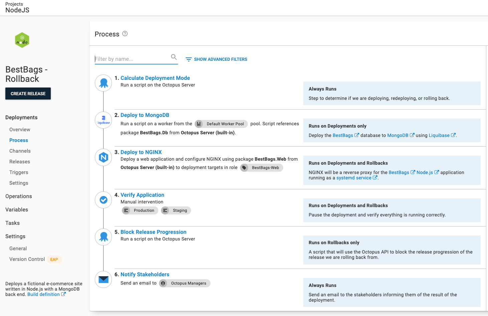

[NGINX](https://nginx.org) is a popular web server for Linux deployments.  This guide will cover how to roll back a [Node.js](https://nodejs.org/en/) application hosted by NGINX.  In this example, NGINX is a reverse proxy to a Node.js service running as a [systemd service](https://wiki.debian.org/systemd/Services).

:::hint
While this guide is for Node.js, the same process can be used for any framework, language, platform NGINX supports.  
:::

## Existing Deployment Process

The existing deployment process is:

1. Deploy to MongoDB.
1. Deploy to NGINX.
1. Verify Application.
1. Notify Stakeholders.


View the deployment process on [samples instance](https://samples.octopus.app/app#/Spaces-762/projects/01-octofx-original/deployments/process).  Please login as a guest.

## Zero Configuration Rollback
!include <zero-configuration-rollback>

## Rollback Process

For most rollbacks, the typical strategy is to skip the database step while re-deploying the Node.js application website.  In addition, a rollback indicates something is wrong with a release, so we'd want to [prevent that release from progressing](/docs/releases/prevent-release-progression.md).

The updated deployment process will be:

1. Check Deployment Mode
1. Deploy to MongoDB (skip during rollback)
1. Deploy to NGINX
1. Block Release Progression
1. Verify the Application
1. Notify stakeholders



View the deployment process on [samples instance](https://samples.octopus.app/app#/Spaces-762/projects/bestbags-rollback/deployments/process).  Please login as a guest.

### Calculate Deployment Mode

!include <calculate-deployment-mode>

### Skip Database Deployment Step

The database deployment step should be skipped during a rollback.  Unlike code, databases cannot easily be rolled back without risking data loss.  For most rollbacks, you won't have database changes.  However, a rollback could accidentally be trigger with a database change.  For example, rolling back a change in **Test** to unblock the QA team.   Skipping these steps during the rollback reduces the chance of accidental data loss.  

To skip these steps during a rollback, set the variable run condition to be:

```
#{Octopus.Action[Calculate Deployment Mode].Output.RunOnDeploy}
```

We also recommend adding or updating the notes field to indicate it will only run on deployments.


### Prevent Release Progression

!include <prevent-release-progression>